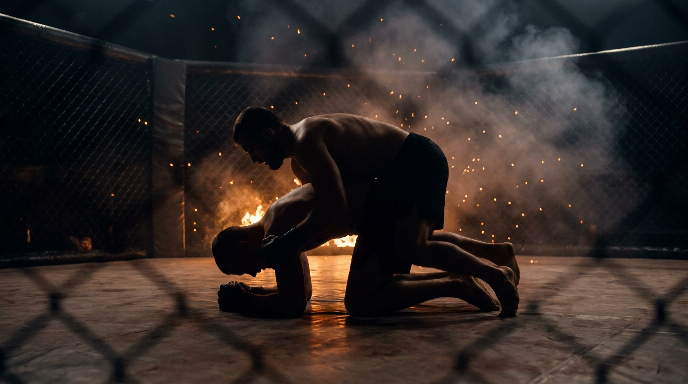

  
  
Ground · WrestlingTurtle Pin

!!! warning "Provisional (WIP): derived from class recording 2026-07-03"
    Invented live in class and **pending review on the platform**.
    Name and structure may change. Remove the WIP status once confirmed.

GroundWrestlingDefensiveBeginnerGet-Up

A sibling of [Turtle Breakout](../turtle-breakout/), same family, different goal. Both start with the defender in turtle. Turtle Breakout is a bare-hands attachment race, connect and you're done. Turtle Pin starts from control already established, hip-and-shoulder with hooks in, and the top player has to earn something harder: break the defender flat to the mat and hold them there.

  
Start<b>Defender in turtle. Top player already has hip-and-shoulder control, hooks in, no hands locked together.</b>

  
→

  
The Goal<b>Top breaks the defender's hips flat to the mat and holds top-level pressure. Defender stands, breaks contact completely, and turns to face.</b>

  
→

  
Finish<b>Hips pinned ~2-3s → top wins · Clean stand-turn-face, or a reversal to top → defender wins.</b>

  
Taking the back doesn't win,  the hips have to be down.

  
A tilt or a ride means nothing without top-level pressure held on grounded hips. <b>Pin the hips, or it's pointless.</b>

What to Read

<b>Attune to</b> the <i>felt pressure and rotation through the established contact</i>, the inertial array, not vision. The defender reads where the top player's weight commits to know which direction is free to explode up into. The top player reads the defender's hips through the hooks and hip-and-shoulder control, hunting the moment weight shifts enough to break them flat. Both are reading the same contact for opposite intentions.

The Starting Position

  
PlayersTwo, one on top, one defending from turtle.

  
DefenderTurtle, referee's position.

  
TopHip-and-shoulder control already established, hooks in. Hands may not be locked together, no full body-lock.

  
TriggerThe defender starts the interaction: they say go.

  
Start &amp; resetReset to the same start after every decision. Switch roles on either win.

The Matchup

  

    
⚓

    
Top

    
Trying to break the defender's hips flat to the mat and hold top-level pressure there, without locking your own hands together.

    A tilt or a back-take alone isn't the win. If you can't pin the hips down, it's pointless, reset the pressure and try again. No self-locked hands, find other ways to maintain control: feet-to-feet, head as a fulcrum, off-balancing.
  

  
VS

  

    
🛡️

    
Defender

    
Trying to stand, break contact completely, and turn to face. A reversal to top also wins.

    Explode on your own go. The wall is an ally if it's near you, glue to it on hands and knees, then use it to scaffold upright while you peel their hooks off, rather than fighting the escape flat on the floor.
  

The Rules

  🗣️ Defender starts itThe defender says go. Same asymmetric trigger as Turtle Breakout, the bottom player owns the timing.
  🔗 Control already establishedUnlike Turtle Breakout's hands-off race, the top player starts with hip-and-shoulder control and hooks in. This isn't a race to first contact, the contact already exists.
  🚫 No self-locked handsThe top player cannot lock their own hands together, no full body-lock. Grip the defender's arms, use feet-to-feet, use the head as a fulcrum, anything except clasping your own hands.
  ⏱️ Hips down, held ~2-3 secondsTaking the back doesn't win. The top player must break the defender's hips flat to the mat and hold top-level pressure there for roughly 2-3 seconds before it counts.
  🥊 Strikes liveLive for both players, unlike Turtle Breakout where strikes are still a proposed, unconfirmed level.
  🔄 Reversal countsIf the defender ends up on top mid-scramble, that's also a defender win, a natural option here since the game starts already engaged on the ground.

How to Win

  
Switch Hips pinned flat, top pressure held ~2-3s → top wins, switch roles.A tilt, a ride, or a back-take without the hips grounded doesn't count. If you can't pin it, it's pointless.

  
Reset Defender stands, breaks contact completely, turns and faces → defender wins.Same clean-separation standard as Turtle Breakout: fully broken, turned, facing, not half a step out.

  
Reset Defender reverses to top mid-scramble → defender wins.A legitimate second way out, unique to this game since it starts already on the ground.

  
Diagnostic Is the top player chasing position or chasing the pin?The coach watches whether the top player treats a back-take as the finish line (it isn't) or keeps working toward grounded hips and held pressure.

The Levels

  
1<b>Base game</b>Strikes live, no self-locked hands.Control-already-established start, hip-pin win held ~2-3s, reversal-to-top also wins for defense, strikes on for both from the first rep.

Recall Check

  
Test yourself before moving on. Answer out loud, then reveal what good looks like.

  

    
Q What is the top player's one and only win condition?

    
<b>Hips pinned flat to the mat, top-level pressure held for roughly 2-3 seconds.</b> A back-take or a tilt alone counts for nothing.

  

  

    
Q What can't the top player do?

    
<b>Lock their own hands together.</b> No full body-lock. Everything else, gripping arms, feet-to-feet, using the head as a fulcrum, is fair game.

  

  

    
Q How is this different from Turtle Breakout?

    
Turtle Breakout is a <b>bare-hands attachment race</b> from a standing start, connect and it's over. Turtle Pin starts with control <b>already established</b> and asks the top player to finish the much harder job of grounding the hips and holding them there.

  

Go Deeper

??? note "Task focus &amp; coaching cues"

    
Each role's job

    

      

⚓

Top

Break the hips down, not just the back; use feet-to-feet and the head as a fulcrum since the hands can't lock; keep hunting the pin once you're on, a tilt is not the finish.

      

🛡️

Defender

Explode upward on your own go; if you're near a wall, glue to it on hands and knees and climb, peeling their hooks off as you rise; a reversal is a legitimate win, not just standing up.

    

    
Coaching cues

    

      

⚓

"If you tilt him and don't pin him, it's pointless"

The line the coach uses to stop the top player from treating a back-take as a finish. The hips have to be down.

      

🧱

The wall is your friend

Get your weight bearing into the wall, glue to it hand-and-knee, then use it to scaffold yourself up while you peel their hooks off, instead of fighting the escape from flat on the floor.

    

??? abstract "Constraints-Led analysis"

    
Constraints → Affordances

    

      
Control already established at the start→Trains finishing a hold, not winning the initial attachment

      
No self-locked hands→Forces alternate control (feet-to-feet, head as a fulcrum, off-balancing) instead of a default body-lock

      
Hips-down + held pressure as the only win→Kills back-take-as-finish; trains completing the pin, not just the tilt

      
Reversal counts for defense→Rewards an aggressive, not just evasive, escape

      
Strikes live from rep one→Hesitation in turtle carries a real cost immediately, no unconfirmed pending level needed

    

    
Develops the <b>finish-the-pin</b> half of the same attachment-under-duress problem Turtle Breakout develops on the attach side, both anchored in the <b>inertial array</b> through established contact (Blau &amp; Wagman, 2022).

    
What the players read

    

      

✋

Haptic

Pressure and rotation through the hip/shoulder control and hooks → where weight commits, which way is free.

      

👁️

Visual

The wall's distance and angle, for the defender's scaffold-up escape.

      

🧭

Proprioceptive

Own base and hip position, top: am I actually grounding this, or just riding; bottom: can I stand from here, or do I need the wall first?

    

    
What we measure (order parameter)

    
Does the top player's control <b>convert into grounded hips held for the full 2-3 seconds</b>, not just a tilt or a ride? Track pin-completion rate vs. tilt-without-finish, reversal frequency, and whether defenders reach for the wall instead of fighting flat. When top players stop treating the back-take as the finish and defenders reliably use terrain, the skill has formed.

    
Representativeness

    
<b>Models:</b> finishing a takedown once the initial control is already secured, and defending it, the far more common real-fight problem than the bare-hands attachment race in Turtle Breakout.

    
First-run observations (2026-07-03)

    <ul class="emma-checklist">
      <li>Coach corrected a mid-round misread: ending in a bottom jiu-jitsu position does not count as a top win, weight has to be on the pinned hips</li>
      <li>Defender used the wall successfully once coached explicitly, did not find it independently</li>
    </ul>

    
Readiness to progress

    <ul class="emma-checklist">
      <li>Top consistently grounds the hips rather than settling for a tilt or a ride</li>
      <li>Top finds alternate control without locking hands (feet-to-feet, head as a fulcrum)</li>
      <li>Defender reaches for the wall as a first option when it's available</li>
      <li>Defender takes the reversal when it's there instead of only fighting to stand</li>
    </ul>

    
Warning signs

    

      Top calls a back-take or a tilt a win
      Top locks hands together out of habit
      Defender never uses the wall
      Defender ignores an open reversal
    

??? note "Safety &amp; related games"

    

      🤝 Scramble intensity, controlled landings
      🛑 No slamming; weight is pressure, not impact
      🔁 Reset if the scramble leaves the mat space
    

    
Where it sits

    

      
Prerequisite→<a href="../ground-to-standing/">Ground to Standing</a>

      
Sibling→<a href="../turtle-breakout/">Turtle Breakout</a> (same turtle start, a bare-hands attachment race instead of a pin)

      
Follow-on→<a href="../counter-wrestling/">Counter-Wrestling</a> · <a href="../takedown-defense/">Takedown Defense</a>

      
Related→<a href="../../concepts/hand-controls/">Hand Controls</a> · <a href="../wall-to-ground/">Wall to Ground</a>

    

