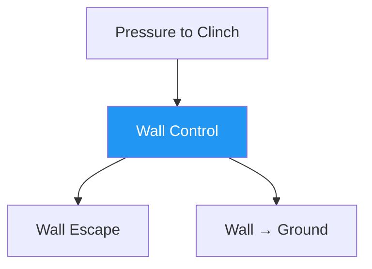

# Wall Control — Establish the Pin

!!! info "Game Identity"
    - **Problem:** Immobilizing opponent against the wall
    - **Environment:** Wall
    - **Stage:** Stabilize

This game teaches **vertical control**. The wall becomes the dominant constraint — it limits the defender's options and creates opportunities for organized control.

---

## Goal

This is an **asymmetric game** focused on control establishment.

| Role | Objective |
|------|-----------|
| **Attacker** | Establish a functional wall pin (hips and shoulders controlled, rotation denied) |
| **Defender** | Prevent pin establishment or disengage before being flattened |

The objective is **stabilization**, not damage or advancement.

---

## Entry Condition

- Start from clinch with defender positioned between attacker and wall
- Distance: 1–2 feet from wall
- Attacker has initial connection but not yet established control
- Reset if defender creates significant space or fully disengages

---

## Invariants

1. Wall is dominant constraint — all control is relative to it
2. No immediate takedowns — stabilize before advancing
3. Defender actively resists — no passive drilling

---

## Key Logic: What Constitutes a Pin?

!!! warning "A pin is NOT just pressing someone against the wall"

A functional wall pin exists when:

- [x] Defender's shoulders are substantially flat to wall
- [x] Defender's hips are controlled or compromised
- [x] Defender cannot rotate freely
- [x] Attacker maintains structure and balance

It requires **organized control**.

### The Rotation Problem

The primary escape mechanism is **shoulder rotation**. If the defender can turn their shoulders, they can:

- Create frames
- Generate hip movement
- Threaten reversals
- Access escape angles

The attacker's primary task is **denying rotation** while maintaining their own balance.

### DNS as Defensive Pressure

!!! note "Defensive Neck Submissions"
    DNS (guillotine threats, front headlock entries) are permitted for the defender. This punishes:

    - Poor posture from the attacker
    - Over-commitment to control
    - Head position errors

    DNS keeps the attacker honest without changing the game's focus.

---

## Win Conditions

| Role | Win Condition |
|------|---------------|
| Attacker | Holding functional pin for 5 seconds |
| Defender | Disengaging (creating space) or reversing position |

5-second hold requirement ensures the pin is stable, not momentary.

---

## Levels

=== "Level 1 — Establish Pin"
    - Focus on achieving flat shoulders and hip control
    - No strikes
    - Defender resists but does not counter-attack

=== "Level 2 — Deny Rotation"
    - Defender actively works rotation escapes
    - Attacker must adjust and re-pin
    - Light strikes permitted

=== "Level 3 — Threaten TKO Pin Access"
    - Attacker may briefly release one control point to simulate strike access
    - Pin must be re-established after strike threat
    - Introduces trade-off between control and damage

=== "Level 4 — Full MMA Expression"
    - Light strikes permitted for both players
    - Attacker can use strikes to soften resistance and maintain pin
    - Defender can use strikes to create escape opportunities
    - Knee strikes available for attacker from control
    - Focus: Wall control under realistic striking pressure
    - See: [Full MMA Expression](../concepts/full-mma-expression.md)

---

## Constraints Analysis

*How this game applies the [Constraints-Led Approach](../principles/cla/index.md)*

| Constraint Type | Constraint | Affordance Created |
|-----------------|------------|-------------------|
| **Task** | Establish functional pin (shoulders flat, hips controlled, rotation denied) | Develops organized control, not just pressing |
| **Task** | 5-second hold requirement | Ensures stable control, not momentary |
| **Task** | DNS allowed for defender | Punishes poor posture, keeps attacker honest |
| **Task** | No immediate takedowns (stabilize first) | Develops control before advancement |
| **Individual** | Prerequisite: Pressure to Clinch | Understands clinch and pressure dynamics |
| **Environmental** | Wall is dominant constraint | All control relative to wall structure |

!!! info "Theoretical Foundation"
    This game develops **pinning affordance perception**—reading when control is organized vs. merely pressing. The wall constraint simplifies the control problem (one fewer dimension of escape) while the rotation denial focus develops **structured grappling** rather than strength-based holding. The defender develops early escape timing through the **scramble window** concept (Renshaw et al., 2019).

---

## Information Structure

*What athletes must perceive to succeed (perception-action coupling)*

### Attacker Perceives

| Information Source | What to Read | Action It Supports |
|--------------------|--------------|-------------------|
| **Haptic** | Defender's shoulder position (flat vs. rotated) | Control quality assessment |
| **Haptic** | Defender's hip movement | Re-pinning direction |
| **Haptic** | Defender's frame attempts | Denial method |
| **Visual** | Defender's rotation setup | Anticipate and prevent |
| **Proprioceptive** | Own balance and structure | Maintain position without over-committing |

### Defender Perceives

| Information Source | What to Read | Action It Supports |
|--------------------|--------------|-------------------|
| **Haptic** | Attacker's control points | Where to create frames |
| **Haptic** | Attacker's weight distribution | Rotation direction |
| **Visual** | Attacker's head position | DNS opportunity |
| **Proprioceptive** | Own shoulder and hip position | Current escape options |

!!! tip "Coaching Cue"
    Ask attackers: "Are their shoulders flat? Can they rotate?" This develops the pin recognition—control isn't just pressure, it's organized structure that denies movement options.

---

## Representativeness

*How this game models real MMA situations*

### Real MMA Situation

Establishing wall control for dirty boxing, grinding, or takedown setup—a dominant position in MMA cage fighting.

### How This Game Represents It

| Element | Real MMA | This Game | Fidelity |
|---------|----------|-----------|----------|
| **Wall pin** | Shoulders flat, hips controlled | Same | High |
| **Control criteria** | Organized structure | Same | High |
| **DNS threat** | Always present | Same | High |
| **Strikes** | Available | Progressive by level | Scaffolded |
| **Consequence** | Damage accumulation or takedown setup | 5-second hold win | Analogous |

### Simplifications & Justification

| Simplification | Why Acceptable |
|----------------|----------------|
| 5-second hold win condition | Provides clear success criteria |
| No immediate takedowns | Develops control before advancement |
| Progressive striking | Builds control foundation first |

!!! note "Transfer Expectation"
    Wall control developed here transfers directly to MMA cage fighting. The perception of "organized control" vs. "just pressing" is identical in competition.

---

## Variability Guidelines

*Creating "repetition without repetition" (Bernstein, 1967)*

### Within-Level Variability

| Vary This | How | Maintains |
|-----------|-----|-----------|
| **Defender resistance level** | Passive, active, explosive | Multiple control solutions |
| **Starting clinch type** | Over-under, double unders, collar tie | Various pin pathways |
| **Defender size** | Larger, smaller, equal | Adaptability |
| **Wall angle** | Flat wall, corner, curved cage | Environmental flexibility |
| **Intensity** | Drilling pace, live pace | Pressure calibration |

### What NOT to Vary

| Keep Constant | Why |
|---------------|-----|
| Functional pin criteria | Core definition of success |
| 5-second hold requirement | Ensures stable control |
| DNS availability for defender | Maintains attacker discipline |

### Progressing Through Levels

| Signal to Progress | Meaning |
|--------------------|---------|
| Pins consistently achieved | Basic control developing |
| Rotation denied effectively | Understanding pin structure |
| Maintains control under resistance | Ready for striking addition |

---

## Readiness Indicators

*When is the athlete ready to advance?*

### Ready for Next Level When

- [ ] Establishes functional pin consistently (shoulders flat, rotation denied)
- [ ] Maintains pin under active resistance
- [ ] Can articulate: "They couldn't rotate because..."
- [ ] Respects DNS (maintains good posture)
- [ ] 5-second holds achieved reliably

### Ready to Exit Game When

- [ ] Level 2+ competence (denies active rotation escapes)
- [ ] Pin feels organized, not forced
- [ ] Ready to add exploitation (Wall Grinding) or transition (Wall to Ground)
- [ ] Wall control appears in sparring

### Warning Signs (Not Ready to Progress)

| Sign | Meaning | Response |
|------|---------|----------|
| Just pressing (not controlling) | Not understanding structure | Slow down, focus on rotation denial |
| Gets DNS'd frequently | Posture neglected | Emphasize head position, stay at current level |
| Pin breaks immediately | Control not organized | More reps, focus on structure |
| Exhausted quickly | Using strength, not structure | Develop efficient control |

---

## Advanced Expressions (Coach Context)

**For attackers:**

- Pin becomes a platform, not an endpoint
- Control becomes dynamic — adjustments without losing position
- Strike threats emerge from stable control
- TKO pin access becomes available at Level 3+

**For defenders:**

- Early rotation becomes instinctive
- Frames become structural rather than desperate
- DNS threats become genuine tactical options
- Escape timing improves — act before consolidation

---

## System Position

This is the **first true grappling control game** in the system.

---

!!! abstract "System Evolution Notice"
    Pin definitions may evolve as control models refine.
