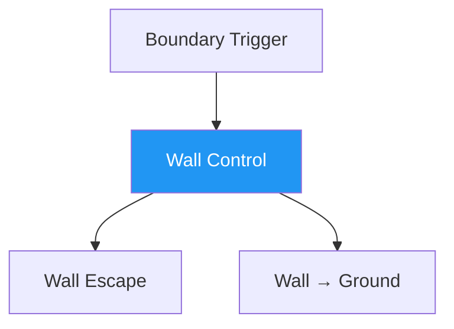

# Wall Control — Establish the Pin

!!! info "Game Identity"
    - **Problem:** Immobilizing opponent against the wall
    - **Environment:** Wall
    - **Stage:** Stabilize

This game teaches **vertical control**. The wall becomes the dominant constraint — it limits the defender's options and creates opportunities for organized control.

---

## Goal

This is an **asymmetric game** focused on control establishment.

| Role | Objective |
|------|-----------|
| **Attacker** | Establish a functional wall pin (hips and shoulders controlled, rotation denied) |
| **Defender** | Prevent pin establishment or disengage before being flattened |

The objective is **stabilization**, not damage or advancement.

---

## Entry Condition

- Start from clinch with defender positioned between attacker and wall
- Distance: 1–2 feet from wall
- Attacker has initial connection but not yet established control
- Reset if defender creates significant space or fully disengages

---

## Invariants

1. Wall is dominant constraint — all control is relative to it
2. No immediate takedowns — stabilize before advancing
3. Defender actively resists — no passive drilling

---

## Key Logic: What Constitutes a Pin?

!!! warning "A pin is NOT just pressing someone against the wall"

A functional wall pin exists when:

- [x] Defender's shoulders are substantially flat to wall
- [x] Defender's hips are controlled or compromised
- [x] Defender cannot rotate freely
- [x] Attacker maintains structure and balance

It requires **organized control**.

### The Rotation Problem

The primary escape mechanism is **shoulder rotation**. If the defender can turn their shoulders, they can:

- Create frames
- Generate hip movement
- Threaten reversals
- Access escape angles

The attacker's primary task is **denying rotation** while maintaining their own balance.

### DNS as Defensive Pressure

!!! note "Defensive Neck Submissions"
    DNS (guillotine threats, front headlock entries) are permitted for the defender. This punishes:

    - Poor posture from the attacker
    - Over-commitment to control
    - Head position errors

    DNS keeps the attacker honest without changing the game's focus.

---

## Win Conditions

| Role | Win Condition |
|------|---------------|
| Attacker | Holding functional pin for 5 seconds |
| Defender | Disengaging (creating space) or reversing position |

5-second hold requirement ensures the pin is stable, not momentary.

---

## Levels

=== "Level 1 — Establish Pin"
    - Focus on achieving flat shoulders and hip control
    - No strikes
    - Defender resists but does not counter-attack

=== "Level 2 — Deny Rotation"
    - Defender actively works rotation escapes
    - Attacker must adjust and re-pin
    - Light strikes permitted

=== "Level 3 — Threaten TKO Pin Access"
    - Attacker may briefly release one control point to simulate strike access
    - Pin must be re-established after strike threat
    - Introduces trade-off between control and damage

=== "Level 4 — Full MMA Expression"
    - Light strikes permitted for both players
    - Attacker can use strikes to soften resistance and maintain pin
    - Defender can use strikes to create escape opportunities
    - Knee strikes available for attacker from control
    - Focus: Wall control under realistic striking pressure
    - See: [Full MMA Expression](../concepts/full-mma-expression.md)

---

## Advanced Expressions (Coach Context)

**For attackers:**

- Pin becomes a platform, not an endpoint
- Control becomes dynamic — adjustments without losing position
- Strike threats emerge from stable control
- TKO pin access becomes available at Level 3+

**For defenders:**

- Early rotation becomes instinctive
- Frames become structural rather than desperate
- DNS threats become genuine tactical options
- Escape timing improves — act before consolidation

---

## System Position

This is the **first true grappling control game** in the system.

---

!!! abstract "System Evolution Notice"
    Pin definitions may evolve as control models refine.
