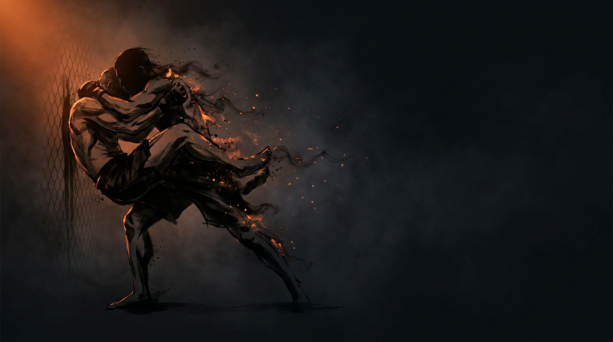

  
  
Wall · WrestlingWall Control, Establish the Pin

WallWrestlingOffensiveIntermediateStabilize

Teach vertical control, the wall becomes the dominant constraint that organizes the pin.

  
Start<b>Two grapplers clinched, defender pinned between attacker and wall.</b>

  
→

  
The Goal<b>Attacker organizes a functional pin; defender rotates out or disengages.</b>

  
→

  
Finish<b>Hold pin 5s → attacker · Disengage or reverse → defender · Only pressing → no pin.</b>

  
Pressing isn't pinning,  deny the rotation.

  
A pin is organized structure, not muscle. <b>If their shoulders can turn, it's only pressure.</b>

Key Positions

  🧱 Wall pinAt least two points of pinning control, the hips and upper body held immobile and flat to the wall. If the shoulders can still rotate, it's pressure, not a pin.

What to Read

<b>Attune to</b> the <i>felt resistance to rotation</i> through your grips and frames, the <b>inertial array</b> at the shoulders and hips, plus where the defender's weight wants to escape. That resistance (or its sudden absence) specifies whether the pin is organized or merely pressing, not how hard you are pushing or what their face is doing.

The Starting Position

  
PlayersTwo grapplers, clinched with connection but no control yet.

  
Range/positionTied up at the wall, 1–2 feet out, defender pinned against it.

  
BoundaryThe wall (or cage) is the dominant constraint, inside a marked perimeter.

  
RolesOne attacker establishing the pin, one defender resisting and escaping.

  
Start &amp; resetBegin from clinch; reset on significant space or full disengage.

The Matchup

  

    
🤼

    
Attacker

    
Trying to establish a functional wall pin, hips and shoulders controlled, rotation denied.

    You start with initial connection but no control yet. No immediate takedowns, stabilize first, then organize the pin against the wall.
  

  
VS

  

    
🧱

    
Defender

    
Trying to prevent the pin or disengage before being flattened.

    Active resistance only, no passive drilling. Work rotation, frames, and defensive neck submissions to keep the attacker honest.
  

The Rules

  🧱 Wall is the dominant constraintAll control is relative to the wall. It limits the defender's options and is the structure the attacker organizes the pin around.
  🚫 No immediate takedownsStabilize before advancing. The game is about establishing control, not shooting for the takedown right away.
  ⚡ Defender actively resistsNo passive drilling, the defender works real escapes, frames, and rotation so the control problem is genuine.
  🤐 DNS permitted for the defenderDefensive neck submissions, guillotine threats and front headlock entries, are allowed. They punish poor posture, over-commitment, and head-position errors without changing the game's focus.
  📍 Start 1–2 feet from the wallBegin from clinch with the defender positioned between attacker and wall. Reset if the defender creates significant space or fully disengages.

How to Win

  
Attacker wins Hold a functional pin for 5 seconds → attacker wins.A functional pin: shoulders substantially flat to the wall, hips controlled or compromised, no free rotation, with the attacker keeping structure and balance. The 5-second hold ensures the pin is stable, not momentary.

  
Defender wins Disengage or reverse → defender wins.Break free by creating significant space, or turn the position around. Either ends the attacker's control attempt.

  
No pin Shoulders can still rotate → pressing, not a pin.If the defender can still rotate their shoulders, it isn't a pin, only pressure. Organized structure that denies rotation is what counts.

The Levels

  
1<b>Establish Pin</b>Flat shoulders and hip control, no strikes.Focus on achieving flat shoulders and hip control. No strikes. The defender resists but does not counter-attack.

  
2<b>Deny Rotation</b>Defender works rotation; attacker re-pins.The defender actively works rotation escapes and the attacker must adjust and re-pin. Light strikes permitted.

  
3<b>Threaten TKO Pin Access</b>Release a control point to simulate strike access.The attacker may briefly release one control point to simulate strike access, then re-establish the pin. Introduces the trade-off between control and damage.

  
4<b>Full MMA Expression</b>Light strikes for both; knees from control.Light strikes permitted for both players. The attacker softens resistance and maintains the pin; the defender strikes to create escapes. Knee strikes available for the attacker from control.

Recall Check

  
Test yourself before moving on. Answer out loud, then reveal what good looks like.

  

    
Q What is the difference between pressing and a real wall pin?

    
A <b>wall pin</b> is at least <b>two points of pinning control</b>, hips and upper body held immobile and flat to the wall, with <b>rotation denied</b>. If the shoulders can still rotate, it is only pressure, not a pin.

  

  

    
Q What are you reading to know whether the pin is organized or just muscle?

    
The <b>felt resistance to rotation</b> through your grips and frames, the <b>inertial array</b> at the shoulders and hips, plus where the defender's weight wants to escape. Not how hard you push or what their face does.

  

  

    
Q Why is denying shoulder rotation the attacker's primary task?

    
<b>Shoulder rotation is the primary escape</b>: it lets the defender frame, generate hip movement, and access angles. Deny it and the position crosses from pressing into a pin.

  

  

    
Q Why no immediate takedowns, and what keeps the attacker honest?

    
<b>Stabilize before advancing</b>: the game develops control before the shot. The defender's <b>DNS</b> (guillotine, front headlock) punishes <b>poor posture, over-commitment, and head-position errors</b>.

  

Go Deeper

??? note "Task focus &amp; coaching cues"

    
Each role's job

    

      

🤼

Attacker

Establish a functional pin, shoulders flat, hips controlled, rotation denied, while keeping your own balance and structure.

      

🧱

Defender

Prevent the pin or disengage before being flattened. Resist actively; use frames, rotation, and DNS.

    

    
Coaching cues

    

      

👁️

Are their shoulders flat?

Ask: "Are their shoulders flat? Can they rotate?" This develops pin recognition, control is organized structure, not just pressure.

      

🔃

Deny the rotation

Shoulder rotation is the primary escape, it lets the defender frame, generate hip movement, and access angles. Denying it is the attacker's primary task.

    

??? abstract "Constraints-Led analysis"

    
Constraints → Affordances

    

      
Functional pin required→Develops organized control, not just pressing

      
5-second hold→Ensures stable control, not momentary

      
DNS allowed for defender→Punishes poor posture, keeps attacker honest

      
No immediate takedowns→Develops control before advancement

      
Wall as dominant constraint→All control relative to wall structure

    

    
Develops <b>pinning affordance perception</b>, reading when control is organized vs. merely pressing. The defender develops early escape timing through the scramble window (Renshaw et al., 2019).

    
What the attacker reads

    

      

✋

Haptic

Shoulder position (flat vs. rotated), hip movement, and frame attempts → control quality, re-pinning direction, denial method.

      

👁️

Visual

Defender's rotation setup → anticipate and prevent it.

      

🧭

Proprioceptive

Own balance and structure → maintain position without over-committing.

    

    
What the defender reads

    

      

✋

Haptic

Attacker's control points &amp; weight distribution → where to frame, which way to rotate.

      

👁️

Visual

Attacker's head position → DNS opportunity.

      

🧭

Proprioceptive

Own shoulder and hip position → current escape options.

    

    
What we measure (order parameter)

    
Whether the defender's <b>shoulders stay rotatable or go flat</b>, track free rotation vs. denied rotation under active resistance, and whether the attacker can hold that flatness for the full 5 seconds. That rotation-denial relationship is the order parameter; when it stabilizes, organized control has formed and the position has crossed from pressing into a pin.

    
Representativeness

    
<b>Models:</b> establishing wall control for dirty boxing, grinding, or takedown setup, a dominant position in MMA cage fighting.

    
Simplified: 5-second hold winno immediate takedownsprogressive striking

    
Wall control developed here transfers directly to cage fighting, "organized control" vs. "just pressing" is identical in competition.

    
Readiness to progress

    <ul class="emma-checklist">
      <li>Establishes functional pin consistently</li>
      <li>Maintains pin under active resistance</li>
      <li>Can articulate: "They couldn't rotate because…"</li>
      <li>Respects DNS (maintains good posture)</li>
      <li>5-second holds achieved reliably</li>
    </ul>

    
Warning signs

    

      Just pressing, not controlling
      Gets DNS'd frequently
      Pin breaks immediately
      Exhausted quickly, using strength
    

??? note "Safety &amp; related games"

    

      🧱 Use mats and a controlled wall surface
      🤐 DNS threats stay controlled, no cranking
      🔄 Reset on significant space or disengage
    

    
Where it sits

    

      
Prerequisite→<a href="../pressure-to-clinch/">Pressure to Clinch</a> · <a href="../../concepts/tko-pin/">TKO Pin</a>

      
Follow-on→<a href="../wall-escape/">Wall Escape</a> · <a href="../wall-to-ground/">Wall to Ground</a>

      
Related→<a href="../wall-grinding/">Wall Grinding</a>

    

