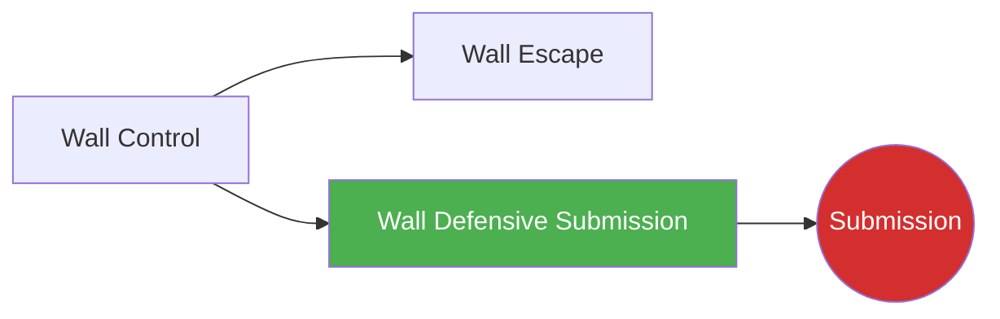

# Wall Defensive Submission

!!! info "Game Identity"
    - **Problem:** Using submissions to deter or reverse wall control
    - **Environment:** Wall
    - **Stage:** Counter (Defensive Grappling)

This is a **defensive grappling game** where the pinned player uses submission threats to deter control and create escape opportunities. Submissions from defensive wall position serve as both threat and escape tool.

---

## Goal

This is an **asymmetric game** with distinct roles.

| Role | Objective |
|------|-----------|
| **Defender (Pinned)** | Threaten or complete submission from defensive position |
| **Controller** | Maintain wall control while avoiding submission danger |

The objective is **submission as defensive weapon** — making control dangerous.

---

## Entry Condition

- Defender is pinned against wall
- Controller has established wall control
- Defender works submission threats
- Reset when submission achieved, defended, OR controller disengages

---

## Invariants

1. Defender must **threaten submissions** — not just escape
2. Controller **maintains intent to control** — not just defending
3. Submissions must be available from position (not fantasy techniques)
4. Wall position remains the environment

---

## Task Focus

### Defender (Pinned)
- Identify submission opportunities from position
- Threaten guilotine, front headlock, Kimura, etc.
- Use submission threat to create escape
- Finish if controller gives the opening

### Controller (Offensive)
- Maintain position while protecting neck/arms
- Recognize submission setups
- Choose: disengage or defend in place
- Keep head position safe

!!! question "Key Internal Questions — Defender"
    - "What submission is available from here?"
    - "Is their head position vulnerable?"
    - "Can I use this threat to escape even if I don't finish?"

---

## Key Logic: Submissions as Deterrent

!!! note "The Core Skill"
    Defensive wall submissions serve multiple purposes:

    | Purpose | How It Works |
    |---------|--------------|
    | **Deterrent** | Makes controller cautious, loosens control |
    | **Reversal setup** | Threat creates space to escape |
    | **Actual finish** | If controller doesn't respect, finish |

    Available submissions from wall defense:

    - **Guillotine** — Controller's head is low
    - **Front headlock/DNS** — Controller shoots or ducks
    - **Kimura** — Controller's arm is exposed
    - **Standing arm triangle** — Rare but possible

    The skill is recognizing when submission is available and using it appropriately.

---

## Win Conditions

| Role | Win Condition |
|------|---------------|
| **Defender** | Complete submission OR use threat to escape |
| **Controller** | Maintain control while defending submissions for set duration |

**On defender win:** Roles switch.
**On controller win:** Reset, same roles.

---

## Levels

=== "Level 1 — Guillotine Only"
    - Defender can only threaten guillotine
    - Focus: Recognizing head position vulnerability

=== "Level 2 — Add Arm Attacks"
    - Defender can threaten guillotine and Kimura
    - Multiple submission threats
    - Focus: Reading which submission is available

=== "Level 3 — Submission to Escape"
    - Defender uses threats to create escape
    - Score for escape OR submission
    - Focus: Submission as escape tool

=== "Level 4 — Full MMA Expression"
    - Controller can strike during wall control
    - Defender must time submissions around strikes
    - Focus: Defensive submissions under MMA pressure
    - See: [Full MMA Expression](../concepts/full-mma-expression.md)

---

## Safety

- **Contact limits:** Controlled submissions, tap early
- **Stop conditions:** Cranking submissions, slamming
- **Coach intervention:** Reset if stalling without progress

---

## System Position

- **Prerequisite games:** Wall Escape (understand wall defense first)
- **Follow-on games:** End state (Submission) if completed
- **Related concepts:** DNS, Defensive Solutions

---

!!! abstract "System Evolution Notice"
    This game may be refined as wall submission patterns emerge.
