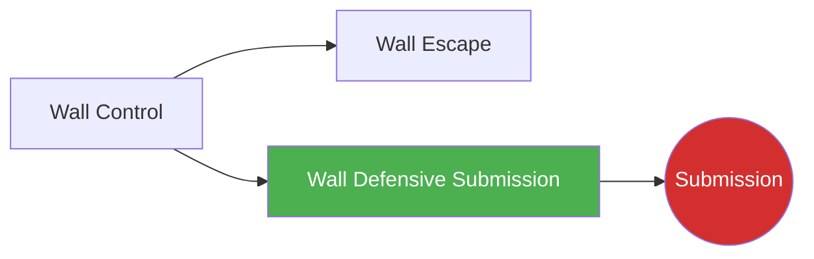

# Wall Defensive Submission

!!! info "Game Identity"
    - **Problem:** Using submissions to deter or reverse wall control
    - **Environment:** Wall
    - **Stage:** Counter (Defensive Grappling)

This is a **defensive grappling game** where the pinned player uses submission threats to deter control and create escape opportunities. Submissions from defensive wall position serve as both threat and escape tool.

---

## Goal

This is an **asymmetric game** with distinct roles.

| Role | Objective |
|------|-----------|
| **Defender (Pinned)** | Threaten or complete submission from defensive position |
| **Controller** | Maintain wall control while avoiding submission danger |

The objective is **submission as defensive weapon** — making control dangerous.

---

## Entry Condition

- Defender is pinned against wall
- Controller has established wall control
- Defender works submission threats
- Reset when submission achieved, defended, OR controller disengages

---

## Invariants

1. Defender must **threaten submissions** — not just escape
2. Controller **maintains intent to control** — not just defending
3. Submissions must be available from position (not fantasy techniques)
4. Wall position remains the environment

---

## Task Focus

### Defender (Pinned)
- Identify submission opportunities from position
- Threaten guilotine, front headlock, Kimura, etc.
- Use submission threat to create escape
- Finish if controller gives the opening

### Controller (Offensive)
- Maintain position while protecting neck/arms
- Recognize submission setups
- Choose: disengage or defend in place
- Keep head position safe

!!! question "Key Internal Questions — Defender"
    - "What submission is available from here?"
    - "Is their head position vulnerable?"
    - "Can I use this threat to escape even if I don't finish?"

---

## Key Logic: Submissions as Deterrent

!!! note "The Core Skill"
    Defensive wall submissions serve multiple purposes:

    | Purpose | How It Works |
    |---------|--------------|
    | **Deterrent** | Makes controller cautious, loosens control |
    | **Reversal setup** | Threat creates space to escape |
    | **Actual finish** | If controller doesn't respect, finish |

    Available submissions from wall defense:

    - **Guillotine** — Controller's head is low
    - **Front headlock/DNS** — Controller shoots or ducks
    - **Kimura** — Controller's arm is exposed
    - **Standing arm triangle** — Rare but possible

    The skill is recognizing when submission is available and using it appropriately.

---

## Win Conditions

| Role | Win Condition |
|------|---------------|
| **Defender** | Complete submission OR use threat to escape |
| **Controller** | Maintain control while defending submissions for set duration |

**On defender win:** Roles switch.
**On controller win:** Reset, same roles.

---

## Levels

=== "Level 1 — Guillotine Only"
    - Defender can only threaten guillotine
    - Focus: Recognizing head position vulnerability

=== "Level 2 — Add Arm Attacks"
    - Defender can threaten guillotine and Kimura
    - Multiple submission threats
    - Focus: Reading which submission is available

=== "Level 3 — Submission to Escape"
    - Defender uses threats to create escape
    - Score for escape OR submission
    - Focus: Submission as escape tool

=== "Level 4 — Full MMA Expression"
    - Controller can strike during wall control
    - Defender must time submissions around strikes
    - Focus: Defensive submissions under MMA pressure
    - See: [Full MMA Expression](../concepts/full-mma-expression.md)

---

## Constraints Analysis

*How this game applies the [Constraints-Led Approach](../principles/cla/index.md)*

| Constraint Type | Constraint | Affordance Created |
|-----------------|------------|-------------------|
| **Task** | Defender must threaten submissions (not just escape) | Develops submission as defensive weapon |
| **Task** | Controller maintains control intent | Creates realistic control situation |
| **Task** | Submissions must be available from position | Reality-based technique selection |
| **Task** | Progressive submission options (guillotine → arm attacks → escape use) | Scaffolded learning |
| **Individual** | Prerequisite: Wall Escape | Understands wall defense first |
| **Environmental** | Wall position maintained | Defensive submissions specific to environment |

!!! info "Theoretical Foundation"
    This game develops **defensive submission perception**—recognizing when submission opportunities exist from disadvantaged positions. The constraint requiring submission threats (not just escape) develops **counter-offense from defense**. This is a key MMA skill where defensive situations become offensive opportunities through submission awareness (Renshaw et al., 2019).

---

## Information Structure

*What athletes must perceive to succeed (perception-action coupling)*

### Defender (Pinned) Perceives

| Information Source | What to Read | Action It Supports |
|--------------------|--------------|-------------------|
| **Visual** | Controller's head position | Guillotine/DNS opportunity |
| **Visual** | Controller's arm position | Kimura opportunity |
| **Haptic** | Controller's posture | What submission is available |
| **Haptic** | Control loosening | Escape timing from threat |
| **Proprioceptive** | Own grip/hook position | Submission setup |

### Controller Perceives

| Information Source | What to Read | Action It Supports |
|--------------------|--------------|-------------------|
| **Haptic** | Defender's grip changes | Submission setup recognition |
| **Visual** | Defender's hand positioning | Threat identification |
| **Proprioceptive** | Own head/arm position | Vulnerability awareness |

!!! tip "Coaching Cue"
    Ask defenders: "What submission was available there?" This develops recognition. Ask: "Did you use the threat to escape?" This develops the understanding that submission threats create escape opportunities even without finishing.

---

## Representativeness

*How this game models real MMA situations*

### Real MMA Situation

Using submission threats from defensive wall position—making control dangerous for the attacker and creating escape opportunities.

### How This Game Represents It

| Element | Real MMA | This Game | Fidelity |
|---------|----------|-----------|----------|
| **Defensive submissions** | Available from wall | Same | High |
| **Deterrent effect** | Makes control cautious | Same | High |
| **Escape creation** | Threats create space | Same | High |
| **Position-specific techniques** | Guillotine, Kimura, DNS | Same | High |
| **Strikes** | Available | Progressive by level | Scaffolded |

### Simplifications & Justification

| Simplification | Why Acceptable |
|----------------|----------------|
| Progressive submission options | Develops one submission well before adding more |
| Clear threat requirement | Ensures active offense, not just escape |
| Controlled submissions | Safety during learning |

!!! note "Transfer Expectation"
    Defensive submission perception developed here transfers directly to MMA. The recognition of "their head is down, guillotine is available" is identical in competition.

---

## Variability Guidelines

*Creating "repetition without repetition" (Bernstein, 1967)*

### Within-Level Variability

| Vary This | How | Maintains |
|-----------|-----|-----------|
| **Controller style** | Head down, arms exposed, tight control | Multiple submission opportunities |
| **Controller size** | Larger, smaller, equal | Adaptability |
| **Pin type** | Various wall clinch positions | Different submission availability |
| **Intensity** | Drilling pace, live pace | Pressure calibration |
| **Threat vs. finish emphasis** | Finish-focused rounds, escape-focused rounds | Full skill development |

### What NOT to Vary

| Keep Constant | Why |
|---------------|-----|
| Submission threats required | Core constraint defining the game |
| Position-appropriate techniques | Maintains realism |
| Controlled submissions | Safety |

### Progressing Through Levels

| Signal to Progress | Meaning |
|--------------------|---------|
| Guillotine threats effective | Basic recognition developing |
| Multiple submissions available | Degeneracy developing |
| Uses threats to escape | Full understanding of defensive submission |

---

## Readiness Indicators

*When is the athlete ready to advance?*

### Ready for Next Level When

- [ ] Recognizes submission opportunities from position
- [ ] Threatens effectively (controller feels danger)
- [ ] Finishes when controller gives opening
- [ ] Uses threats to create escape
- [ ] Can articulate: "Their head was down so I..."

### Ready to Exit Game When

- [ ] Level 3+ competence (uses submissions for escape)
- [ ] Submission threats are instinctive from wall
- [ ] Controller respects the threat (adjusts posture)
- [ ] Defensive submissions appear in sparring

### Warning Signs (Not Ready to Progress)

| Sign | Meaning | Response |
|------|---------|----------|
| Only tries escape (no submissions) | Not threatening | Constrain escape, require threat |
| Controller doesn't feel danger | Technique ineffective | Work on grip and positioning |
| Cranks without control | Safety issue | Emphasize control before squeeze |
| Only one submission works | Limited recognition | Vary controller position to force different threats |

---

## Safety

- **Contact limits:** Controlled submissions, tap early
- **Stop conditions:** Cranking submissions, slamming
- **Coach intervention:** Reset if stalling without progress

---

## System Position

- **Prerequisite games:** Wall Escape (understand wall defense first)
- **Follow-on games:** End state (Submission) if completed
- **Related concepts:** DNS, Defensive Solutions

---

!!! abstract "System Evolution Notice"
    This game may be refined as wall submission patterns emerge.
