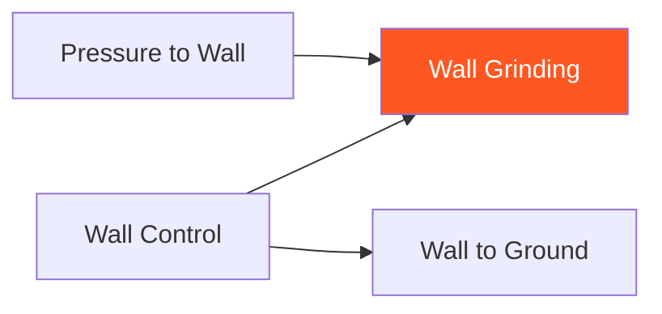

# Wall Grinding

!!! info "Game Identity"
    - **Problem:** Dealing damage from wall control position
    - **Environment:** Wall
    - **Stage:** Exploit (Wall Damage)

This is an **offensive wall game** focused on dealing damage from wall position. Unlike Wall to Ground, the goal is NOT to transition — it's to damage the opponent while maintaining wall control.

---

## Goal

This is an **asymmetric game** with distinct roles.

| Role | Objective |
|------|-----------|
| **Attacker** | Maintain wall control AND deal significant damage |
| **Defender** | Escape wall OR nullify damage output |

The objective is **damage from wall**, not transition.

---

## Entry Condition

- Start from established wall control (attacker has position)
- Attacker works dirty boxing, knees, grinding
- Defender attempts escape or damage nullification
- Reset when defender escapes OR sufficient damage dealt

---

## Invariants

1. Attacker must **deal damage** — just holding doesn't count
2. Attacker should **NOT transition to ground** — stay on wall
3. Defender actively resists — not passive
4. Position resets if attacker loses wall control completely

---

## Task Focus

### Attacker
- Maintain wall control (shoulders flat, hips controlled)
- Find openings for knees, short punches, elbows
- Manage energy — grinding is work
- Deny escape while creating damage

### Defender
- Create frames to block strikes
- Work rotation escapes
- Nullify knee opportunities
- Find reversal or escape opportunities

!!! question "Key Internal Questions — Attacker"
    - "Am I controlling AND damaging, or just one?"
    - "Can I find the opening for a knee?"
    - "Am I maintaining position through their escape attempts?"

---

## Key Logic: Control + Damage Balance

!!! note "The Core Skill"
    Wall grinding requires balancing two demands:

    | Priority | Risk |
    |----------|------|
    | More control | Less damage output |
    | More damage | Risk losing position |

    The skill is finding the balance — creating damage opportunities WITHOUT losing control.

    This is the "dirty boxing" or "grinding" that characterizes some fighting styles.

---

## Win Conditions

| Role | Win Condition |
|------|---------------|
| **Attacker** | Sustained damage output from wall (multiple clean strikes) |
| **Defender** | Escape to open space OR nullify damage for extended period |

**On attacker win:** Roles switch.
**On defender win:** Reset, same roles.

---

## Levels

=== "Level 1 — Control + Strikes"
    - Attacker maintains control and works short strikes
    - Defender defends and works escape
    - Focus: Finding openings while controlling

=== "Level 2 — Add Knees"
    - Attacker can use knees from clinch position
    - More damaging but requires space creation
    - Focus: Knee setups from wall

=== "Level 3 — Defender Strikes Back"
    - Defender can strike from wall position
    - Attacker must control while managing return fire
    - Focus: Two-way wall exchanges

=== "Level 4 — Full MMA Expression"
    - Attacker can choose to transition to ground if advantageous
    - Defender can shoot to escape
    - Focus: Wall fighting under full MMA options
    - See: [Full MMA Expression](../concepts/full-mma-expression.md)

---

## Safety

- **Contact limits:** Light to moderate — knees especially controlled
- **Stop conditions:** Excessive force, loss of composure
- **Coach intervention:** Reset if grinding becomes stalling

---

## System Position

- **Prerequisite games:** Wall Control
- **Follow-on games:** N/A (this is an end-state game)
- **Related concepts:** TKO Pin (ground equivalent)

---

!!! abstract "System Evolution Notice"
    This game may be refined as wall damage patterns emerge.
