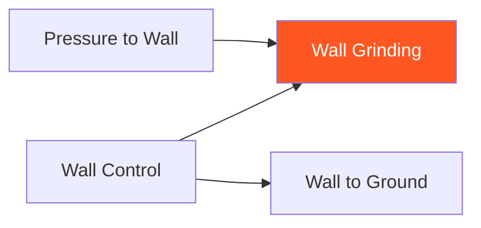

# Wall Grinding

!!! info "Game Identity"
    - **Problem:** Dealing damage from wall control position
    - **Environment:** Wall
    - **Stage:** Exploit (Wall Damage)

This is an **offensive wall game** focused on dealing damage from wall position. Unlike Wall to Ground, the goal is NOT to transition — it's to damage the opponent while maintaining wall control.

---

## Goal

This is an **asymmetric game** with distinct roles.

| Role | Objective |
|------|-----------|
| **Attacker** | Maintain wall control AND deal significant damage |
| **Defender** | Escape wall OR nullify damage output |

The objective is **damage from wall**, not transition.

---

## Entry Condition

- Start from established wall control (attacker has position)
- Attacker works dirty boxing, knees, grinding
- Defender attempts escape or damage nullification
- Reset when defender escapes OR sufficient damage dealt

---

## Invariants

1. Attacker must **deal damage** — just holding doesn't count
2. Attacker should **NOT transition to ground** — stay on wall
3. Defender actively resists — not passive
4. Position resets if attacker loses wall control completely

---

## Task Focus

### Attacker
- Maintain wall control (shoulders flat, hips controlled)
- Find openings for knees, short punches, elbows
- Manage energy — grinding is work
- Deny escape while creating damage

### Defender
- Create frames to block strikes
- Work rotation escapes
- Nullify knee opportunities
- Find reversal or escape opportunities

!!! question "Key Internal Questions — Attacker"
    - "Am I controlling AND damaging, or just one?"
    - "Can I find the opening for a knee?"
    - "Am I maintaining position through their escape attempts?"

---

## Key Logic: Control + Damage Balance

!!! note "The Core Skill"
    Wall grinding requires balancing two demands:

    | Priority | Risk |
    |----------|------|
    | More control | Less damage output |
    | More damage | Risk losing position |

    The skill is finding the balance — creating damage opportunities WITHOUT losing control.

    This is the "dirty boxing" or "grinding" that characterizes some fighting styles.

---

## Win Conditions

| Role | Win Condition |
|------|---------------|
| **Attacker** | Sustained damage output from wall (multiple clean strikes) |
| **Defender** | Escape to open space OR nullify damage for extended period |

**On attacker win:** Roles switch.
**On defender win:** Reset, same roles.

---

## Levels

=== "Level 1 — Control + Strikes"
    - Attacker maintains control and works short strikes
    - Defender defends and works escape
    - Focus: Finding openings while controlling

=== "Level 2 — Add Knees"
    - Attacker can use knees from clinch position
    - More damaging but requires space creation
    - Focus: Knee setups from wall

=== "Level 3 — Defender Strikes Back"
    - Defender can strike from wall position
    - Attacker must control while managing return fire
    - Focus: Two-way wall exchanges

=== "Level 4 — Full MMA Expression"
    - Attacker can choose to transition to ground if advantageous
    - Defender can shoot to escape
    - Focus: Wall fighting under full MMA options
    - See: [Full MMA Expression](../concepts/full-mma-expression.md)

---

## Constraints Analysis

*How this game applies the [Constraints-Led Approach](../principles/cla/index.md)*

| Constraint Type | Constraint | Affordance Created |
|-----------------|------------|-------------------|
| **Task** | Attacker must deal damage (not just hold) | Develops control-to-damage skill |
| **Task** | Stay on wall (no ground transition) | Distinguishes from Wall to Ground |
| **Task** | Multiple clean strikes for win | Sustained output, not single shots |
| **Task** | Progressive defender options (escape → strike back) | Scaffolded resistance |
| **Individual** | Prerequisite: Wall Control | Has pin skill as foundation |
| **Environmental** | Wall position with striking | Dirty boxing environment |

!!! info "Theoretical Foundation"
    This game develops the **control-damage balance**—the perception of when damage opportunities exist without losing position. This is a classic MMA skill where athletes must solve the dual constraint: maintaining control while creating offense. **Degeneracy** emerges as multiple solutions develop for the same control situation (Renshaw et al., 2019).

---

## Information Structure

*What athletes must perceive to succeed (perception-action coupling)*

### Attacker Perceives

| Information Source | What to Read | Action It Supports |
|--------------------|--------------|-------------------|
| **Haptic** | Control stability | When strike is safe |
| **Haptic** | Defender's frame position | Where openings exist |
| **Visual** | Defender's guard position | Knee vs. punch opportunities |
| **Visual** | Defender's escape attempts | When to reinforce control |
| **Proprioceptive** | Own balance and position | Maintain structure while striking |

### Defender Perceives

| Information Source | What to Read | Action It Supports |
|--------------------|--------------|-------------------|
| **Haptic** | Attacker's grip changes | Escape timing |
| **Visual** | Attacker's strike setup | Defense timing |
| **Visual** | Attacker's knee chamber | Blocking/nullifying |
| **Proprioceptive** | Own frame position | Protection effectiveness |

!!! tip "Coaching Cue"
    Ask attackers: "Are you controlling AND damaging?" Many athletes do one or the other; the skill is both simultaneously. If damage drops, control is likely too tight. If control drops, they're over-committing to strikes.

---

## Representativeness

*How this game models real MMA situations*

### Real MMA Situation

Dirty boxing and grinding against the cage—the classic pressure-fighter approach of accumulating damage while maintaining wall position.

### How This Game Represents It

| Element | Real MMA | This Game | Fidelity |
|---------|----------|-----------|----------|
| **Dirty boxing** | Knees, short strikes, grinding | Same | High |
| **Control-damage balance** | Core skill | Same | High |
| **Energy management** | Grinding is work | Same | High |
| **Defender resistance** | Active | Progressive by level | Scaffolded |
| **Consequence** | Damage accumulation | Multiple clean strikes win | Analogous |

### Simplifications & Justification

| Simplification | Why Acceptable |
|----------------|----------------|
| Stay on wall (no ground transition) | Isolates grinding skill from transition |
| Progressive defender options | Develops control-damage before managing return fire |
| Controlled knee contact | Safety during learning |

!!! note "Transfer Expectation"
    Wall grinding developed here transfers directly to MMA. The balance perception—when to strike without losing position—is identical in competition.

---

## Variability Guidelines

*Creating "repetition without repetition" (Bernstein, 1967)*

### Within-Level Variability

| Vary This | How | Maintains |
|-----------|-----|-----------|
| **Defender resistance** | Passive, active, explosive | Multiple damage solutions |
| **Weapon emphasis** | Knees, punches, elbows | Full dirty boxing vocabulary |
| **Defender size** | Larger, smaller, equal | Adaptability |
| **Intensity** | Light contact, moderate contact | Pressure calibration |
| **Duration** | Short rounds, long rounds | Energy management |

### What NOT to Vary

| Keep Constant | Why |
|---------------|-----|
| Damage required (not just holding) | Core constraint defining the game |
| Stay on wall | Maintains grinding focus |
| Controlled contact | Safety |

### Progressing Through Levels

| Signal to Progress | Meaning |
|--------------------|---------|
| Consistent damage output | Control-damage developing |
| Knees landing cleanly | Ready for more resistance |
| Maintains control through escape attempts | Integration occurring |

---

## Readiness Indicators

*When is the athlete ready to advance?*

### Ready for Next Level When

- [ ] Deals damage while maintaining control
- [ ] Finds openings consistently
- [ ] Knees land cleanly from position
- [ ] Manages energy effectively (doesn't gas)
- [ ] Can articulate: "I found the opening when they..."

### Ready to Exit Game When

- [ ] Level 2+ competence (knees effective)
- [ ] Control-damage balance is instinctive
- [ ] Can manage defender return fire (Level 3)
- [ ] Grinding appears in sparring

### Warning Signs (Not Ready to Progress)

| Sign | Meaning | Response |
|------|---------|----------|
| Just holds (no damage) | Not finding openings | Focus on damage opportunities |
| Loses position when striking | Over-committing | Focus on structure during strikes |
| Gasses quickly | Energy inefficient | Develop economical grinding |
| Knees miss consistently | Not reading openings | Slow down, emphasize reading |

---

## Safety

- **Contact limits:** Light to moderate — knees especially controlled
- **Stop conditions:** Excessive force, loss of composure
- **Coach intervention:** Reset if grinding becomes stalling

---

## System Position

- **Prerequisite games:** Wall Control
- **Follow-on games:** N/A (this is an end-state game)
- **Related concepts:** TKO Pin (ground equivalent)

---

!!! abstract "System Evolution Notice"
    This game may be refined as wall damage patterns emerge.
