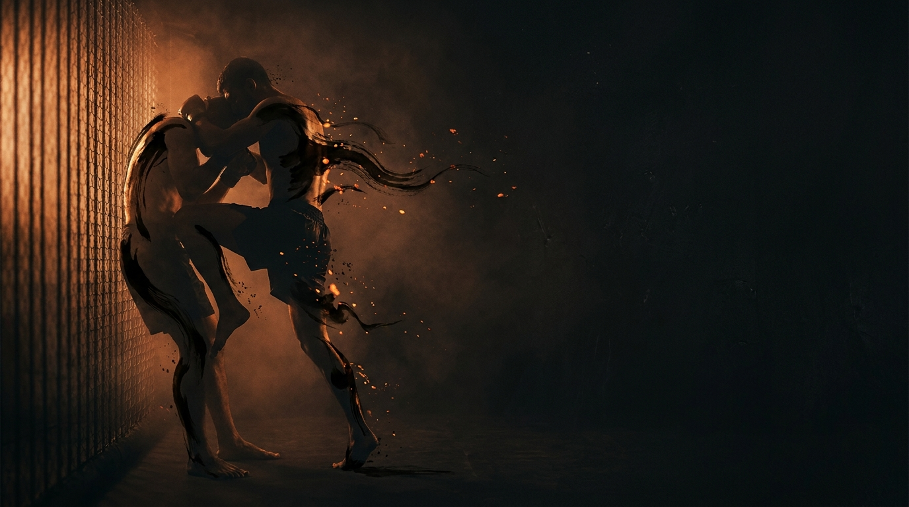

  
  
Wall · WrestlingWall Grinding

WallWrestlingOffensiveIntermediateExploit

Deal damage from wall control without losing the control — dirty boxing, knees and grinding while the pin holds.

  
Start<b>Attacker has wall control; defender pinned, ready to resist.</b>

  
→

  
The Goal<b>Attacker damages while holding the pin; defender escapes or nullifies it.</b>

  
→

  
Finish<b>Sustained damage → attacker wins, switch · Escape or nullify → defender wins, reset.</b>

  
Holding isn't the win — make the pin hurt.

  
Just holding doesn't count, but neither does winging shots that cost you position. <b>Control AND damage at once.</b>

What to Read

<b>Attune to</b> the <i>felt resistance to rotation through your grips and frames</i> — when the pin feels solid enough to free a hand for a knee or short shot, versus when striking would loosen control. That balance of load at the shoulders and hips specifies <i>when</i> damage is safe — not a fixed combination or a memorized rhythm.

The Starting Position

  
PlayersTwo — attacker grinding from control, defender resisting.

  
PositionEstablished wall control — shoulders flattened, hips controlled.

  
BoundaryWall or cage within a marked perimeter — no ground transition.

  
RolesAttacker controls and damages; defender escapes or nullifies the damage.

  
Start &amp; resetBegin from control; reset on escape, sufficient damage, or lost control.

The Matchup

  

    
🥊

    
Attacker

    
Trying to maintain wall control AND deal significant, sustained damage.

    Dirty boxing, knees and short elbows while the pin holds. Manage energy — grinding is work. Find openings without over-committing; if damage drops, control is too tight, if control drops, you over-committed to strikes.
  

  
VS

  

    
🛡️

    
Defender

    
Trying to escape the wall or nullify the damage output.

    Active resistance, not passive. Create frames to block strikes, work rotation escapes, nullify knee opportunities, and look for a reversal or escape.
  

The Rules

  💥 Damage requiredThe attacker must actually deal damage — just holding the pin doesn't count. The win is sustained output, multiple clean strikes, not a single shot.
  🧱 Stay on the wallNo transition to the ground. Staying on the wall is what distinguishes this game from Wall to Ground and keeps the focus on grinding.
  🏃 Defender resists activelyThe defender works real escapes and damage nullification, not passive shelling. Position resets if the attacker loses wall control completely.
  🤝 Controlled contactLight to moderate contact, knees especially controlled. This keeps the grinding safe during learning.
  ⬛ Stay inside the perimeterPlay happens against a wall or cage within a marked perimeter — any shape. Both players stay inside it.

How to Win

  
Attacker Sustained damage while holding control → attacker wins, switch.Sustained output — multiple clean strikes while holding control — not a single lucky shot. Controlling AND damaging at once is the skill being rewarded.

  
Defender Escape to space or nullify the damage → defender wins, reset.Either break free into open space, or shut the damage down long enough that grinding fails.

The Levels

  
1<b>Control + strikes</b>Short shots while holding.Attacker maintains control and works short strikes; defender defends and works escape. Focus: finding openings while controlling.

  
2<b>Add knees</b>Knees from the clinch.Knees from clinch position — more damaging but they require space creation. Focus: knee setups from the wall.

  
3<b>Defender strikes back</b>Two-way exchanges.Defender can strike from wall position; attacker must control while managing return fire. Focus: two-way wall exchanges.

  
4<b>Full MMA</b>Ground option opens.Attacker may transition to ground if advantageous; defender may shoot to escape. Focus: wall fighting under full MMA options.

Go Deeper

??? note "Task focus &amp; coaching cues"

    
Each role's job

    

      

🥊

Attacker

Maintain control (shoulders flat, hips controlled), find openings for knees and short punches, manage energy, deny escape while creating damage.

      

🛡️

Defender

Create frames to block strikes, work rotation escapes, nullify knee opportunities, find a reversal or escape.

    

    
Coaching cues

    

      

⚖️

Control AND damage

Ask: "Are you controlling AND damaging?" Many do one or the other. If damage drops, control is likely too tight; if control drops, they're over-committing to strikes.

      

🔋

Economical grinding

Grinding is work. Spend energy on openings that exist, not on muscling shots that cost position.

    

??? abstract "Constraints-Led analysis"

    
Constraints → Affordances

    

      
Must deal damage (not just hold)→Develops the control-to-damage skill

      
Stay on the wall→Distinguishes grinding from a ground transition

      
Multiple clean strikes to win→Rewards sustained output, not single shots

      
Progressive defender options→Scaffolds resistance from escape to striking back

      
Wall position with striking→Creates a true dirty-boxing environment

    

    
Implements <b>Constrain to Afford</b> (Renshaw et al., 2019) — <b>degeneracy</b> emerges as multiple damage solutions develop for the same control situation.

    
What the attacker reads

    

      

✋

Haptic

Control stability → when a strike is safe; defender's frame position → where openings exist.

      

👁️

Visual

Defender's guard → knee vs. punch opportunity; escape attempts → when to reinforce control.

      

🧭

Proprioceptive

Own balance and position → maintain structure while striking.

    

    
What we measure (order parameter)

    
Whether the attacker keeps the defender's <b>shoulders and hips pinned flat vs. free to rotate</b> while still landing strikes — track control time held against damage output. The press→pin-or-escape phase transition is the order parameter; the skill has formed when damage rises without the pin slackening.

    
Representativeness

    
<b>Models:</b> dirty boxing and grinding against the cage — the pressure-fighter's accumulation of damage while holding wall position.

    
Simplified: stay on wallprogressive defender optionscontrolled knee contact

    
An end-state game built on <a href="../wall-control/">Wall Control</a>; ground equivalent is <a href="../../concepts/tko-pin/">TKO Pin</a>.

    
Readiness to progress

    <ul class="emma-checklist">
      <li>Deals damage while maintaining control</li>
      <li>Finds openings consistently</li>
      <li>Knees land cleanly from position</li>
      <li>Manages energy effectively (doesn't gas)</li>
      <li>Can describe: "I found the opening when they…"</li>
    </ul>

    
Warning signs

    

      Just holds, no damage
      Loses position when striking
      Gasses quickly
      Knees miss consistently
    

??? note "Safety &amp; related games"

    

      🤝 Light-to-moderate contact — knees especially controlled
      🛑 Stop on excessive force or lost composure
      🔁 Reset if grinding becomes stalling
    

    
Where it sits

    

      
Prerequisite→<a href="../wall-control/">Wall Control</a> · <a href="../pressure-to-wall/">Pressure to Wall</a>

      
Follow-on→End-state game — no follow-on

      
Related→<a href="../../concepts/tko-pin/">TKO Pin</a> · <a href="../wall-to-ground/">Wall to Ground</a>

    

