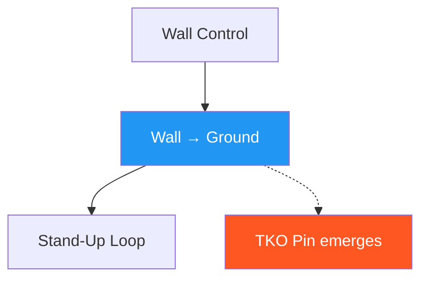

# Wall Pin → Ground Control

!!! info "Game Identity"
    - **Problem:** Converting vertical control to horizontal control
    - **Environment:** Wall → Ground
    - **Stage:** Stabilize → Exploit

This game teaches the **transition from standing wall control to ground control**. It is the first game where the ground becomes the dominant environment.

---

## Goal

This is an **asymmetric game** focused on positional transition.

| Role | Objective |
|------|-----------|
| **Attacker** | Bring opponent to ground safely and establish hip/shoulder control |
| **Defender** | Scramble during descent, use wall to stand, or exploit sloppy transitions |

The objective is **controlled transition**, not the takedown itself.

---

## Entry Condition

- Start from established wall pin (attacker has control)
- Defender's escape options are limited
- Attacker initiates transition to ground
- Reset if defender fully escapes to standing or attacker loses control completely

---

## Invariants

!!! danger "Safety-Critical Invariants"
    1. **No dumping bodyweight** — control precedes gravity
    2. **Off-balancing precedes descent** — takedown is created, not forced
    3. Scrambles are allowed and expected

---

## Key Logic: Controlled Descent vs Dumping

| Type | Characteristics | Outcome |
|------|-----------------|---------|
| **Controlled descent** | Connection maintained, base compromised first, attacker lands in position | Attacker advantage |
| **Dumping** | Bodyweight or momentum forces descent, control lost | Scramble favors defender |

The game explicitly rewards controlled descent and punishes dumping through scramble outcomes.

### The Scramble Window

The transition from wall to ground creates a **scramble window** — a period where control is contested.

During this window:

- Both athletes have opportunities
- Posture and balance determine outcomes
- DNS threats are most dangerous

Athletes learn to **shorten the scramble window** (attackers) or **exploit it** (defenders).

### Ground Control Criteria

Ground control is established when:

- [x] Attacker controls defender's hips and shoulders
- [x] Defender cannot easily stand or reverse
- [x] Position is stable for 2–3 seconds

!!! note "Lower Threshold than TKO Pin"
    This represents **control**, not **dominance**.

---

## Win Conditions

| Role | Win Condition |
|------|---------------|
| Attacker | Controlled hip and shoulder control on ground (2–3 seconds) |
| Defender | Scramble (return to neutral), stand-up (using wall), or reversal |

---

## Levels

=== "Level 1 — Controlled Descent"
    - Focus on bringing opponent to ground safely
    - No strikes
    - Success = descent with maintained connection

=== "Level 2 — Deny Scramble"
    - Defender actively scrambles during descent
    - Attacker must follow and establish control
    - Success = control despite scramble attempt

=== "Level 3 — Establish TKO Pin Threat"
    - After ground control, attacker works toward TKO pin access
    - Strike threats become available
    - Introduces the exploitation layer

---

## Advanced Expressions (Coach Context)

**For attackers:**

- Descent timing becomes intuitive
- Scramble anticipation improves
- Control on ground emerges immediately from transition
- TKO pin access becomes available directly from descent

**For defenders:**

- Scramble timing becomes precise
- Wall-assisted recovery becomes instinctive
- DNS threats become tactical rather than desperate
- Early posting prevents uncontrolled descent entirely

---

## System Position

This is the **first environment transition game** in the system.

---

!!! abstract "System Evolution Notice"
    Descent mechanics may evolve for safety or realism.
