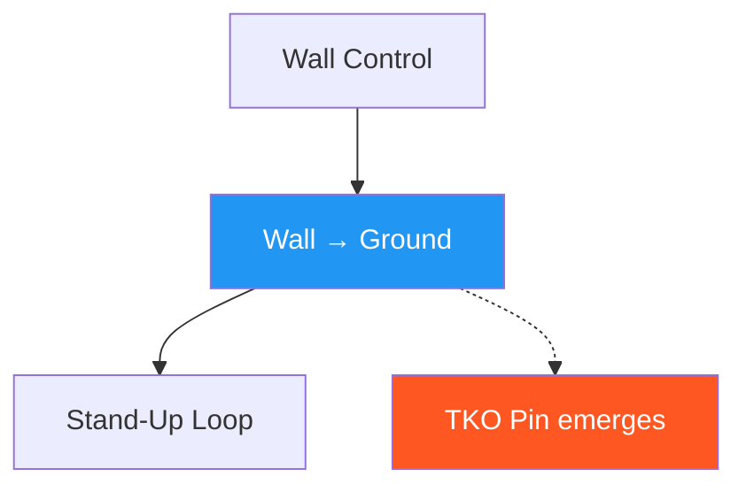

# Wall Pin → Ground Control

!!! info "Game Identity"
    - **Problem:** Converting vertical control to horizontal control
    - **Environment:** Wall → Ground
    - **Stage:** Stabilize → Exploit

This game teaches the **transition from standing wall control to ground control**. It is the first game where the ground becomes the dominant environment.

---

## Goal

This is an **asymmetric game** focused on positional transition.

| Role | Objective |
|------|-----------|
| **Attacker** | Bring opponent to ground safely and establish hip/shoulder control |
| **Defender** | Scramble during descent, use wall to stand, or exploit sloppy transitions |

The objective is **controlled transition**, not the takedown itself.

---

## Entry Condition

- Start from established wall pin (attacker has control)
- Defender's escape options are limited
- Attacker initiates transition to ground
- Reset if defender fully escapes to standing or attacker loses control completely

---

## Invariants

!!! danger "Safety-Critical Invariants"
    1. **No dumping bodyweight** — control precedes gravity
    2. **Off-balancing precedes descent** — takedown is created, not forced
    3. Scrambles are allowed and expected

---

## Key Logic: Controlled Descent vs Dumping

| Type | Characteristics | Outcome |
|------|-----------------|---------|
| **Controlled descent** | Connection maintained, base compromised first, attacker lands in position | Attacker advantage |
| **Dumping** | Bodyweight or momentum forces descent, control lost | Scramble favors defender |

The game explicitly rewards controlled descent and punishes dumping through scramble outcomes.

### The Scramble Window

The transition from wall to ground creates a **scramble window** — a period where control is contested.

During this window:

- Both athletes have opportunities
- Posture and balance determine outcomes
- DNS threats are most dangerous

Athletes learn to **shorten the scramble window** (attackers) or **exploit it** (defenders).

### Ground Control Criteria

Ground control is established when:

- [x] Attacker controls defender's hips and shoulders
- [x] Defender cannot easily stand or reverse
- [x] Position is stable for 2–3 seconds

!!! note "Lower Threshold than TKO Pin"
    This represents **control**, not **dominance**.

---

## Win Conditions

| Role | Win Condition |
|------|---------------|
| Attacker | Controlled hip and shoulder control on ground (2–3 seconds) |
| Defender | Scramble (return to neutral), stand-up (using wall), or reversal |

---

## Levels

=== "Level 1 — Controlled Descent"
    - Focus on bringing opponent to ground safely
    - No strikes
    - Success = descent with maintained connection

=== "Level 2 — Deny Scramble"
    - Defender actively scrambles during descent
    - Attacker must follow and establish control
    - Success = control despite scramble attempt

=== "Level 3 — Establish TKO Pin Threat"
    - After ground control, attacker works toward TKO pin access
    - Strike threats become available
    - Introduces the exploitation layer

=== "Level 4 — Full MMA Expression"
    - Light strikes permitted throughout transition
    - Attacker can use strikes to set up takedown and maintain control
    - Defender can use strikes during scramble window
    - Focus: Wall-to-ground transition under realistic striking pressure
    - See: [Full MMA Expression](../concepts/full-mma-expression.md)

---

## Constraints Analysis

*How this game applies the [Constraints-Led Approach](../principles/cla/index.md)*

| Constraint Type | Constraint | Affordance Created |
|-----------------|------------|-------------------|
| **Task** | Control precedes gravity (no dumping) | Develops controlled descent, not forcing |
| **Task** | Off-balancing precedes descent | Creates earned takedowns |
| **Task** | Scrambles allowed and expected | Realistic transition dynamics |
| **Task** | Ground control criteria (hips + shoulders, 2-3 seconds) | Clear success definition |
| **Individual** | Prerequisite: Wall Control | Has wall pin skill |
| **Environmental** | Wall → Ground transition | First environment change game |

!!! info "Theoretical Foundation"
    This game develops **transition affordance perception**—reading when descent is available (base compromised) vs. when it must be forced. The "control precedes gravity" constraint prevents dumping and develops safe, controlled transitions. The **scramble window** becomes a key learning arena where both athletes explore solutions under dynamic conditions (Renshaw et al., 2019).

---

## Information Structure

*What athletes must perceive to succeed (perception-action coupling)*

### Attacker Perceives

| Information Source | What to Read | Action It Supports |
|--------------------|--------------|-------------------|
| **Haptic** | Defender's base stability | When descent is available |
| **Haptic** | Connection quality during descent | Where to follow |
| **Visual** | Defender's scramble direction | Anticipate and counter |
| **Proprioceptive** | Own balance during transition | Controlled vs. falling |

### Defender Perceives

| Information Source | What to Read | Action It Supports |
|--------------------|--------------|-------------------|
| **Haptic** | Attacker's descent initiation | Scramble timing |
| **Haptic** | Connection quality | Exploit gaps |
| **Visual** | Wall position | Stand-up opportunity |
| **Visual** | Attacker's head position | DNS during scramble |

!!! tip "Coaching Cue"
    Ask attackers: "Was their base compromised before you went?" This develops the key perception—controlled descent requires reading balance, not forcing through strength.

---

## Representativeness

*How this game models real MMA situations*

### Real MMA Situation

Taking an opponent from cage to ground—a common MMA transition requiring controlled technique.

### How This Game Represents It

| Element | Real MMA | This Game | Fidelity |
|---------|----------|-----------|----------|
| **Controlled descent** | Required for advantage | Same | High |
| **Scramble window** | Critical transition period | Same | High |
| **DNS threats** | Most dangerous during scramble | Same | High |
| **Ground control** | Hips and shoulders | Same | High |
| **Strikes** | Available throughout | Progressive by level | Scaffolded |

### Simplifications & Justification

| Simplification | Why Acceptable |
|----------------|----------------|
| Start from wall pin | Isolates transition from access |
| No strikes at Level 1 | Develops mechanics first |
| 2-3 second control criteria | Ensures stable control, not momentary |

!!! note "Transfer Expectation"
    Wall-to-ground transitions developed here transfer directly to MMA. The perception of "base compromised" and scramble window management are identical in competition.

---

## Variability Guidelines

*Creating "repetition without repetition" (Bernstein, 1967)*

### Within-Level Variability

| Vary This | How | Maintains |
|-----------|-----|-----------|
| **Takedown type** | Trips, lifts, pulls | Multiple descent solutions |
| **Defender resistance** | Passive, scrambling, explosive | Transition adaptability |
| **Defender size** | Larger, smaller, equal | Adaptability |
| **Wall angle** | Flat, corner, curved | Environmental variety |
| **Intensity** | Drilling pace, live pace | Pressure calibration |

### What NOT to Vary

| Keep Constant | Why |
|---------------|-----|
| Control precedes gravity | Core safety and skill principle |
| Off-balancing precedes descent | Prevents forcing |
| Controlled landings | Safety |

### Progressing Through Levels

| Signal to Progress | Meaning |
|--------------------|---------|
| Controlled descents consistently | Core principle understood |
| Wins scrambles | Transition skill developing |
| Ground control established quickly | Ready for exploitation |

---

## Readiness Indicators

*When is the athlete ready to advance?*

### Ready for Next Level When

- [ ] Descents are controlled (not dumped)
- [ ] Connection maintained through transition
- [ ] Scrambles won consistently
- [ ] Ground control established in 2-3 seconds
- [ ] Can articulate: "I felt their base go so I..."

### Ready to Exit Game When

- [ ] Level 2+ competence (denies scrambles effectively)
- [ ] Transition timing is instinctive
- [ ] Ready to add exploitation (TKO pin threat)
- [ ] Wall-to-ground appears in sparring

### Warning Signs (Not Ready to Progress)

| Sign | Meaning | Response |
|------|---------|----------|
| Dumps opponents | Not reading base compromise | Slow down, emphasize control |
| Loses position in scramble | Follow-through lacking | More reps on scramble denial |
| Gets DNS'd during descent | Head position neglected | Focus on posture maintenance |
| Controlled but not controlling | Transition incomplete | Focus on immediate ground establishment |

---

## Advanced Expressions (Coach Context)

**For attackers:**

- Descent timing becomes intuitive
- Scramble anticipation improves
- Control on ground emerges immediately from transition
- TKO pin access becomes available directly from descent

**For defenders:**

- Scramble timing becomes precise
- Wall-assisted recovery becomes instinctive
- DNS threats become tactical rather than desperate
- Early posting prevents uncontrolled descent entirely

---

## System Position

This is the **first environment transition game** in the system.

---

!!! abstract "System Evolution Notice"
    Descent mechanics may evolve for safety or realism.
