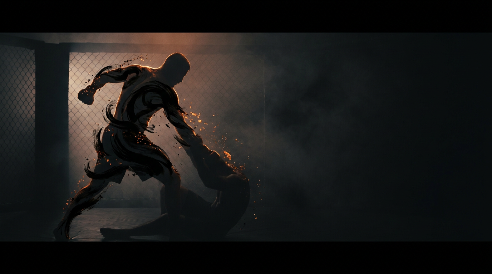

  
  
Wall → Ground · WrestlingWall Pin → Ground Control

Wall → GroundWrestlingOffensiveIntermediateStabilize → Exploit

Convert vertical control into horizontal, bring the opponent down from the wall pin and land in hip-and-shoulder control.

  
Start<b>Established wall pin, attacker in control, defender's escapes limited.</b>

  
→

  
The Goal<b>Attacker brings them down with control intact; defender scrambles, stands, or exploits a sloppy descent.</b>

  
→

  
Finish<b>Hip + shoulder control for 2–3s → attacker wins · Scramble, stand, or reverse → defender wins.</b>

  
The takedown isn't the point,  the controlled descent is.

  
Off-balance first, then descend with connection intact. <b>Control precedes gravity, never dump bodyweight.</b>

Key Positions

  🧱 Wall pinAt least two points of pinning control, the hips and upper body held immobile and flat to the wall. If the shoulders can still rotate, it's pressure, not a pin.

What to Read

<b>Attune to</b> the <i>felt resistance to rotation through your grips, and the moment the opponent's base goes</i>, the load through the clinch that tells you their weight is committed and a descent is available, versus when it must be forced. That changing resistance specifies <i>when</i> to go and <i>where</i> the weight wants to fall, not a memorized takedown entry.

The Starting Position

  
PlayersTwo, attacker transitioning to ground, defender contesting the descent.

  
PositionEstablished wall pin, defender's escapes already limited.

  
BoundaryWall or cage within a marked perimeter, transitioning onto mats.

  
RolesAttacker brings them down and establishes ground control; defender scrambles, stands off the wall, or exploits a sloppy transition.

  
Start &amp; resetAttacker initiates from the pin; reset on full stand-up escape or lost control.

The Matchup

  

    
🤼

    
Attacker

    
Trying to bring the opponent to ground safely and establish hip and shoulder control.

    Off-balance first, then descend, control precedes gravity, no dumping bodyweight. Shorten the scramble window and land in control, not on top of a scramble.
  

  
VS

  

    
🛡️

    
Defender

    
Trying to scramble during the descent, use the wall to stand, or exploit sloppy transitions.

    The transition opens a scramble window, exploit it. Use the wall to stand, attack a dropping head with DNS during the descent, or beat the attacker to control.
  

The Rules

  🛑 No dumping bodyweight<strong>Safety-critical, prescriptive.</strong> Control precedes gravity, the attacker may not force the descent by dropping bodyweight or momentum. Connection stays maintained all the way down.
  ⚖️ Off-balance before descent<strong>Prescriptive.</strong> The takedown is created, not forced, the base must be compromised before the descent begins.
  🌀 Scrambles allowedScrambles are expected during the transition. The scramble window is a contested period where both athletes have opportunities.
  ⏱️ 2–3 second ground controlGround control means hips and shoulders controlled, stable for 2–3 seconds, a control threshold, lower than a TKO pin's dominance.
  ⬛ Stay inside the perimeterPlay happens against a wall or cage within a marked perimeter, any shape, transitioning onto mats. Both players stay inside it.

How to Win

  
Attacker Hip + shoulder control held 2–3s → attacker wins.The defender can't easily stand or reverse, and the position is stable. This is control, not yet dominance.

  
Defender Scramble to neutral, stand off the wall, or reverse → defender wins.Any of the three exits the position before the attacker can consolidate control.

The Levels

  
1<b>Controlled descent</b>Bring them down safely.No strikes. Success is a descent with maintained connection, the controlled-descent mechanic itself.

  
2<b>Deny scramble</b>Follow and control.Defender actively scrambles during descent; attacker must follow and establish control. Success is control despite the scramble attempt.

  
3<b>TKO pin threat</b>Add the exploit layer.After ground control, attacker works toward TKO pin access; strike threats become available. Introduces the exploitation layer.

  
4<b>Full MMA</b>Strikes throughout.Light strikes throughout the transition, attacker to set up and maintain control, defender during the scramble window. Wall-to-ground under realistic striking pressure.

Go Deeper

??? note "Task focus &amp; coaching cues"

    
Each role's job

    

      

🤼

Attacker

Off-balance, then descend with connection maintained; shorten the scramble window; establish hip and shoulder control immediately on landing.

      

🛡️

Defender

Exploit the scramble window, use the wall to stand, attack a dropping head, or beat the attacker to control.

    

    
Coaching cues

    

      

⚖️

Base compromised?

Ask attackers: "Was their base compromised before you went?" Controlled descent requires reading balance, not forcing through strength.

      

🌀

Scramble window

The transition is a contested window, posture and balance decide it, and DNS threats are most dangerous here. Attackers shorten it; defenders exploit it.

    

??? abstract "Constraints-Led analysis"

    
Constraints → Affordances

    

      
Control precedes gravity (no dumping)→Develops controlled descent, not forcing

      
Off-balance before descent→Creates earned, not forced, takedowns

      
Scrambles allowed and expected→Realistic transition dynamics

      
2–3s hip + shoulder control→Clear success definition

      
Wall → ground transition→First environment-change game

    

    
Implements <b>Constrain to Afford</b> (Renshaw et al., 2019), develops transition-affordance perception: reading when descent is <i>available</i> versus when it must be forced. The scramble window becomes a shared learning arena.

    
What the players read

    

      

✋

Haptic

Attacker: defender's base stability → when descent is available; connection quality → where to follow. Defender: descent initiation → scramble timing.

      

👁️

Visual

Attacker: scramble direction → anticipate and counter. Defender: wall position → stand-up; attacker head → DNS during scramble.

      

🧭

Proprioceptive

Attacker: own balance during transition → controlled vs. falling.

    

    
What we measure (order parameter)

    
Whether the attacker keeps the opponent's <b>shoulders and hips pinned flat vs. free to rotate</b> through the descent and into the landing, track whether control survives the scramble window. The press→pin-or-scramble phase transition is the order parameter; the skill has formed when controlled descents consistently end in immediate control.

    
Representativeness

    
<b>Models:</b> taking an opponent from cage to ground, controlled descent, scramble-window management, and DNS threats, identical to competition.

    
Simplified: start from pinno strikes at L12–3s control criteria

    
First environment-transition game; builds on <a href="../wall-control/">Wall Control</a> and feeds <a href="../standup-loop/">Stand-Up Loop</a>.

    
Readiness to progress

    <ul class="emma-checklist">
      <li>Descents are controlled, not dumped</li>
      <li>Connection maintained through the transition</li>
      <li>Scrambles won consistently</li>
      <li>Ground control established in 2–3 seconds</li>
      <li>Can describe: "I felt their base go so I…"</li>
    </ul>

    
Warning signs

    

      Dumps opponents
      Loses position in the scramble
      Gets DNS'd during descent
      Controlled but not controlling
    

??? note "Safety &amp; related games"

    

      🤝 Controlled landings, no dumping bodyweight
      🛑 Stop on uncontrolled descent or slam
      🔁 Reset if the attacker forces through strength
    

    
Where it sits

    

      
Prerequisite→<a href="../wall-control/">Wall Control</a>

      
Follow-on→<a href="../standup-loop/">Stand-Up Loop</a> · TKO Pin emerges

      
Related→<a href="../../concepts/tko-pin/">TKO Pin</a> · <a href="../../concepts/full-mma-expression/">Full MMA Expression</a>

    

