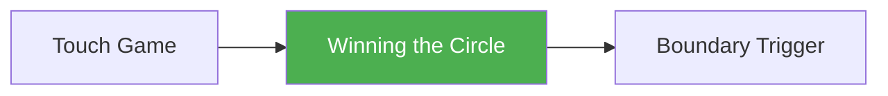

# Winning the Circle

!!! info "Game Identity"
    - **Problem:** Space domination and engagement denial
    - **Environment:** Open Space
    - **Stage:** Access

This is the **primary space-control game** in the system. It teaches athletes to manage distance through movement and pressure rather than through blocking or absorbing strikes.

---

## Goal

This is an **asymmetric game** with distinct roles.

| Role | Objective |
|------|-----------|
| **Outside Player (Attacker)** | Apply pressure to control space and limit escape routes |
| **Inside Player (Defender)** | Maintain access to open space and avoid being crowded |

The objective is **spatial control**, not damage accumulation.

---

## Entry Condition

- Both players start in open space
- A visible or imagined circular boundary exists (training ring, tape, cones)
- Roles are assigned and may switch between rounds
- Reset to neutral distance after each boundary violation

---

## Invariants

1. No clinching
2. No takedowns
3. Movement is continuous — static exchanges reset

---

## Task Focus

### Outside Player (Attacker)

- Apply intelligent forward pressure
- Use footwork, feints, and probing strikes
- Corral opponent toward boundary
- Cut off lateral escape routes

### Inside Player (Defender)

- Maintain space through movement
- Avoid being crowded or flattened against boundary
- Minimize need for physical blocking by positional accuracy
- Recognize when space is shrinking

!!! question "Key Internal Questions"
    - "Am I controlling the center or being pushed to the edge?"
    - "Can I escape laterally, or are my routes being cut?"
    - "Is my pressure creating reactions, or am I just chasing?"

---

## Legal Actions

- **Strikes:** Light punches and kicks allowed
- **Submissions:** None
- **Wrestling:** None

No flurries (max 2–3 strike sequences). Strikes are informational — they measure distance and create reactions, not damage.

---

## Key Logic: Pressure vs Chasing

!!! warning "Critical Distinction"

    Effective pressure **limits options**. Chasing **follows the opponent**.

**Signs of chasing:**

- Lunging forward without cutting angles
- Reacting to movement instead of anticipating it
- Losing balance or posture during pursuit

**Signs of pressure:**

- Opponent's movement becomes predictable
- Escape routes visibly shrink
- Attacker maintains composure and structure

The game rewards **intelligent pressure** and punishes **mindless aggression**.

---

## Win Conditions

| Role | Win Condition |
|------|---------------|
| Attacker | Defender steps out of the circle |
| Defender | Time expires without boundary violation |

Typical round length: 60–90 seconds.

---

## Levels

=== "Level 1 — Movement Only"
    - No strikes
    - Pure footwork and spatial awareness
    - Focus on angles, not speed

=== "Level 2 — Add Light Strikes"
    - Punches and kicks permitted
    - Strikes used to create movement, not damage
    - Defender learns to move without flinching

=== "Level 3 — Feints and Stance Manipulation"
    - Feints count as pressure tools
    - Stance switches and level changes permitted
    - Attacker learns to create false reads

=== "Level 4 — Full MMA Expression"
    - Moderate strike contact permitted (not just touch)
    - Counter-striking fully allowed
    - Attacker must manage space while respecting counter threat
    - Defender can counter-attack to regain space
    - Focus: Space control under realistic striking pressure
    - See: [Full MMA Expression](../concepts/full-mma-expression.md)

---

## Advanced Expressions (Coach Context)

As athletes develop, the game reveals deeper layers:

**For attackers:**

- Pressure becomes rhythmic rather than constant
- Feints create more movement than real strikes
- Cutting angles becomes instinctive

**For defenders:**

- Movement becomes smaller and more efficient
- Circling transitions to pivoting
- Counter-striking opportunities emerge naturally

!!! tip "Advanced Insight"
    At advanced levels, the boundary becomes less relevant — the athlete has internalized spatial awareness. The game can then transition to open sparring with spatial goals.

---

## Safety

- **Contact limits:** Touch or light strikes only
- **Stop conditions:** Any loss of control, chasing collisions, or boundary disputes
- **Coach intervention:** Reset if exchanges become static or if pressure degrades into aggression

---

## System Position

- **Prerequisite:** Touch and Don't Get Touched
- **Leads to:** Winning the Circle — Boundary Trigger
- **Related concepts:** Defensive Solutions in Striking, Hand Controls

---

!!! abstract "System Evolution Notice"
    This game may be refined as space-management principles evolve.
