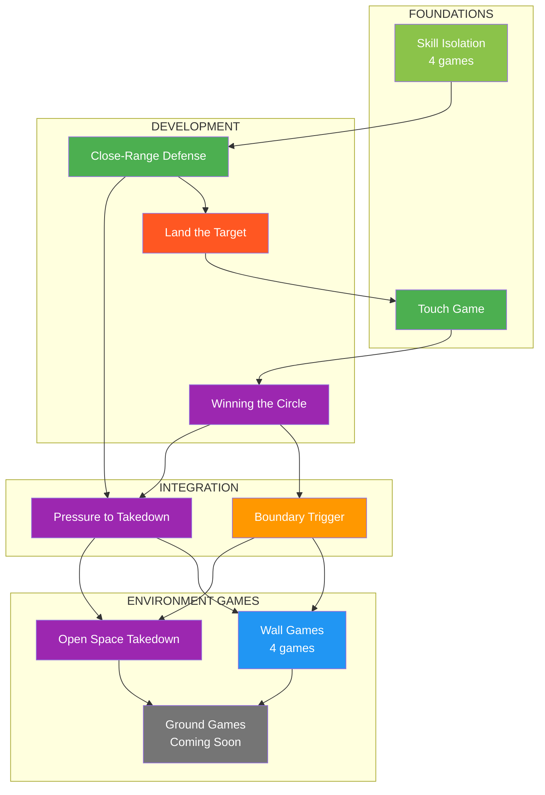

# Ecological MMA Games System

A constraints-led, game-based training framework for MMA.

---

## What Is This?

This is a **complete training system** built on one insight: **MMA is a decision game, not a technique collection.**

Instead of drilling techniques in isolation, athletes solve problems through structured games. The environment does the teaching. Correct behavior emerges from constraints, not coaching cues.

**15 games. 4 environments. Infinite combinations.**

---

## Quick Start

!!! tip "New to the System?"

    **Step 1:** Read the [Training Mindset](principles/training-mindset.md) — this changes everything.

    **Step 2:** Start with a foundational game:

    | If you want to work on... | Start here |
    |---------------------------|------------|
    | Striking defense | [Parry the Straight](games/parry-the-straight.md) or [Slip the Straight](games/slip-the-straight.md) |
    | Striking offense | [Land the Target](games/land-the-target.md) |
    | Range and timing | [Touch and Don't Get Touched](games/touch-game.md) |
    | Space control | [Winning the Circle](games/winning-circle.md) |
    | Wall work | [Wall Control](games/wall-control.md) |

    **Step 3:** Use the [Game Finder](#find-your-game) below to discover more.

---

## Core Philosophy

### Games, Not Drills

| Traditional Drilling | Ecological Games |
|---------------------|------------------|
| Coach prescribes technique | Athlete discovers solutions |
| Repetition of fixed movements | Exploration of possibilities |
| "Do it like this" | "Solve this problem" |
| Isolated from context | Representative of real fighting |

### The Four Decision States

Every MMA interaction maps to one of four states:

| State | The Question | Example |
|-------|--------------|---------|
| **Access** | Can I connect? | Closing distance, entering clinch |
| **Stabilize** | Can I control? | Establishing pin, controlling hips |
| **Exploit** | Can I damage? | Strikes from control, submissions |
| **Counter** | Can I escape or reverse? | Escapes, scrambles, reversals |

### Control Before Damage

Across all environments: **control precedes striking**. Stability before exploitation. This is non-negotiable.

### Full MMA Expression

Every game has a pathway to [Full MMA Expression](concepts/full-mma-expression.md) — the highest level where cross-domain threats are added. Striking games add grappling threats. Grappling games add striking threats. Lower levels build skill; highest levels test it under MMA reality.

---

## Find Your Game

=== "By Environment"

    **Skill Isolation** — Single-skill focus, constrained options

    - [Parry the Straight](games/parry-the-straight.md) — Deflect straight punches
    - [Tight Block](games/tight-block.md) — Absorb strikes on guard
    - [Slip the Straight](games/slip-the-straight.md) — Evade with head movement
    - [Evade the Punch](games/evade-the-punch.md) — Match evasion to punch type

    **Open Space** — Standing, unrestricted movement

    - [Touch and Don't Get Touched](games/touch-game.md) — Range and timing literacy
    - [Close-Range Defense](games/close-range-defense.md) — Layered defensive solutions
    - [Land the Target](games/land-the-target.md) — Offensive target selection
    - [Winning the Circle](games/winning-circle.md) — Space domination
    - [Boundary Trigger](games/boundary-trigger.md) — Clinch recognition
    - [Pressure to Takedown](games/pressure-to-takedown.md) — Strike-to-takedown chains
    - [Open Space Takedown](games/open-space-takedown.md) — Takedowns without wall

    **Wall** — Vertical constraint, limited retreat

    - [Wall Control](games/wall-control.md) — Establish the pin
    - [Wall Escape](games/wall-escape.md) — Break the pin
    - [Wall Pin to Ground](games/wall-to-ground.md) — Transition to ground
    - [Stand-Up Loop](games/standup-loop.md) — Cyclical position battles

=== "By Focus"

    **Defensive** — Defender is primary learner

    - Parry the Straight, Tight Block, Slip the Straight, Evade the Punch
    - Close-Range Defense, Wall Escape

    **Offensive** — Attacker is primary learner

    - Land the Target, Pressure to Takedown
    - Wall Control, Wall Pin to Ground

    **Combined** — Both sides learning simultaneously

    - Touch Game, Winning the Circle, Boundary Trigger
    - Open Space Takedown, Stand-Up Loop

=== "By Difficulty"

    **Beginner** — Start here

    - Parry the Straight, Tight Block, Slip the Straight
    - Touch Game, Winning the Circle

    **Intermediate** — Build on foundations

    - Evade the Punch, Close-Range Defense, Land the Target
    - Boundary Trigger, Open Space Takedown
    - Wall Control, Wall Escape, Wall Pin to Ground

    **Advanced** — Full integration

    - Pressure to Takedown, Stand-Up Loop

---

## System Navigation

| Section | What You'll Find |
|---------|------------------|
| [System Map](system/map.md) | Visual overview of all games and connections |
| [Games Library](games/index.md) | Complete catalog with filters |
| [Concepts](concepts/defensive-solutions.md) | Key ideas that span multiple games |
| [Coach Tools](tools/safety.md) | Safety, assessment, session planning |
| [Prerequisites](reference/prerequisites.md) | Game progression pathways |
| [FAQ](reference/faq.md) | Common questions and troubleshooting |

---

## The System at a Glance

---

## Guiding Principles

1. **The environment teaches** — Design constraints, not techniques
2. **Control before damage** — Stability precedes exploitation
3. **Offense needs defense** — Every attack has a counter
4. **Struggle is learning** — Difficulty is the point
5. **Games are academic** — Learning matters more than winning

---

!!! abstract "System Evolution"
    This framework is intentionally non-dogmatic. Concepts refine, definitions update, games reorganize. The requirements: ecological validity, internal consistency, safety, and clarity.
