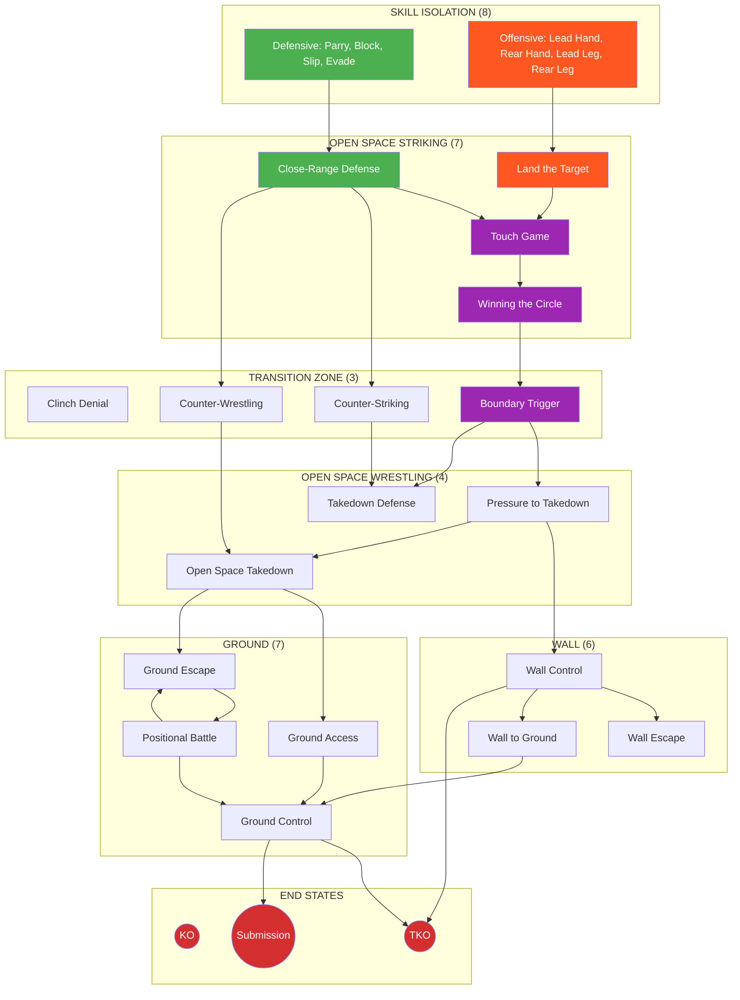

# Ecological MMA Games System

A constraints-led, game-based training framework for MMA.

---

## What Is This?

This is a **complete training system** built on one insight: **MMA is a decision game, not a technique collection.**

Instead of drilling techniques in isolation, athletes solve problems through structured games. The environment does the teaching. Correct behavior emerges from constraints, not coaching cues.

**35 games. 5 environments. All paths lead to finish.**

---

## Quick Start

!!! tip "New to the System?"

    **Step 1:** Read the [Training Mindset](principles/training-mindset.md) — this changes everything.

    **Step 2:** Start with a foundational game:

    | If you want to work on... | Start here |
    |---------------------------|------------|
    | Striking defense | [Parry the Straight](games/parry-the-straight.md) or [Slip the Straight](games/slip-the-straight.md) |
    | Striking offense | [Lead Hand Offense](games/lead-hand-offense.md) or [Land the Target](games/land-the-target.md) |
    | Range and timing | [Touch and Don't Get Touched](games/touch-game.md) |
    | Space control | [Winning the Circle](games/winning-circle.md) |
    | Wall work | [Wall Control](games/wall-control.md) |
    | Ground work | [Ground Escape](games/ground-escape.md) or [Ground Access](games/ground-access.md) |

    **Step 3:** Check the [Prerequisite Map](reference/prerequisites.md) for progression pathways.

---

## Core Philosophy

### Games, Not Drills

| Traditional Drilling | Ecological Games |
|---------------------|------------------|
| Coach prescribes technique | Athlete discovers solutions |
| Repetition of fixed movements | Exploration of possibilities |
| "Do it like this" | "Solve this problem" |
| Isolated from context | Representative of real fighting |

### The Fight Philosophy

**Finish the fight while taking as little damage as possible.**

Every game in this system ultimately leads to one of three endings:

| End State | How It Happens |
|-----------|----------------|
| **Knockout (KO)** | Striking → Sustained Offense → Finish |
| **TKO** | Control → Wall Grinding or Ground Control → Damage accumulation |
| **Submission** | Control → Ground Control or Defensive Submission → Tap |

See: [Fight Philosophy](concepts/fight-philosophy.md)

### Full MMA Expression

Every game has a highest level called [Full MMA Expression](concepts/full-mma-expression.md) where cross-domain threats are added. Striking games add grappling threats. Grappling games add striking threats. Lower levels build skill; highest levels test it under MMA reality.

---

## The System at a Glance

**Legend:** 🟢 Defensive | 🟠 Offensive | 🟣 Combined | 🔴 Finish

For the complete map with all 35 games, see [System Map](system/map.md).

---

## Find Your Game

=== "By Environment"

    **Skill Isolation (8 games)** — Single-skill focus

    - Defensive: [Parry](games/parry-the-straight.md), [Block](games/tight-block.md), [Slip](games/slip-the-straight.md), [Evade](games/evade-the-punch.md)
    - Offensive: [Lead Hand](games/lead-hand-offense.md), [Rear Hand](games/rear-hand-offense.md), [Lead Leg](games/lead-leg-offense.md), [Rear Leg](games/rear-leg-offense.md)

    **Open Space — Striking (7 games)**

    - [Touch Game](games/touch-game.md), [Winning the Circle](games/winning-circle.md)
    - [Close-Range Defense](games/close-range-defense.md), [Evasive Movement](games/evasive-movement.md), [Counter-Striking](games/counter-striking.md)
    - [Land the Target](games/land-the-target.md), [Sustained Offense](games/sustained-offense.md)

    **Transition Zone (3 games)**

    - [Clinch Denial](games/clinch-denial.md), [Counter-Wrestling](games/counter-wrestling.md), [Boundary Trigger](games/boundary-trigger.md)

    **Open Space — Wrestling (4 games)**

    - [Takedown Defense](games/takedown-defense.md), [Pressure to Takedown](games/pressure-to-takedown.md)
    - [Pressure to Wall](games/pressure-to-wall.md), [Open Space Takedown](games/open-space-takedown.md)

    **Wall (6 games)**

    - [Wall Control](games/wall-control.md), [Wall Escape](games/wall-escape.md), [Wall Defensive Submission](games/wall-defensive-submission.md)
    - [Wall to Ground](games/wall-to-ground.md), [Wall Grinding](games/wall-grinding.md), [Stand-Up Loop](games/standup-loop.md)

    **Ground (7 games)**

    - [Ground Access](games/ground-access.md), [Ground Control](games/ground-control.md)
    - [Ground Escape](games/ground-escape.md), [Leg Reclaim](games/leg-reclaim.md), [Ground to Standing](games/ground-to-standing.md), [Ground Defensive Submission](games/ground-defensive-submission.md)
    - [Positional Battle](games/positional-battle.md)

=== "By Focus"

    **Defensive (17 games)** — Defender is primary learner

    - Skill Isolation: Parry, Block, Slip, Evade
    - Striking: Close-Range Defense, Evasive Movement, Counter-Striking
    - Transition: Clinch Denial, Counter-Wrestling
    - Wrestling: Takedown Defense
    - Wall: Wall Escape, Wall Defensive Submission
    - Ground: Ground Escape, Leg Reclaim, Ground to Standing, Ground Defensive Submission

    **Offensive (12 games)** — Attacker is primary learner

    - Skill Isolation: Lead Hand, Rear Hand, Lead Leg, Rear Leg
    - Striking: Land the Target, Sustained Offense
    - Wrestling: Pressure to Takedown, Pressure to Wall
    - Wall: Wall Control, Wall to Ground, Wall Grinding
    - Ground: Ground Access, Ground Control

    **Combined (6 games)** — Both sides have distinct objectives

    - Striking: Touch Game, Winning the Circle
    - Transition: Boundary Trigger
    - Wrestling: Open Space Takedown
    - Wall: Stand-Up Loop
    - Ground: Positional Battle

=== "By Difficulty"

    **Beginner** — Start here

    - Parry the Straight, Tight Block, Slip the Straight
    - Lead Hand Offense, Rear Hand Offense
    - Touch Game, Winning the Circle

    **Intermediate** — Build on foundations

    - Evade the Punch, Close-Range Defense, Land the Target
    - Evasive Movement, Counter-Striking, Sustained Offense
    - Clinch Denial, Counter-Wrestling, Boundary Trigger
    - Takedown Defense, Open Space Takedown
    - Wall Control, Wall Escape, Wall to Ground, Wall Grinding
    - Ground Access, Ground Control, Ground Escape, Leg Reclaim, Ground to Standing, Positional Battle

    **Advanced** — Full integration

    - Lead Leg Offense, Rear Leg Offense
    - Pressure to Takedown, Pressure to Wall
    - Wall Defensive Submission, Stand-Up Loop
    - Ground Defensive Submission

---

## System Navigation

| Section | What You'll Find |
|---------|------------------|
| [System Map](system/map.md) | Visual overview of all 35 games and connections |
| [Games Library](games/index.md) | Complete catalog with filters |
| [Concepts](concepts/fight-philosophy.md) | Key ideas: Fight Philosophy, Decision States, TKO Pin |
| [Coach Tools](tools/safety.md) | Safety, assessment, session planning |
| [Prerequisites](reference/prerequisites.md) | Game progression pathways |
| [FAQ](reference/faq.md) | Common questions and troubleshooting |

---

## Guiding Principles

1. **The environment teaches** — Design constraints, not techniques
2. **Finish while minimizing damage** — The fight philosophy
3. **Offense needs defense** — Every attack has a counter
4. **Struggle is learning** — Difficulty is the point
5. **Games are academic** — Learning matters more than winning

---

!!! abstract "System Evolution"
    This framework is intentionally non-dogmatic. Concepts refine, definitions update, games reorganize. See the [Change Log](reference/changelog.md) for version history.
