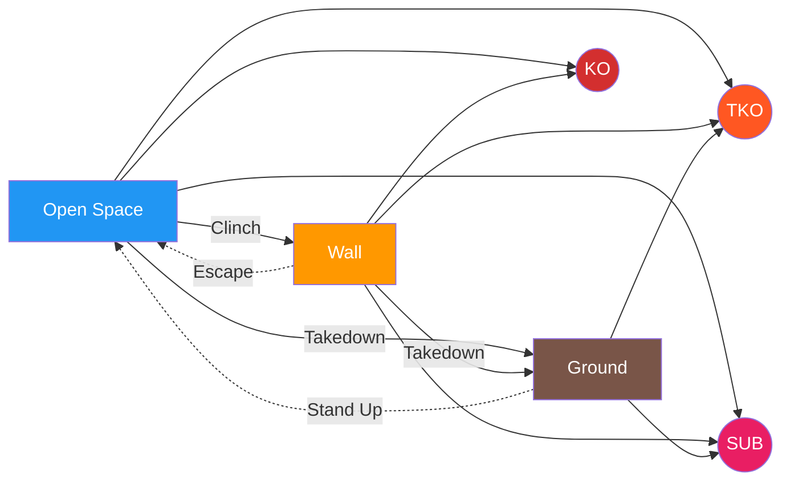

# Ecological MMA Games System

A constraints-led, game-based training framework for MMA.

---

## What Is This?

This is a **complete training system** built on one insight: **MMA is a decision game, not a technique collection.**

Instead of drilling techniques in isolation, athletes solve problems through structured games. The environment does the teaching. Correct behavior emerges from constraints, not coaching cues.

**34 games. 15 subcategories. All paths lead to finish.**

---

## Quick Start

!!! tip "New to the System?"

    **Step 1:** Read the [Training Mindset](principles/training-mindset.md) — this changes everything.

    **Step 2:** Start with a foundational game:

    | If you want to work on... | Start here |
    |---------------------------|------------|
    | Striking defense | [Parry the Straight](games/parry-the-straight.md) or [Slip the Straight](games/slip-the-straight.md) |
    | Striking offense | [Lead Hand Offense](games/lead-hand-offense.md) or [Land the Target](games/land-the-target.md) |
    | Range and timing | [Touch and Don't Get Touched](games/touch-game.md) |
    | Space control | [Pressure to Clinch](games/pressure-to-clinch.md) |
    | Wall work | [Wall Control](games/wall-control.md) |
    | Ground work | [Ground Escape](games/ground-escape.md) or [Ground Access](games/ground-access.md) |

    **Step 3:** Check the [Prerequisite Map](reference/prerequisites.md) for progression pathways.

---

## Core Philosophy

### Games, Not Drills

| Traditional Drilling | Ecological Games |
|---------------------|------------------|
| Coach prescribes technique | Athlete discovers solutions |
| Repetition of fixed movements | Exploration of possibilities |
| "Do it like this" | "Solve this problem" |
| Isolated from context | Representative of real fighting |

### The Fight Philosophy

**Finish the fight while taking as little damage as possible.**

Every game in this system ultimately leads to one of three endings:

| End State | How It Happens |
|-----------|----------------|
| **Knockout (KO)** | Striking → Clean shot lands with power and precision |
| **TKO** | Sustained Offense, Wall Grinding, or Ground Control → Accumulated damage |
| **Submission** | Ground Control or Defensive Submission → Choke or joint lock |

See: [Fight Philosophy](concepts/fight-philosophy.md)

---

## The System at a Glance

**The fight is cyclical.** You move between positions until someone finishes.

**The cycle:** Open Space → Wall or Ground → Escape back → Repeat until finish

**Three positions:**

- **Open Space** — Standing at distance (where every fight starts)
- **Wall** — Clinch against the cage
- **Ground** — Horizontal grappling

**Three finishes:**

- **KO** — Clean strike ends the fight
- **TKO** — Accumulated damage overwhelms defense
- **SUB** — Choke or joint lock forces tap

For the full interactive diagram, see the **[System Map](system/map.md)**.

---

## Games by Category

For the complete interactive map, see the [System Map](system/map.md).

---

### FOUNDATION — Skill Isolation

Skills developed in isolation before integration into live fighting.

| Game | Focus | What It Develops |
|------|-------|------------------|
| [Parry the Straight](games/parry-the-straight.md) | 🟢 Defense | Hand deflection timing |
| [Tight Block](games/tight-block.md) | 🟢 Defense | Guard absorption |
| [Slip the Straight](games/slip-the-straight.md) | 🟢 Defense | Head movement |
| [Evade the Punch](games/evade-the-punch.md) | 🟢 Defense | Full evasion vocabulary |
| [Lead Hand Offense](games/lead-hand-offense.md) | 🟠 Offense | Jab mechanics and setups |
| [Rear Hand Offense](games/rear-hand-offense.md) | 🟠 Offense | Cross/power hand timing |
| [Lead Leg Offense](games/lead-leg-offense.md) | 🟠 Offense | Lead kick variety |
| [Rear Leg Offense](games/rear-leg-offense.md) | 🟠 Offense | Power kick delivery |

---

### OPEN SPACE — Striking at Distance

This is where every fight starts.

| Game | Focus | What It Develops |
|------|-------|------------------|
| [Close-Range Defense](games/close-range-defense.md) | 🟢 Defense | Layered defensive response |
| [Evasive Movement](games/evasive-movement.md) | 🟢 Defense | Creating distance under fire |
| [Counter-Striking](games/counter-striking.md) | 🟢 Defense | Punishing initiation |
| [Land the Target](games/land-the-target.md) | 🟠 Offense | Reading defense, landing clean |
| [Sustained Offense](games/sustained-offense.md) | 🟠 Offense | Maintaining pressure to finish |
| [Touch Game](games/touch-game.md) | 🟣 Control | Range awareness and timing |

---

### POSITION CHANGES — Transitions Between States

How you move from Open Space to Wall or Ground.

#### Open Space → Wall

| Game | Focus | What It Develops |
|------|-------|------------------|
| [Clinch Denial](games/clinch-denial.md) | 🟢 Prevent | Breaking clinch attempts |
| [Pressure to Clinch](games/pressure-to-clinch.md) | 🟠 Initiate | Space control and clinch entry |
| [Pressure to Wall](games/pressure-to-wall.md) | 🟠 Initiate | Driving opponent to cage |

#### Open Space → Ground

| Game | Focus | What It Develops |
|------|-------|------------------|
| [Takedown Defense](games/takedown-defense.md) | 🟢 Prevent | Sprawl, underhooks, recovery |
| [Counter-Wrestling](games/counter-wrestling.md) | 🟢 Prevent | Punishing shot attempts |
| [Pressure to Takedown](games/pressure-to-takedown.md) | 🟠 Initiate | Chaining strikes to takedown |
| [Open Space Takedown](games/open-space-takedown.md) | 🟠 Initiate | Takedowns without wall |

---

### WALL — Standing Against Cage

You arrive via clinch or pressure. Exit by escaping or taking down.

| Game | Focus | What It Develops |
|------|-------|------------------|
| [Wall Escape](games/wall-escape.md) | 🟢 Escape | Breaking the pin, returning to open space |
| [Wall Defensive Submission](games/wall-defensive-submission.md) | 🟢 Defense | Submissions to deter/punish control |
| [Wall Control](games/wall-control.md) | 🟠 Control | Maintaining the pin |
| [Wall Grinding](games/wall-grinding.md) | 🟠 Offense | Accumulating damage toward TKO |
| [Wall to Ground](games/wall-to-ground.md) | 📍 Transition | Taking fight to ground |
| [Stand-Up Loop](games/standup-loop.md) | 🟣 Combined | Managing repeated stand-up/re-pin cycles |

---

### GROUND — Horizontal Grappling

You arrive via takedown or knockdown. Exit by standing up, or finish.

| Game | Focus | What It Develops |
|------|-------|------------------|
| [Ground Escape](games/ground-escape.md) | 🟢 Escape | Basic escapes from bottom |
| [Leg Reclaim](games/leg-reclaim.md) | 🟢 Defense | Guard recovery |
| [Ground to Standing](games/ground-to-standing.md) | 🟢 Escape | Technical stand-up |
| [Ground Defensive Submission](games/ground-defensive-submission.md) | 🟢 Defense | Submissions from bottom |
| [Ground Access](games/ground-access.md) | 🟠 Offense | Passing guard |
| [Ground Control](games/ground-control.md) | 🟠 Offense | Maintaining dominant position |
| [Positional Battle](games/positional-battle.md) | 🟣 Combined | Winning scrambles and exchanges |

---

## System Navigation

| Section | What You'll Find |
|---------|------------------|
| [System Map](system/map.md) | Interactive fight states diagram with game navigation |
| [Games Library](games/index.md) | Complete catalog with filters |
| [Concepts](concepts/fight-philosophy.md) | Key ideas: Fight Philosophy, Decision States, TKO Pin |
| [Coach Tools](tools/safety.md) | Safety, assessment, session planning |
| [Prerequisites](reference/prerequisites.md) | Game progression pathways |
| [FAQ](reference/faq.md) | Common questions and troubleshooting |

---

## Guiding Principles

1. **The environment teaches** — Design constraints, not techniques
2. **Finish while minimizing damage** — The fight philosophy
3. **Offense needs defense** — Every attack has a counter
4. **Struggle is learning** — Difficulty is the point
5. **Games are academic** — Learning matters more than winning

---

!!! abstract "System Evolution"
    This framework is intentionally non-dogmatic. Concepts refine, definitions update, games reorganize. See the [Change Log](reference/changelog.md) for version history.
