# Ecological MMA Games System

A constraints-led, game-based training framework for MMA.

---

## What Is This?

This is a **complete training system** built on one insight: **MMA is a decision game, not a technique collection.**

Instead of drilling techniques in isolation, athletes solve problems through structured games. The environment does the teaching. Correct behavior emerges from constraints, not coaching cues.

**35 games. 13 subcategories. All paths lead to finish.**

---

## Quick Start

!!! tip "New to the System?"

    **Step 1:** Read the [Training Mindset](principles/training-mindset.md) — this changes everything.

    **Step 2:** Start with a foundational game:

    | If you want to work on... | Start here |
    |---------------------------|------------|
    | Striking defense | [Parry the Straight](games/parry-the-straight.md) or [Slip the Straight](games/slip-the-straight.md) |
    | Striking offense | [Lead Hand Offense](games/lead-hand-offense.md) or [Land the Target](games/land-the-target.md) |
    | Range and timing | [Touch and Don't Get Touched](games/touch-game.md) |
    | Space control | [Pressure to Clinch](games/pressure-to-clinch.md) |
    | Wall work | [Wall Control](games/wall-control.md) |
    | Ground work | [Ground Escape](games/ground-escape.md) or [Ground Access](games/ground-access.md) |

    **Step 3:** Check the [Prerequisite Map](reference/prerequisites.md) for progression pathways.

---

## Core Philosophy

### Games, Not Drills

| Traditional Drilling | Ecological Games |
|---------------------|------------------|
| Coach prescribes technique | Athlete discovers solutions |
| Repetition of fixed movements | Exploration of possibilities |
| "Do it like this" | "Solve this problem" |
| Isolated from context | Representative of real fighting |

### The Fight Philosophy

**Finish the fight while taking as little damage as possible.**

Every game in this system ultimately leads to one of three endings:

| End State | How It Happens |
|-----------|----------------|
| **Knockout (KO)** | Striking → Clean shot lands with power and precision |
| **TKO** | Sustained Offense, Wall Grinding, or Ground Control → Accumulated damage |
| **Submission** | Ground Control or Defensive Submission → Choke or joint lock |

See: [Fight Philosophy](concepts/fight-philosophy.md)

---

## The System at a Glance

**The fight is cyclical.** You move between positions until someone finishes.

```mermaid
flowchart LR
    START((FIGHT<br>STARTS)) --> OPEN

    subgraph OPEN["OPEN SPACE"]
        direction TB
        O_ATK["🟠 Attack & Finish"]
        O_CTL["🟣 Control Space"]
        O_DEF["🟢 Defend & Counter"]
    end

    subgraph WALL["WALL"]
        direction TB
        W_ATK["🟠 Control & Grind"]
        W_DEF["🟢 Escape"]
    end

    subgraph GROUND["GROUND"]
        direction TB
        G_ATK["🟠 Advance & Finish"]
        G_DEF["🟢 Escape & Survive"]
    end

    subgraph FINISH["FIGHT ENDS"]
        direction TB
        KO((KO))
        TKO((TKO))
        SUB((Sub))
    end

    %% Position transitions (gray)
    OPEN -->|"Clinch"| WALL
    OPEN -->|"Takedown"| GROUND
    WALL -->|"Escape"| OPEN
    WALL -->|"Takedown"| GROUND
    GROUND -->|"Stand Up"| OPEN
    GROUND -.->|"Scramble"| WALL
    O_ATK -.->|"Knockdown"| GROUND
    O_DEF -.->|"Knockdown"| GROUND

    %% KO paths (red)
    O_ATK --> KO
    O_DEF -.->|"Counter"| KO
    W_ATK -.-> KO

    %% TKO paths (orange)
    O_ATK --> TKO
    W_ATK --> TKO
    G_ATK --> TKO

    %% SUB paths (purple)
    O_ATK -.-> SUB
    W_ATK -.-> SUB
    G_ATK --> SUB
    W_DEF -.->|"Def Sub"| SUB
    G_DEF -.->|"Def Sub"| SUB

    %% Node styling
    style START fill:#2196F3,color:#fff
    style O_DEF fill:#4CAF50,color:#fff
    style O_CTL fill:#9C27B0,color:#fff
    style O_ATK fill:#FF5722,color:#fff
    style W_DEF fill:#4CAF50,color:#fff
    style W_ATK fill:#FF5722,color:#fff
    style G_DEF fill:#4CAF50,color:#fff
    style G_ATK fill:#FF5722,color:#fff
    style KO fill:#D32F2F,color:#fff
    style TKO fill:#FF9800,color:#fff
    style SUB fill:#7B1FA2,color:#fff

    %% Link styling by type
    %% Links 0-7: Position transitions (gray)
    linkStyle 0 stroke:#757575,stroke-width:2px
    linkStyle 1 stroke:#757575,stroke-width:2px
    linkStyle 2 stroke:#757575,stroke-width:2px
    linkStyle 3 stroke:#757575,stroke-width:2px
    linkStyle 4 stroke:#757575,stroke-width:2px
    linkStyle 5 stroke:#757575,stroke-width:2px
    linkStyle 6 stroke:#757575,stroke-width:2px
    linkStyle 7 stroke:#757575,stroke-width:2px
    linkStyle 8 stroke:#757575,stroke-width:2px
    %% Links 9-11: KO paths (red)
    linkStyle 9 stroke:#D32F2F,stroke-width:3px
    linkStyle 10 stroke:#D32F2F,stroke-width:2px
    linkStyle 11 stroke:#D32F2F,stroke-width:2px
    %% Links 12-14: TKO paths (orange)
    linkStyle 12 stroke:#FF9800,stroke-width:3px
    linkStyle 13 stroke:#FF9800,stroke-width:3px
    linkStyle 14 stroke:#FF9800,stroke-width:3px
    %% Links 15-19: SUB paths (purple)
    linkStyle 15 stroke:#7B1FA2,stroke-width:2px
    linkStyle 16 stroke:#7B1FA2,stroke-width:2px
    linkStyle 17 stroke:#7B1FA2,stroke-width:3px
    linkStyle 18 stroke:#7B1FA2,stroke-width:2px
    linkStyle 19 stroke:#7B1FA2,stroke-width:2px

    click O_DEF "#open-space-defensive"
    click O_CTL "#open-space-control"
    click O_ATK "#open-space-offensive"
    click W_DEF "#wall-defensive"
    click W_ATK "#wall-offensive"
    click G_DEF "#ground-defensive"
    click G_ATK "#ground-offensive"
```

**Reading the diagram:**

- **Arrow colors show destination:**
    - **Gray** = Position transitions (moving between environments)
    - **Red** = Paths to KO
    - **Orange** = Paths to TKO
    - **Purple** = Paths to Submission
- **Solid arrows** = Common paths
- **Dotted arrows** = Less common paths (counters, defensive submissions, scrambles)

**Role colors in boxes:**

- **🟢 Green** = Defensive (survive, escape, counter)
- **🟠 Orange** = Offensive (attack, control, finish)
- **🟣 Purple** = Combined (both roles active)

**The cycle:** Open Space → Wall or Ground → Escape back to Open Space → Repeat until finish

---

## Games by Position

Click any colored box in the diagram above to jump to that section.

---

### OPEN SPACE — Standing at Distance

This is where every fight starts. All striking and wrestling initiation happens here.

#### Open Space — Defensive
Survive strikes, defend takedowns, counter attacks, return to neutral.

| Game | Category | What It Develops |
|------|----------|------------------|
| [Parry the Straight](games/parry-the-straight.md) | Skill Building | Hand deflection timing |
| [Tight Block](games/tight-block.md) | Skill Building | Guard absorption |
| [Slip the Straight](games/slip-the-straight.md) | Skill Building | Head movement |
| [Evade the Punch](games/evade-the-punch.md) | Skill Building | Full evasion vocabulary |
| [Close-Range Defense](games/close-range-defense.md) | Application | Layered defensive response |
| [Evasive Movement](games/evasive-movement.md) | Application | Creating distance under fire |
| [Counter-Striking](games/counter-striking.md) | Application | Punishing initiation |
| [Clinch Denial](games/clinch-denial.md) | Transition | Breaking clinch attempts |
| [Counter-Wrestling](games/counter-wrestling.md) | Transition | Punishing shot attempts |
| [Takedown Defense](games/takedown-defense.md) | Transition | Sprawl, underhooks, recovery |

---

#### Open Space — Control
Manage distance, angles, and position. Neither pure offense nor defense.

| Game | What It Develops |
|------|------------------|
| [Touch Game](games/touch-game.md) | Range awareness and timing |
| [Pressure to Clinch](games/pressure-to-clinch.md) | Space control, pressure, and clinch entry |

---

#### Open Space — Offensive
Land strikes, initiate grappling, pressure opponent toward finish or position change.

| Game | Category | What It Develops |
|------|----------|------------------|
| [Lead Hand Offense](games/lead-hand-offense.md) | Skill Building | Jab mechanics and setups |
| [Rear Hand Offense](games/rear-hand-offense.md) | Skill Building | Cross/power hand timing |
| [Lead Leg Offense](games/lead-leg-offense.md) | Skill Building | Lead kick variety |
| [Rear Leg Offense](games/rear-leg-offense.md) | Skill Building | Power kick delivery |
| [Land the Target](games/land-the-target.md) | Application | Reading defense, landing clean |
| [Sustained Offense](games/sustained-offense.md) | Application | Maintaining pressure to KO |
| [Pressure to Takedown](games/pressure-to-takedown.md) | Position Change | Chaining strikes to takedown |
| [Pressure to Wall](games/pressure-to-wall.md) | Position Change | Driving opponent to cage |
| [Open Space Takedown](games/open-space-takedown.md) | Position Change | Takedowns without wall |

---

### WALL — Standing Against Cage

You arrive here via clinch or pressure. Exit by escaping, taking down, or finishing.

#### Wall — Defensive
Get off the wall and return to open space.

| Game | What It Develops |
|------|------------------|
| [Wall Escape](games/wall-escape.md) | Breaking the pin, returning to open space |
| [Wall Defensive Submission](games/wall-defensive-submission.md) | Submissions to deter/punish control |

---

#### Wall — Offensive
Maintain control, accumulate damage, or advance to ground.

| Game | What It Develops |
|------|------------------|
| [Wall Control](games/wall-control.md) | Maintaining the pin |
| [Wall Grinding](games/wall-grinding.md) | Accumulating damage toward TKO |
| [Wall to Ground](games/wall-to-ground.md) | Taking fight to ground |
| [Stand-Up Loop](games/standup-loop.md) | Managing repeated stand-up/re-pin cycles |

---

### GROUND — Horizontal Grappling

You arrive here via takedown. Exit by standing up, or finish via TKO/submission.

#### Ground — Defensive
Escape back to feet or survive until you can. Defensive submissions punish mistakes.

| Game | What It Develops |
|------|------------------|
| [Ground Escape](games/ground-escape.md) | Basic escapes from bottom |
| [Leg Reclaim](games/leg-reclaim.md) | Guard recovery |
| [Ground to Standing](games/ground-to-standing.md) | Technical stand-up |
| [Ground Defensive Submission](games/ground-defensive-submission.md) | Submissions from bottom |

---

#### Ground — Offensive
Pass guard, establish control, finish the fight.

| Game | What It Develops |
|------|------------------|
| [Ground Access](games/ground-access.md) | Passing guard |
| [Ground Control](games/ground-control.md) | Maintaining dominant position |
| [Positional Battle](games/positional-battle.md) | Winning scrambles and exchanges |

---

## System Navigation

| Section | What You'll Find |
|---------|------------------|
| [System Map](system/map.md) | Visual overview of all 35 games and connections |
| [Games Library](games/index.md) | Complete catalog with filters |
| [Concepts](concepts/fight-philosophy.md) | Key ideas: Fight Philosophy, Decision States, TKO Pin |
| [Coach Tools](tools/safety.md) | Safety, assessment, session planning |
| [Prerequisites](reference/prerequisites.md) | Game progression pathways |
| [FAQ](reference/faq.md) | Common questions and troubleshooting |

---

## Guiding Principles

1. **The environment teaches** — Design constraints, not techniques
2. **Finish while minimizing damage** — The fight philosophy
3. **Offense needs defense** — Every attack has a counter
4. **Struggle is learning** — Difficulty is the point
5. **Games are academic** — Learning matters more than winning

---

!!! abstract "System Evolution"
    This framework is intentionally non-dogmatic. Concepts refine, definitions update, games reorganize. See the [Change Log](reference/changelog.md) for version history.
