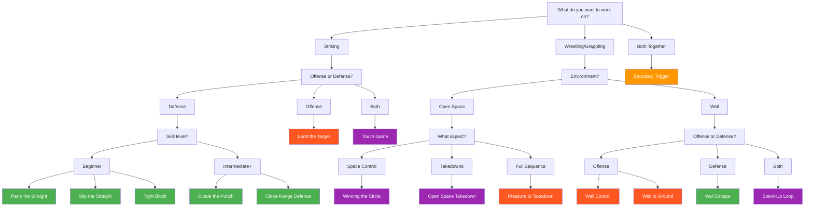

# Game Finder

Not sure which game to play? Use this guide to find the right game for your training goal.

---

## Quick Decision Tree

---

## Find by Training Goal

### "I want to improve my defense"

=== "Against Punches"

    **Beginner — Start here:**

    | Game | What You'll Learn |
    |------|-------------------|
    | [Parry the Straight](../games/parry-the-straight.md) | Deflecting punches with hands |
    | [Slip the Straight](../games/slip-the-straight.md) | Head movement evasion |
    | [Tight Block](../games/tight-block.md) | Absorbing on guard |

    **Intermediate — Build on foundations:**

    | Game | What You'll Learn |
    |------|-------------------|
    | [Evade the Punch](../games/evade-the-punch.md) | Matching evasion to punch type |
    | [Close-Range Defense](../games/close-range-defense.md) | Layering multiple solutions |

=== "Against Takedowns"

    | Game | What You'll Learn |
    |------|-------------------|
    | [Winning the Circle](../games/winning-circle.md) | Avoiding being cornered |
    | [Open Space Takedown](../games/open-space-takedown.md) | Scrambles and DNS defense |

=== "Against Wall Pins"

    | Game | What You'll Learn |
    |------|-------------------|
    | [Wall Escape](../games/wall-escape.md) | Breaking pins, creating space |
    | [Stand-Up Loop](../games/standup-loop.md) | Getting up when taken down near wall |

---

### "I want to improve my offense"

=== "Striking"

    | Game | What You'll Learn |
    |------|-------------------|
    | [Land the Target](../games/land-the-target.md) | Reading defense, setup, landing targets |

=== "Takedowns"

    | Game | What You'll Learn |
    |------|-------------------|
    | [Pressure to Takedown](../games/pressure-to-takedown.md) | Chaining strikes to takedowns |
    | [Open Space Takedown](../games/open-space-takedown.md) | Controlled takedowns from clinch |

=== "Wall Control"

    | Game | What You'll Learn |
    |------|-------------------|
    | [Wall Control](../games/wall-control.md) | Establishing and maintaining pins |
    | [Wall Pin to Ground](../games/wall-to-ground.md) | Transitioning to ground control |

---

### "I want to work on fundamentals"

| Game | What It Teaches |
|------|-----------------|
| [Touch and Don't Get Touched](../games/touch-game.md) | Range, timing, composure under contact |
| [Winning the Circle](../games/winning-circle.md) | Space awareness, pressure vs. movement |
| [Parry the Straight](../games/parry-the-straight.md) | Basic defensive mechanics |

---

### "I want realistic MMA integration"

| Game | What It Teaches |
|------|-----------------|
| [Pressure to Takedown](../games/pressure-to-takedown.md) | Full strike-to-takedown sequence |
| [Boundary Trigger](../games/boundary-trigger.md) | Recognizing when domains change |
| Any game at **Full MMA Expression** level | Adding cross-domain threats |

See: [Full MMA Expression](../concepts/full-mma-expression.md)

---

## Find by Time Available

### Short Session (15-20 min)

Pick **one** game, work through levels 1-3:

- Skill Isolation games (Parry, Slip, Block, Evade)
- Touch Game
- Winning the Circle

### Medium Session (30-45 min)

Pick **two** related games:

- Skill Isolation → Close-Range Defense
- Touch Game → Winning the Circle
- Wall Control → Wall Escape

### Full Session (60+ min)

Run a **pathway**:

- Skill Isolation → Close-Range Defense → Land the Target
- Touch Game → Winning the Circle → Boundary Trigger
- Wall Control → Wall Escape → Wall to Ground

---

## Find by Equipment

### No Equipment Needed

| Game | Notes |
|------|-------|
| [Touch and Don't Get Touched](../games/touch-game.md) | Light contact only |
| [Winning the Circle](../games/winning-circle.md) | Use tape/cones for boundary |

### Gloves Only

| Game | Notes |
|------|-------|
| All Skill Isolation games | |
| [Close-Range Defense](../games/close-range-defense.md) | |
| [Land the Target](../games/land-the-target.md) | |

### Wall + Mats Required

| Game | Notes |
|------|-------|
| [Wall Control](../games/wall-control.md) | Padded wall preferred |
| [Wall Escape](../games/wall-escape.md) | |
| [Wall Pin to Ground](../games/wall-to-ground.md) | Mats essential |
| [Stand-Up Loop](../games/standup-loop.md) | |

---

## Find by Partner Skill Level

### Partner is Less Experienced

Good games for mixed skill levels:

| Game | Why It Works |
|------|--------------|
| Skill Isolation games | Clear roles, adjustable intensity |
| [Land the Target](../games/land-the-target.md) | Defender doesn't counter |
| [Winning the Circle](../games/winning-circle.md) | Space-based, low contact |

### Partner is More Experienced

Games where skill gap is addressed:

| Game | Adjustment |
|------|------------|
| Any asymmetric game | Put less experienced in learning role |
| Use lower levels | Experienced partner moderates intensity |
| Focus on defensive games | Less experienced defends, learns reading |

### Equal Partners

Any game works! Progress through levels together.

---

## Still Not Sure?

!!! tip "Default Recommendations"

    **Brand new to the system?**
    Start with [Touch and Don't Get Touched](../games/touch-game.md) — it's the foundational game.

    **Want striking defense?**
    Start with [Parry the Straight](../games/parry-the-straight.md) — it's the simplest skill isolation game.

    **Want wrestling?**
    Start with [Winning the Circle](../games/winning-circle.md) — no contact required.

    **Want full MMA feel?**
    Try [Pressure to Takedown](../games/pressure-to-takedown.md) — it chains everything together.

---

!!! abstract "System Evolution Notice"
    More games will be added as the system develops. This finder will be updated accordingly.
