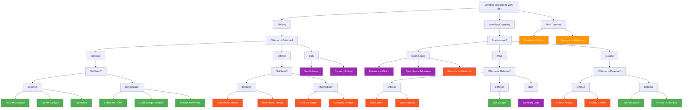

# Game Finder

Not sure which game to play? Use this guide to find the right game for your training goal.

---

## Quick Decision Tree

```mermaid
flowchart TD
    START[What do you want to work on?] --> STRIKING[Striking]
    START --> WRESTLING[Wrestling/Grappling]
    START --> BOTH[Both Together]

    STRIKING --> S_FOCUS[Offense or Defense?]
    S_FOCUS --> S_DEF[Defense]
    S_FOCUS --> S_OFF[Offense]
    S_FOCUS --> S_BOTH[Both]

    S_DEF --> S_DEF_LEVEL[Skill level?]
    S_DEF_LEVEL --> S_DEF_BEG[Beginner]
    S_DEF_LEVEL --> S_DEF_INT[Intermediate+]

    S_DEF_BEG --> PARRY[Parry the Straight]
    S_DEF_BEG --> SLIP[Slip the Straight]
    S_DEF_BEG --> TIGHT[Tight Block]

    S_DEF_INT --> EVADE[Evade the Punch]
    S_DEF_INT --> CRD[Close-Range Defense]
    S_DEF_INT --> EVASIVE[Evasive Movement]

    S_OFF --> S_OFF_LEVEL[Skill level?]
    S_OFF_LEVEL --> S_OFF_BEG[Beginner]
    S_OFF_LEVEL --> S_OFF_INT[Intermediate+]

    S_OFF_BEG --> LHO[Lead Hand Offense]
    S_OFF_BEG --> RHO[Rear Hand Offense]
    S_OFF_INT --> LT[Land the Target]
    S_OFF_INT --> SO[Sustained Offense]

    S_BOTH --> TOUCH[Touch Game]
    S_BOTH --> CS[Counter-Striking]

    WRESTLING --> W_ENV[Environment?]
    W_ENV --> W_OPEN[Open Space]
    W_ENV --> W_WALL[Wall]
    W_ENV --> W_GROUND[Ground]

    W_OPEN --> PC[Pressure to Clinch]
    W_OPEN --> OST[Open Space Takedown]
    W_OPEN --> PTT[Pressure to Takedown]

    W_WALL --> W_WALL_Q[Offense or Defense?]
    W_WALL_Q --> W_WALL_OFF[Offense]
    W_WALL_Q --> W_WALL_DEF[Defense]
    W_WALL_Q --> W_WALL_BOTH[Both]

    W_WALL_OFF --> WCON[Wall Control]
    W_WALL_OFF --> WG[Wall Grinding]
    W_WALL_DEF --> WE[Wall Escape]
    W_WALL_BOTH --> SUL[Stand-Up Loop]

    W_GROUND --> W_GND_Q[Offense or Defense?]
    W_GND_Q --> W_GND_OFF[Offense]
    W_GND_Q --> W_GND_DEF[Defense]

    W_GND_OFF --> GA[Ground Access]
    W_GND_OFF --> GC[Ground Control]
    W_GND_DEF --> GE[Ground Escape]
    W_GND_DEF --> GTS[Ground to Standing]

    BOTH --> PC2[Pressure to Clinch]
    BOTH --> PTT2[Pressure to Takedown]

    style PARRY fill:#4CAF50,color:#fff
    style SLIP fill:#4CAF50,color:#fff
    style TIGHT fill:#4CAF50,color:#fff
    style EVADE fill:#4CAF50,color:#fff
    style CRD fill:#4CAF50,color:#fff
    style EVASIVE fill:#4CAF50,color:#fff
    style LHO fill:#FF5722,color:#fff
    style RHO fill:#FF5722,color:#fff
    style LT fill:#FF5722,color:#fff
    style SO fill:#FF5722,color:#fff
    style TOUCH fill:#9C27B0,color:#fff
    style CS fill:#9C27B0,color:#fff
    style PC fill:#9C27B0,color:#fff
    style OST fill:#9C27B0,color:#fff
    style PTT fill:#FF5722,color:#fff
    style WCON fill:#FF5722,color:#fff
    style WG fill:#FF5722,color:#fff
    style WE fill:#4CAF50,color:#fff
    style SUL fill:#9C27B0,color:#fff
    style GA fill:#FF5722,color:#fff
    style GC fill:#FF5722,color:#fff
    style GE fill:#4CAF50,color:#fff
    style GTS fill:#4CAF50,color:#fff
    style PC2 fill:#FF9800,color:#fff
    style PTT2 fill:#FF9800,color:#fff
```

---

## Browse All Games

=== "By Training Goal"

    === "Defense"

        **Against Punches:**

        ??? tip "Beginner — Start here"
            | Game | What You'll Learn |
            |------|-------------------|
            | [Parry the Straight](../games/parry-the-straight.md) | Deflecting punches with hands |
            | [Tight Block](../games/tight-block.md) | Absorbing on guard |
            | [Slip the Straight](../games/slip-the-straight.md) | Head movement evasion |

        ??? tip "Intermediate — Build on foundations"
            | Game | What You'll Learn |
            |------|-------------------|
            | [Evade the Punch](../games/evade-the-punch.md) | Matching evasion to punch type |
            | [Close-Range Defense](../games/close-range-defense.md) | Layering multiple solutions |
            | [Evasive Movement](../games/evasive-movement.md) | Creating distance under fire |
            | [Counter-Striking](../games/counter-striking.md) | Punishing initiation |

        **Against Takedowns:**

        | Game | What You'll Learn |
        |------|-------------------|
        | [Takedown Defense](../games/takedown-defense.md) | Sprawl and recovery |
        | [Counter-Wrestling](../games/counter-wrestling.md) | Punishing shot attempts |
        | [Clinch Denial](../games/clinch-denial.md) | Preventing clinch establishment |

        **Against Wall Pins:**

        | Game | What You'll Learn |
        |------|-------------------|
        | [Wall Escape](../games/wall-escape.md) | Breaking pins, creating space |
        | [Wall Defensive Submission](../games/wall-defensive-submission.md) | Submissions to deter control |

        **From Ground (Bottom):**

        | Game | What You'll Learn |
        |------|-------------------|
        | [Ground Escape](../games/ground-escape.md) | Escaping dominant position |
        | [Leg Reclaim](../games/leg-reclaim.md) | Guard recovery |
        | [Ground to Standing](../games/ground-to-standing.md) | Technical stand-up |
        | [Ground Defensive Submission](../games/ground-defensive-submission.md) | Submissions from bottom |

    === "Offense"

        **Striking:**

        ??? tip "Beginner — Single weapon isolation"
            | Game | What You'll Learn |
            |------|-------------------|
            | [Lead Hand Offense](../games/lead-hand-offense.md) | Jab mechanics and setups |
            | [Rear Hand Offense](../games/rear-hand-offense.md) | Cross/power hand timing |
            | [Lead Leg Offense](../games/lead-leg-offense.md) | Lead kick variety |
            | [Rear Leg Offense](../games/rear-leg-offense.md) | Power kick delivery |

        ??? tip "Intermediate — Integrated striking"
            | Game | What You'll Learn |
            |------|-------------------|
            | [Land the Target](../games/land-the-target.md) | Reading defense, landing targets |
            | [Sustained Offense](../games/sustained-offense.md) | Maintaining pressure to finish |

        **Takedowns & Pressure:**

        | Game | What You'll Learn |
        |------|-------------------|
        | [Pressure to Clinch](../games/pressure-to-clinch.md) | Space control and clinch entry |
        | [Pressure to Wall](../games/pressure-to-wall.md) | Driving opponent to cage |
        | [Pressure to Takedown](../games/pressure-to-takedown.md) | Chaining strikes to takedowns |
        | [Open Space Takedown](../games/open-space-takedown.md) | Controlled takedowns from clinch |

        **Wall Control:**

        | Game | What You'll Learn |
        |------|-------------------|
        | [Wall Control](../games/wall-control.md) | Establishing and maintaining pins |
        | [Wall Grinding](../games/wall-grinding.md) | Dealing damage from wall position |
        | [Wall to Ground](../games/wall-to-ground.md) | Transitioning to ground control |

        **Ground Control:**

        | Game | What You'll Learn |
        |------|-------------------|
        | [Ground Access](../games/ground-access.md) | Passing guard |
        | [Ground Control](../games/ground-control.md) | Maintaining dominant position |

    === "Combined"

        Games where both sides have active, distinct objectives:

        | Game | What It Develops |
        |------|------------------|
        | [Touch and Don't Get Touched](../games/touch-game.md) | Range awareness and timing |
        | [Stand-Up Loop](../games/standup-loop.md) | Managing stand-up/re-pin cycles |
        | [Positional Battle](../games/positional-battle.md) | Winning scrambles and exchanges |

    === "Fundamentals"

        New to the system? Start here:

        | Game | What It Teaches | Why Start Here |
        |------|-----------------|----------------|
        | [Touch and Don't Get Touched](../games/touch-game.md) | Range, timing, composure | Lowest contact, highest learning |
        | [Parry the Straight](../games/parry-the-straight.md) | Basic defensive mechanics | Simplest skill isolation |
        | [Pressure to Clinch](../games/pressure-to-clinch.md) | Space awareness, pressure | Bridges striking and wrestling |

=== "By Session Time"

    === "Short (15-20 min)"

        Pick **one** game, work through levels 1-3:

        | Game | Why It Fits |
        |------|-------------|
        | [Parry the Straight](../games/parry-the-straight.md) | Quick rounds, clear feedback |
        | [Slip the Straight](../games/slip-the-straight.md) | Quick rounds, clear feedback |
        | [Tight Block](../games/tight-block.md) | Quick rounds, clear feedback |
        | [Evade the Punch](../games/evade-the-punch.md) | Quick rounds, clear feedback |
        | [Touch and Don't Get Touched](../games/touch-game.md) | Great warm-up game |
        | [Pressure to Clinch](../games/pressure-to-clinch.md) | Space-focused, low contact |

    === "Medium (30-45 min)"

        Pick **two** related games and progress between them:

        | Pairing | Flow |
        |---------|------|
        | Skill Isolation → Close-Range Defense | Foundation → integration |
        | Touch Game → Pressure to Clinch | Range → space control |
        | Wall Control → Wall Escape | Offense → defense pairing |
        | Ground Access → Ground Control | Passing → maintaining |
        | Ground Escape → Ground to Standing | Escaping → getting up |

    === "Full (60+ min)"

        Run a **pathway** — progression through related games:

        | Pathway | Games |
        |---------|-------|
        | Striking Defense | Skill Isolation → Close-Range Defense → Evasive Movement |
        | Striking Offense | Skill Isolation → Land the Target → Sustained Offense |
        | Space to Wall | Touch Game → Pressure to Clinch → Wall Control |
        | Wall Work | Wall Control → Wall Escape → Wall Grinding → Stand-Up Loop |
        | Ground Work | Ground Access → Ground Control → Ground Escape |
        | Full MMA | Pressure to Clinch → Pressure to Takedown → Ground Control |

=== "By Equipment"

    === "No Equipment"

        | Game | Notes |
        |------|-------|
        | [Touch and Don't Get Touched](../games/touch-game.md) | Light contact only |
        | [Pressure to Clinch](../games/pressure-to-clinch.md) | Use tape/cones for boundary |
        | [Ground Escape](../games/ground-escape.md) | Mats preferred but not required |
        | [Leg Reclaim](../games/leg-reclaim.md) | Mats preferred but not required |

    === "Gloves Only"

        | Game | Notes |
        |------|-------|
        | All Skill Isolation games | Parry, Slip, Block, Evade, all weapon isolation |
        | [Close-Range Defense](../games/close-range-defense.md) | Multiple defensive layers |
        | [Land the Target](../games/land-the-target.md) | Reading and landing |
        | [Counter-Striking](../games/counter-striking.md) | Punishing initiation |
        | [Sustained Offense](../games/sustained-offense.md) | Pressure and finishing |
        | [Evasive Movement](../games/evasive-movement.md) | Creating distance |

    === "Wall + Mats"

        | Game | Notes |
        |------|-------|
        | [Wall Control](../games/wall-control.md) | Padded wall preferred |
        | [Wall Escape](../games/wall-escape.md) | |
        | [Wall Grinding](../games/wall-grinding.md) | |
        | [Wall to Ground](../games/wall-to-ground.md) | Mats essential |
        | [Stand-Up Loop](../games/standup-loop.md) | |
        | All Ground games | Mats required |

=== "By Partner Level"

    === "Less Experienced Partner"

        | Game | Why It Works |
        |------|--------------|
        | All Skill Isolation games | Clear roles, adjustable intensity |
        | [Touch and Don't Get Touched](../games/touch-game.md) | Low contact, high learning |
        | [Land the Target](../games/land-the-target.md) | Defender doesn't counter |
        | [Pressure to Clinch](../games/pressure-to-clinch.md) | Space-based, low contact |

        !!! tip "Coaching Tip"
            Put the less experienced partner in the **learning role** (usually defender). The experienced partner moderates intensity and provides realistic but controlled pressure.

    === "Equal Partners"

        Any game works. Progress through levels together.

        **Best for equal partners:**

        | Game | Why |
        |------|-----|
        | [Counter-Striking](../games/counter-striking.md) | Requires matched timing |
        | [Positional Battle](../games/positional-battle.md) | True scramble competition |
        | [Stand-Up Loop](../games/standup-loop.md) | Both roles equally demanding |
        | Any game at Full MMA Expression | Maximum realism |

    === "More Experienced Partner"

        Use them as a high-quality training tool:

        | Game | Adjustment |
        |------|------------|
        | Any asymmetric game | Put you in learning role, them as feeder |
        | Use lower levels | They moderate intensity |
        | Focus on defensive games | You defend, learn reading |
        | Ask them to vary timing | Builds your perception |

---

## Still Not Sure?

!!! tip "Default Recommendations"

    **Brand new to the system?**
    Start with [Touch and Don't Get Touched](../games/touch-game.md) — it's the foundational game.

    **Want striking defense?**
    Start with [Parry the Straight](../games/parry-the-straight.md) — it's the simplest skill isolation game.

    **Want wrestling?**
    Start with [Pressure to Clinch](../games/pressure-to-clinch.md) — low contact, space-focused.

    **Want ground work?**
    Start with [Ground Escape](../games/ground-escape.md) — fundamental bottom position skills.

    **Want full MMA feel?**
    Try [Pressure to Takedown](../games/pressure-to-takedown.md) — it chains everything together.

---

!!! abstract "System Evolution Notice"
    More games will be added as the system develops. This finder will be updated accordingly.
