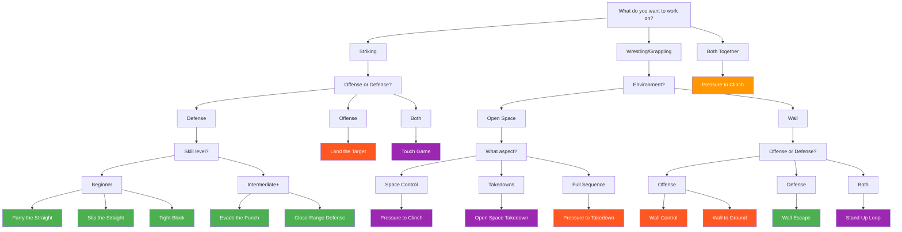

# Game Finder

ReferenceFind Your GameBy Goal · Time · Gear · Partner

<b>Not sure which game to play?</b> Tell the finder what you want — it points you to the game that builds it. Start with the decision tree, then narrow by goal, time, equipment, or partner.

Quick Decision Tree

```mermaid
flowchart TD
    START[What do you want to work on?] --> STRIKING[Striking]
    START --> WRESTLING[Wrestling/Grappling]
    START --> BOTH[Both Together]

    STRIKING --> S_FOCUS[Offense or Defense?]
    S_FOCUS --> S_DEF[Defense]
    S_FOCUS --> S_OFF[Offense]
    S_FOCUS --> S_BOTH[Both]

    S_DEF --> S_DEF_LEVEL[Skill level?]
    S_DEF_LEVEL --> S_DEF_BEG[Beginner]
    S_DEF_LEVEL --> S_DEF_INT[Intermediate+]

    S_DEF_BEG --> PARRY[Parry the Straight]
    S_DEF_BEG --> SLIP[Slip the Straight]
    S_DEF_BEG --> TIGHT[Tight Block]

    S_DEF_INT --> EVADE[Evade the Punch]
    S_DEF_INT --> CRD[Close-Range Defense]

    S_OFF --> LT[Land the Target]

    S_BOTH --> TOUCH[Touch Game]

    WRESTLING --> W_ENV[Environment?]
    W_ENV --> W_OPEN[Open Space]
    W_ENV --> W_WALL[Wall]

    W_OPEN --> W_OPEN_Q[What aspect?]
    W_OPEN_Q --> W_SPACE[Space Control]
    W_OPEN_Q --> W_TD[Takedowns]
    W_OPEN_Q --> W_FULL[Full Sequence]

    W_SPACE --> PC[Pressure to Clinch]
    W_TD --> OST[Open Space Takedown]
    W_FULL --> PTT[Pressure to Takedown]

    W_WALL --> W_WALL_Q[Offense or Defense?]
    W_WALL_Q --> W_WALL_OFF[Offense]
    W_WALL_Q --> W_WALL_DEF[Defense]
    W_WALL_Q --> W_WALL_BOTH[Both]

    W_WALL_OFF --> WCON[Wall Control]
    W_WALL_OFF --> WG[Wall to Ground]
    W_WALL_DEF --> WE[Wall Escape]
    W_WALL_BOTH --> SUL[Stand-Up Loop]

    BOTH --> PC2[Pressure to Clinch]

    style PARRY fill:#4CAF50,color:#fff
    style SLIP fill:#4CAF50,color:#fff
    style TIGHT fill:#4CAF50,color:#fff
    style EVADE fill:#4CAF50,color:#fff
    style CRD fill:#4CAF50,color:#fff
    style LT fill:#FF5722,color:#fff
    style TOUCH fill:#9C27B0,color:#fff
    style PC fill:#9C27B0,color:#fff
    style OST fill:#9C27B0,color:#fff
    style PTT fill:#FF5722,color:#fff
    style WCON fill:#FF5722,color:#fff
    style WG fill:#FF5722,color:#fff
    style WE fill:#4CAF50,color:#fff
    style SUL fill:#9C27B0,color:#fff
    style PC2 fill:#FF9800,color:#fff
```

Find by Training Goal — Defense

=== "Against Punches"

    
Beginner — start here

    

      
Deflect punches with the hands→<a href="../../games/parry-the-straight/">Parry the Straight</a>

      
Evade with head movement→<a href="../../games/slip-the-straight/">Slip the Straight</a>

      
Absorb on a tight guard→<a href="../../games/tight-block/">Tight Block</a>

    

    
Intermediate — build on foundations

    

      
Match evasion to punch type→<a href="../../games/evade-the-punch/">Evade the Punch</a>

      
Layer multiple solutions→<a href="../../games/close-range-defense/">Close-Range Defense</a>

    

=== "Against Takedowns"

    

      
Avoid being cornered→<a href="../../games/pressure-to-clinch/">Pressure to Clinch</a>

      
Scrambles &amp; DNS defense→<a href="../../games/open-space-takedown/">Open Space Takedown</a>

    

=== "Against Wall Pins"

    

      
Break pins, create space→<a href="../../games/wall-escape/">Wall Escape</a>

      
Get up when taken down near the wall→<a href="../../games/standup-loop/">Stand-Up Loop</a>

    

Find by Training Goal — Offense

=== "Striking"

    

      
Read defense, set up, land targets→<a href="../../games/land-the-target/">Land the Target</a>

    

=== "Takedowns"

    

      
Chain strikes into takedowns→<a href="../../games/pressure-to-takedown/">Pressure to Takedown</a>

      
Controlled takedowns from the clinch→<a href="../../games/open-space-takedown/">Open Space Takedown</a>

    

=== "Wall Control"

    

      
Establish &amp; maintain pins→<a href="../../games/wall-control/">Wall Control</a>

      
Transition pin to ground control→<a href="../../games/wall-to-ground/">Wall Pin to Ground</a>

    

Find by Training Goal — Fundamentals &amp; Integration

=== "Fundamentals"

    

      

🎯

<a href="../../games/touch-game/">Touch &amp; Don't Get Touched</a>

Range, timing, composure under contact.The foundational engagement game — learn to manage distance before anything else.

      

🧭

<a href="../../games/pressure-to-clinch/">Pressure to Clinch</a>

Space awareness, pressure vs. movement.Low contact, space-focused — teaches how to cut off the marked perimeter.

      

🥊

<a href="../../games/parry-the-straight/">Parry the Straight</a>

Basic defensive mechanics.The simplest skill-isolation game — a clean first rep of defensive reading.

    

=== "Realistic MMA Integration"

    

      

⛓️

<a href="../../games/pressure-to-takedown/">Pressure to Takedown</a>

Full strike-to-takedown sequence.Chains striking and wrestling into one continuous problem.

      

🔀

<a href="../../games/pressure-to-clinch/">Pressure to Clinch</a> (L3+)

Recognizing when domains change.At higher levels, the moment striking becomes wrestling becomes the focus.

      

🥋

Any game at Full MMA

Adding cross-domain threats.The highest level of any game introduces threats from the other domain.

    

    
See: <a href="../../concepts/full-mma-expression/">Full MMA Expression</a>

Find by Time Available

  

⏱️

Short — 15–20 min

Pick <b>one</b> game, work levels 1–3: a skill-isolation game (Parry, Slip, Block, Evade), Touch Game, or Pressure to Clinch.One focused problem, repeated cleanly, beats spreading thin across many games.

  

⏳

Medium — 30–45 min

Pair <b>two</b> related games and let one feed the other.Skill Isolation → Close-Range Defense · Touch Game → Pressure to Clinch · Wall Control → Wall Escape.

  

🕐

Full — 60+ min

Run a full <b>pathway</b> from isolation to integration.Skill Isolation → Close-Range Defense → Land the Target · Touch Game → Pressure to Clinch → Wall Control · Wall Control → Wall Escape → Wall to Ground.

Find by Equipment

=== "No Equipment"

    

      
Light contact only→<a href="../../games/touch-game/">Touch &amp; Don't Get Touched</a>

      
Use tape/cones for the marked perimeter→<a href="../../games/pressure-to-clinch/">Pressure to Clinch</a>

    

=== "Gloves Only"

    

      🥊 All Skill Isolation games
      🛡️ <a href="../../games/close-range-defense/">Close-Range Defense</a>
      🎯 <a href="../../games/land-the-target/">Land the Target</a>
    

=== "Wall + Mats"

    

      🧱 <a href="../../games/wall-control/">Wall Control</a>Padded wall preferred for repeated pin work.
      ↩️ <a href="../../games/wall-escape/">Wall Escape</a>
      ⬇️ <a href="../../games/wall-to-ground/">Wall Pin to Ground</a>Mats essential — play ends on the ground.
      🔁 <a href="../../games/standup-loop/">Stand-Up Loop</a>
    

Find by Partner Skill Level

=== "Partner Less Experienced"

    

      
Clear roles, adjustable intensity→Skill Isolation games

      
Defender doesn't counter→<a href="../../games/land-the-target/">Land the Target</a>

      
Space-based, low contact→<a href="../../games/pressure-to-clinch/">Pressure to Clinch</a>

    

=== "Partner More Experienced"

    

      

🎭

Any asymmetric game

Put the less experienced player in the learning role.

      

🪜

Use lower levels

The experienced partner moderates intensity.

      

🛡️

Focus on defensive games

Less experienced defends and learns to read.

    

=== "Equal Partners"

    
<b>Any game works.</b> Progress through the levels together — both sides feed and learn in turn.

Still Not Sure?

  
Brand new to the system→<a href="../../games/touch-game/">Touch &amp; Don't Get Touched</a> — the foundational game

  
Want striking defense→<a href="../../games/parry-the-straight/">Parry the Straight</a> — the simplest isolation game

  
Want wrestling→<a href="../../games/pressure-to-clinch/">Pressure to Clinch</a> — low contact, space-focused

  
Want full MMA feel→<a href="../../games/pressure-to-takedown/">Pressure to Takedown</a> — chains everything together

??? abstract "System evolution notice"
    More games will be added as the system develops. This finder will be updated accordingly.
