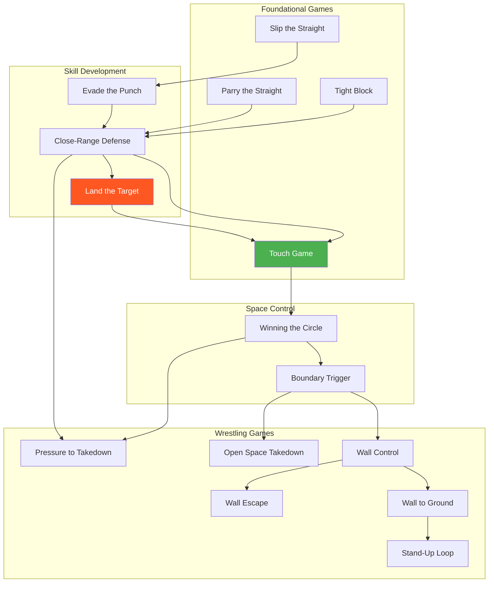

# Prerequisite Map

This page shows how games connect through prerequisites and progressions.

---

## System Overview

---

## By Environment

### Skill Isolation

| Game | Prerequisites | Leads To |
|------|---------------|----------|
| Parry the Straight | None | Close-Range Defense |
| Tight Block | None | Close-Range Defense |
| Slip the Straight | None | Evade the Punch |
| Evade the Punch | Slip the Straight | Close-Range Defense |

### Open Space — Striking

| Game | Prerequisites | Leads To |
|------|---------------|----------|
| Touch Game | None | Winning the Circle, Land the Target |
| Close-Range Defense | Skill isolation games | Land the Target, Touch Game |
| Land the Target | Three Zones concept | Touch Game |

### Open Space — Wrestling

| Game | Prerequisites | Leads To |
|------|---------------|----------|
| Winning the Circle | Touch Game | Boundary Trigger |
| Boundary Trigger | Winning the Circle | Wall Control, Open Space Takedown |
| Pressure to Takedown | Close-Range Defense, Winning the Circle | Wall Control |
| Open Space Takedown | Boundary Trigger | Ground games |

### Wall

| Game | Prerequisites | Leads To |
|------|---------------|----------|
| Wall Control | Boundary Trigger | Wall Escape, Wall to Ground |
| Wall Escape | Wall Control | Stand-Up Loop |
| Wall to Ground | Wall Control | Stand-Up Loop, Ground games |
| Stand-Up Loop | Wall to Ground | Ground games |

---

## By Focus

### Defensive Progression

### Offensive Progression

### Wrestling Progression

---

## Concept Prerequisites

Some games require understanding specific concepts:

| Concept | Required For |
|---------|--------------|
| Three Zones of Attack | Land the Target |
| Confidence Rating | Land the Target (recommended) |
| TKO Pin | Wall Control, Ground games |
| Defensive Solutions | All skill isolation games |
| Hand Controls | Close-Range Defense, Pressure to Takedown |

---

!!! abstract "Development Notice"
    This map will expand as new games are added to the system.
