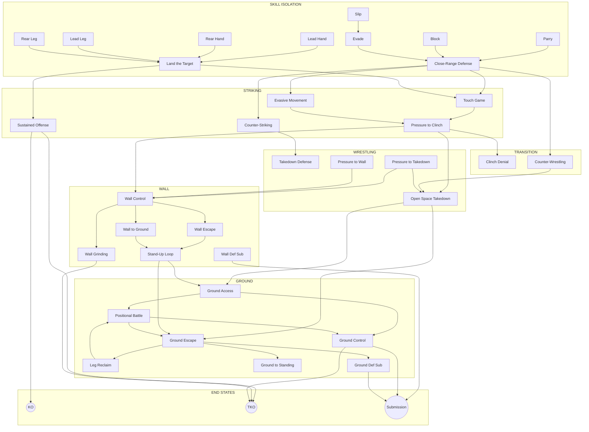

# Prerequisite Map

How games connect through prerequisites and progressions.

---

## Entry Points (No Prerequisites)

Start here — these games have no prerequisites:

| Game | Best For | Why Start Here |
|------|----------|----------------|
| [Parry the Straight](../games/parry-the-straight.md) | Striking defense | Simplest defensive mechanic |
| [Tight Block](../games/tight-block.md) | Striking defense | Pure absorption skill |
| [Slip the Straight](../games/slip-the-straight.md) | Head movement | Single evasion type |
| [Lead Hand Offense](../games/lead-hand-offense.md) | Striking offense | Single weapon isolation |
| [Rear Hand Offense](../games/rear-hand-offense.md) | Striking offense | Single weapon isolation |
| [Lead Leg Offense](../games/lead-leg-offense.md) | Kicking offense | Single weapon isolation |
| [Rear Leg Offense](../games/rear-leg-offense.md) | Kicking offense | Single weapon isolation |
| [Touch Game](../games/touch-game.md) | Range and timing | Foundational engagement |
| [Ground Escape](../games/ground-escape.md) | Ground defense | Basic bottom position |

---

## By Environment

### Skill Isolation (8 games)

| Game | Prerequisites | Leads To |
|------|---------------|----------|
| Parry the Straight | None | Close-Range Defense |
| Tight Block | None | Close-Range Defense |
| Slip the Straight | None | Evade the Punch |
| Evade the Punch | Slip the Straight | Close-Range Defense |
| Lead Hand Offense | None | Land the Target |
| Rear Hand Offense | None | Land the Target |
| Lead Leg Offense | None | Land the Target |
| Rear Leg Offense | None | Land the Target |

### Open Space — Striking (7 games)

| Game | Prerequisites | Leads To |
|------|---------------|----------|
| Touch Game | None | Pressure to Clinch |
| Close-Range Defense | Skill Isolation (defensive) | Counter-Striking, Evasive Movement |
| Evasive Movement | Close-Range Defense | Pressure to Clinch |
| Counter-Striking | Close-Range Defense, Land the Target | Takedown Defense |
| Land the Target | Three Zones concept | Sustained Offense, Touch Game |
| Sustained Offense | Land the Target | KO/TKO finish |
| Pressure to Clinch | Touch Game | Wall Control, Clinch Denial, Open Space Takedown |

### Transition Zone (2 games)

| Game | Prerequisites | Leads To |
|------|---------------|----------|
| Clinch Denial | Pressure to Clinch, Hand Controls | Wall Control |
| Counter-Wrestling | Close-Range Defense, Pressure to Clinch | Open Space Takedown |

### Open Space — Wrestling (4 games)

| Game | Prerequisites | Leads To |
|------|---------------|----------|
| Takedown Defense | Pressure to Clinch | Open Space Takedown |
| Pressure to Takedown | Close-Range Defense, Pressure to Clinch | Wall Control, Open Space Takedown |
| Pressure to Wall | Pressure to Clinch | Wall Control |
| Open Space Takedown | Pressure to Clinch | Ground games |

### Wall (6 games)

| Game | Prerequisites | Leads To |
|------|---------------|----------|
| Wall Control | Pressure to Clinch | Wall Escape, Wall to Ground, Wall Grinding |
| Wall Escape | Wall Control | Stand-Up Loop |
| Wall Defensive Submission | Wall Escape | Submission finish |
| Wall to Ground | Wall Control | Stand-Up Loop, Ground games |
| Wall Grinding | Wall Control | TKO finish |
| Stand-Up Loop | Wall to Ground | Ground games |

### Ground (7 games)

| Game | Prerequisites | Leads To |
|------|---------------|----------|
| Ground Access | Positional Battle | Ground Control |
| Ground Control | Ground Access | TKO/Submission finish |
| Ground Escape | None | Leg Reclaim, Ground to Standing |
| Leg Reclaim | Ground Escape | Positional Battle, Ground to Standing |
| Ground to Standing | Ground Escape | Return to standing |
| Ground Defensive Submission | Ground Escape | Submission finish |
| Positional Battle | Ground Escape, Ground Access | Role reversal |

---

## Progression Flowchart



---

## Pathway Guides

### Striking Defense Track

```
Parry/Block/Slip → Evade the Punch → Close-Range Defense → Counter-Striking
                                                        → Evasive Movement
```

### Striking Offense Track

```
Weapon Isolation → Land the Target → Sustained Offense → KO/TKO
                                   → Touch Game → Pressure to Clinch
```

### Wrestling Track

```
Pressure to Clinch → Pressure to Takedown → Wall Control
                   → Takedown Defense      → Open Space Takedown
```

### Ground Track

```
Offensive: Open Space Takedown → Ground Access → Ground Control → TKO/Submission
Defensive: Ground Escape → Leg Reclaim → Ground to Standing → Return to feet
Combined:  Positional Battle (role reversal possible)
```

---

## Concept Prerequisites

Some games require understanding specific concepts:

| Concept | Required For |
|---------|--------------|
| [Three Zones](../concepts/three-zones.md) | Land the Target, Sustained Offense, Evasive Movement |
| [Confidence Rating](../concepts/confidence-rating.md) | Land the Target, Sustained Offense, Counter-Striking |
| [TKO Pin](../concepts/tko-pin.md) | Wall Control, Wall to Ground, Wall Grinding, Pressure to Takedown |
| [Defensive Solutions](../concepts/defensive-solutions.md) | All Skill Isolation games |
| [Hand Controls](../concepts/hand-controls.md) | Close-Range Defense, Clinch Denial, Counter-Wrestling, Pressure games |
| [Decision States](../concepts/decision-states.md) | All Ground games, Positional Battle |
| [Full MMA Expression](../concepts/full-mma-expression.md) | Highest level of any game |

---

## Readiness Checklists

### Before Close-Range Defense
- [ ] Can parry straight punches consistently
- [ ] Can slip with good timing
- [ ] Can absorb on tight guard
- [ ] Understands defensive solution trade-offs

### Before Land the Target
- [ ] Understands Three Zones concept
- [ ] Can identify defensive patterns
- [ ] Has weapon isolation experience

### Before Pressure to Takedown
- [ ] Competent at Close-Range Defense
- [ ] Competent at Pressure to Clinch
- [ ] Can chain strikes while moving forward

### Before Ground Games
- [ ] Completed Open Space Takedown OR Wall to Ground
- [ ] Understands Decision States
- [ ] Comfortable with positional hierarchy

### Before Full MMA Expression
- [ ] Proficient at lower levels of the game
- [ ] Primary skill feels automatic
- [ ] Ready for cross-domain pressure

---

!!! abstract "System Evolution Notice"
    This map reflects the current 34-game system and will update as games are added.
