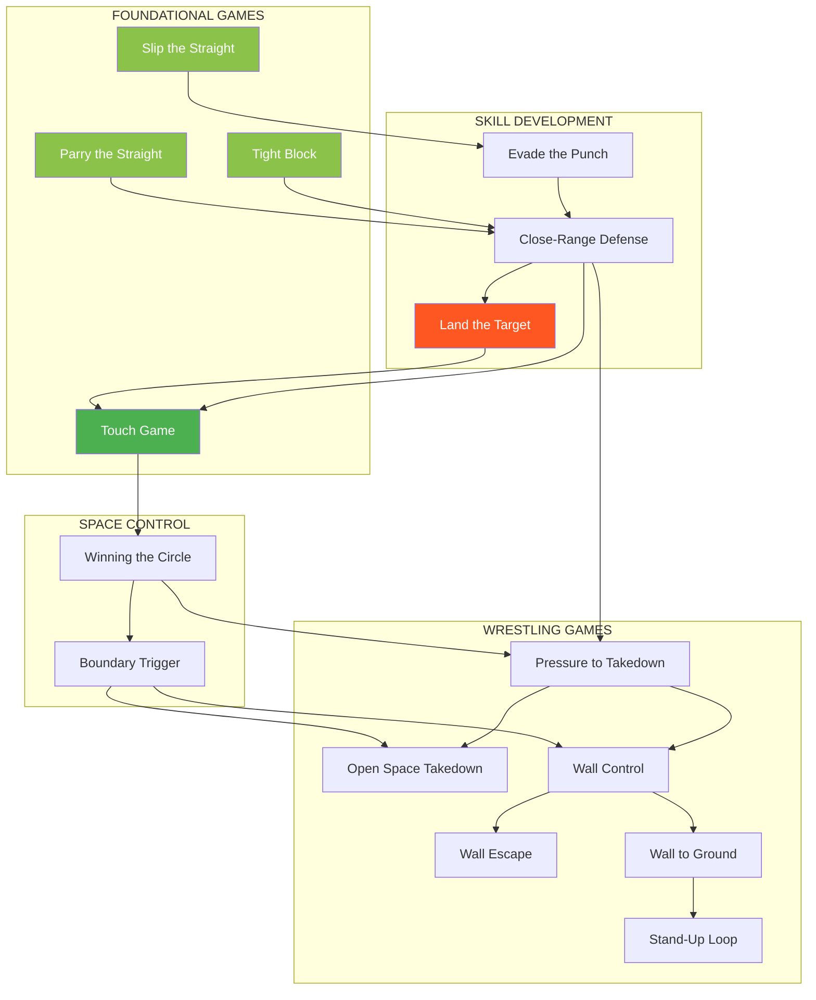
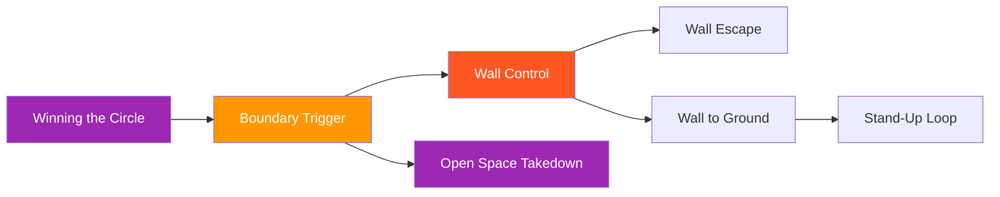
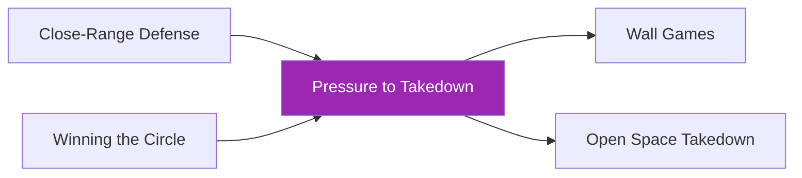
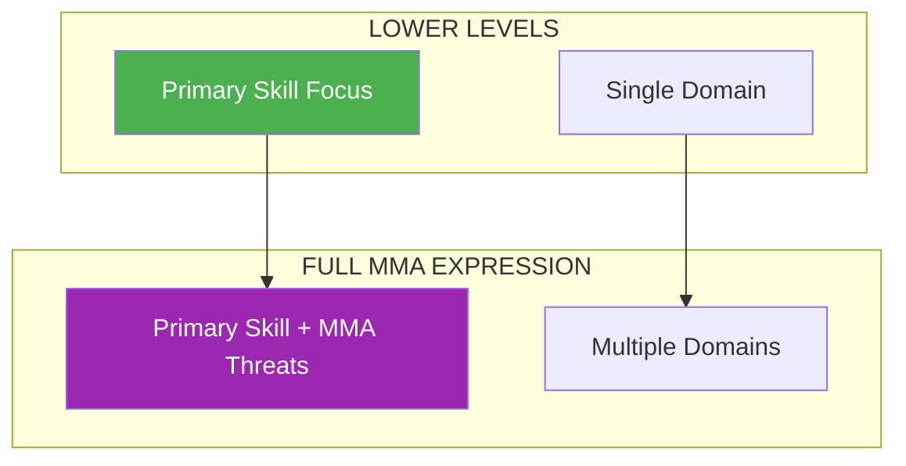

# Prerequisite Map

How games connect through prerequisites and progressions.

---

## System Overview

---

## Start Here: Entry Points

No prerequisites needed for these games:

| Game | Best For | Why Start Here |
|------|----------|----------------|
| [Parry the Straight](../games/parry-the-straight.md) | Striking defense beginners | Simplest defensive mechanic |
| [Tight Block](../games/tight-block.md) | Striking defense beginners | Pure absorption skill |
| [Slip the Straight](../games/slip-the-straight.md) | Head movement development | Single evasion type |
| [Touch and Don't Get Touched](../games/touch-game.md) | Range and timing | Foundational engagement literacy |
| [Winning the Circle](../games/winning-circle.md) | Space awareness | No contact required |
| [Land the Target](../games/land-the-target.md) | Striking offense | Defender doesn't counter |

---

## By Environment

### Skill Isolation

| Game | Prerequisites | Leads To |
|------|---------------|----------|
| Parry the Straight | None | Close-Range Defense |
| Tight Block | None | Close-Range Defense |
| Slip the Straight | None | Evade the Punch |
| Evade the Punch | Slip the Straight | Close-Range Defense |

### Open Space — Striking

| Game | Prerequisites | Leads To |
|------|---------------|----------|
| Touch Game | None (recommended: Close-Range Defense, Land the Target) | Winning the Circle |
| Close-Range Defense | Skill Isolation games | Touch Game, Pressure to Takedown |
| Land the Target | Three Zones concept | Touch Game |

### Open Space — Wrestling

| Game | Prerequisites | Leads To |
|------|---------------|----------|
| Winning the Circle | Touch Game | Boundary Trigger, Pressure to Takedown |
| Boundary Trigger | Winning the Circle | Wall Control, Open Space Takedown |
| Pressure to Takedown | Close-Range Defense, Winning the Circle | Wall Control, Open Space Takedown |
| Open Space Takedown | Boundary Trigger or Pressure to Takedown | Ground games (planned) |

### Wall

| Game | Prerequisites | Leads To |
|------|---------------|----------|
| Wall Control | Boundary Trigger or Pressure to Takedown | Wall Escape, Wall to Ground |
| Wall Escape | Wall Control | Stand-Up Loop |
| Wall to Ground | Wall Control | Stand-Up Loop, Ground games |
| Stand-Up Loop | Wall to Ground | Ground games (planned) |

---

## Progression Pathways

### Striking Defense Pathway

**Progression logic:**
1. Learn single defensive solutions in isolation
2. Combine evasion types (Evade the Punch)
3. Layer all solutions together (Close-Range Defense)
4. Apply under two-way pressure (Touch Game)

### Striking Offense Pathway

**Progression logic:**
1. Learn to read defense and land targets (no counter-threat)
2. Apply under counter-threat (Touch Game)
3. Add grappling threats (Pressure games)

### Space Control Pathway

**Progression logic:**
1. Understand range and timing
2. Add spatial pressure
3. Recognize domain change moments
4. Enter environment-specific games

### Wrestling Pathway

**Progression logic:**
1. Learn space control
2. Recognize clinch opportunities
3. Branch: Wall path OR Open Space path
4. Build environment-specific skills

### Full Integration Pathway

**Progression logic:**
- Requires both striking defense AND space control
- Chains all elements: strikes → closure → takedown → control

---

## Concept Prerequisites

Some games require understanding specific concepts first:

| Concept | Required For | Where to Learn |
|---------|--------------|----------------|
| [Three Zones of Attack](../concepts/three-zones.md) | Land the Target | Read the concept |
| [Confidence Rating](../concepts/confidence-rating.md) | Land the Target (recommended) | Read the concept |
| [TKO Pin](../concepts/tko-pin.md) | Wall Control, Wall to Ground, Stand-Up Loop | Read the concept |
| [Defensive Solutions](../concepts/defensive-solutions.md) | All Skill Isolation games | Read the concept |
| [Hand Controls](../concepts/hand-controls.md) | Close-Range Defense, Pressure to Takedown | Read the concept |
| [Full MMA Expression](../concepts/full-mma-expression.md) | All games at highest level | Read the concept |

---

## Full MMA Expression

Every game has a highest level called **Full MMA Expression** where cross-domain threats are added:

| Game Type | MMA Complication Added |
|-----------|----------------------|
| Striking defense games | Grappling threats (shoot, clinch) |
| Striking offense games | Counter-strikes, clinch denial |
| Wrestling games | Striking threats |

**Prerequisite:** Athletes should be proficient at lower levels before attempting Full MMA Expression.

See: [Full MMA Expression Concept](../concepts/full-mma-expression.md)

---

## Prerequisite Checklist

Use this to track athlete readiness:

### Before Close-Range Defense
- [ ] Can parry straight punches consistently
- [ ] Can slip straight punches with good timing
- [ ] Can absorb combinations on tight guard
- [ ] Understands defensive solution trade-offs

### Before Land the Target
- [ ] Understands Three Zones concept
- [ ] Can identify defensive patterns
- [ ] Distinguishes probes from committed attacks

### Before Pressure to Takedown
- [ ] Competent at Close-Range Defense (multiple solutions)
- [ ] Competent at Winning the Circle (space control)
- [ ] Can chain strikes while moving forward

### Before Wall Games
- [ ] Completed Boundary Trigger OR Pressure to Takedown
- [ ] Understands clinch entry timing
- [ ] Respects DNS threats

### Before Full MMA Expression (any game)
- [ ] Proficient at levels 1-4 of that game
- [ ] Comfortable with game's primary skill
- [ ] Ready for cross-domain pressure

---

!!! abstract "Development Notice"
    This map will expand as new games are added to the system.
