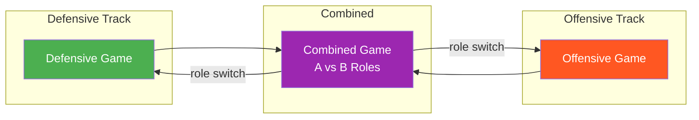
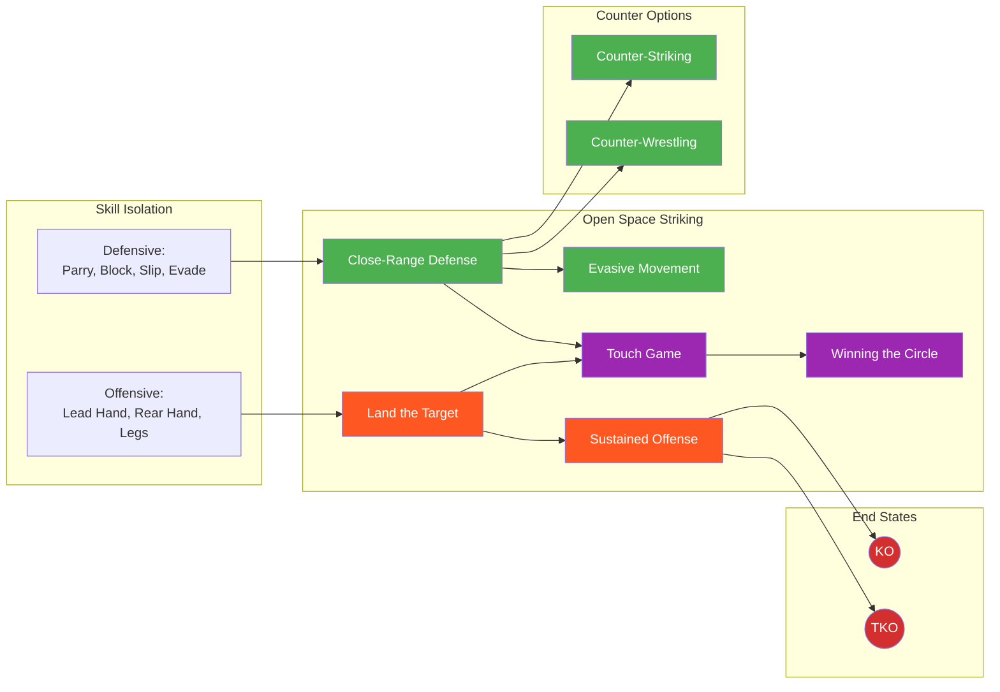
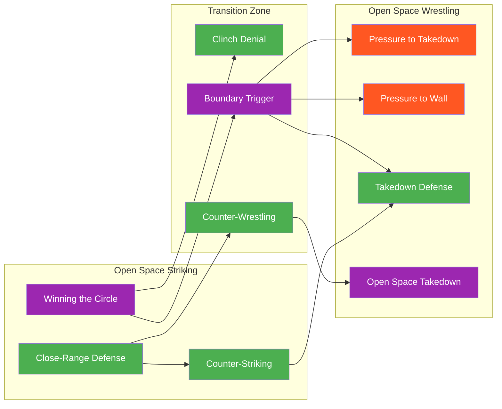
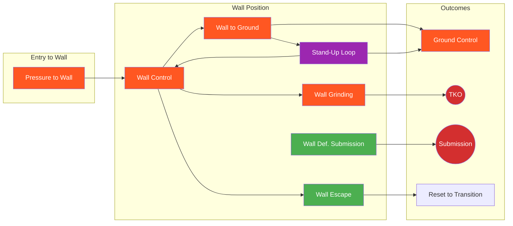
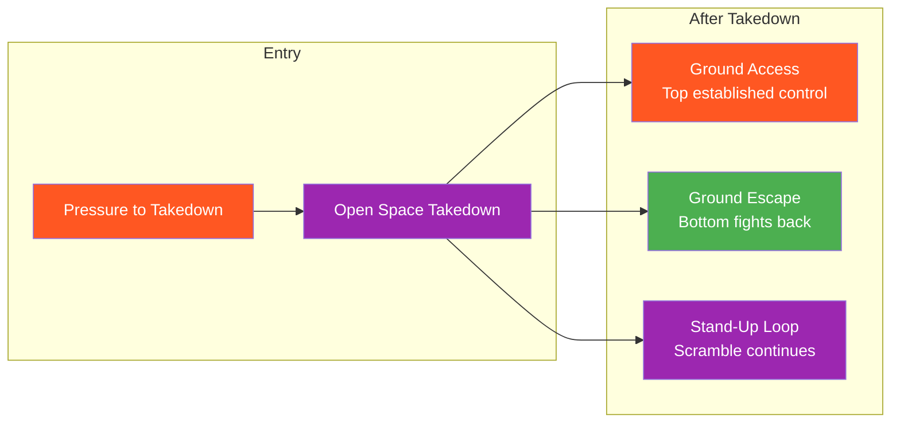
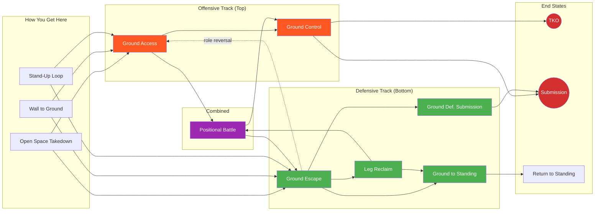

# System Map

This page provides visual navigation of the entire game system. All paths lead toward **three fight-ending outcomes**: Knockout, TKO, or Submission.

---

## Master Flowchart

    <button onclick="zoomFlowchart(0.8)">−</button>
    <button onclick="zoomFlowchart(1)">Reset</button>
    <button onclick="zoomFlowchart(1.25)">+</button>
    Use buttons or scroll to zoom

```mermaid
flowchart LR
    subgraph SKILL["SKILL ISOLATION"]
        subgraph SK_DEF["Defensive"]
            P[Parry the Straight]
            TB[Tight Block]
            SS[Slip the Straight]
            EP[Evade the Punch]
        end
        subgraph SK_OFF["Offensive"]
            LHO[Lead Hand]
            RHO[Rear Hand]
            LLO[Lead Leg]
            RLO[Rear Leg]
        end
    end

    subgraph STRIKING["OPEN SPACE: STRIKING"]
        subgraph STR_DEF["Defensive"]
            CRD[Close-Range Defense]
            EM[Evasive Movement]
            CS[Counter-Striking]
        end
        subgraph STR_OFF["Offensive"]
            LT[Land the Target]
            SO[Sustained Offense]
        end
        subgraph STR_COM["Combined"]
            TG[Touch Game]
            WC[Winning the Circle]
        end
    end

    subgraph TRANSITION["TRANSITION ZONE"]
        subgraph TR_DEF["Defensive"]
            CD[Clinch Denial]
            CW[Counter-Wrestling]
        end
        subgraph TR_COM["Combined"]
            BT[Boundary Trigger]
        end
    end

    subgraph WRESTLING["OPEN SPACE: WRESTLING"]
        subgraph WR_DEF["Defensive"]
            TDD[Takedown Defense]
        end
        subgraph WR_OFF["Offensive"]
            PTT[Pressure to Takedown]
            PTW[Pressure to Wall]
        end
        subgraph WR_COM["Combined"]
            OST[Open Space Takedown]
        end
    end

    subgraph WALL["WALL"]
        subgraph WL_DEF["Defensive"]
            WE[Wall Escape]
            WDS[Wall Def. Submission]
        end
        subgraph WL_OFF["Offensive"]
            WCon[Wall Control]
            WG[Wall to Ground]
            WGr[Wall Grinding]
        end
        subgraph WL_COM["Combined"]
            SUL[Stand-Up Loop]
        end
    end

    subgraph GROUND["GROUND"]
        subgraph GR_DEF["Defensive"]
            GE[Ground Escape]
            LR[Leg Reclaim]
            GTS[Ground to Standing]
            GDS[Ground Def. Submission]
        end
        subgraph GR_OFF["Offensive"]
            GA[Ground Access]
            GC[Ground Control]
        end
        subgraph GR_COM["Combined"]
            PB[Positional Battle]
        end
    end

    subgraph FINISH["END STATES"]
        KO((KO))
        TKO((TKO))
        SUB((Submission))
    end

    %% Skill Isolation → Striking
    SK_DEF --> CRD
    SK_OFF --> LT

    %% Striking internal
    CRD --> TG
    CRD --> EM
    CRD --> CS
    CRD --> CW
    LT --> TG
    LT --> SO
    TG --> WC

    %% Striking → Finish
    SO --> KO
    SO --> TKO

    %% Striking → Transition
    WC --> BT
    WC --> CD
    EM --> BT

    %% Transition → Wrestling
    BT --> PTT
    BT --> PTW
    BT --> TDD
    CS --> TDD
    CW --> OST

    %% Wrestling paths
    PTT --> OST
    PTW --> WCon
    TDD --> OST

    %% Wall paths
    WCon --> WE
    WCon --> WG
    WCon --> WGr
    WE --> BT
    WDS --> SUB
    WG --> SUL
    WG --> GC
    WGr --> TKO
    SUL --> WCon
    SUL --> GA
    SUL --> GE

    %% Takedown paths
    OST --> GA
    OST --> GE
    OST --> SUL

    %% Ground paths
    GA --> GC
    GA --> PB
    GC --> TKO
    GC --> SUB
    GE --> LR
    GE --> GTS
    GE --> GDS
    LR --> PB
    LR --> GTS
    GTS --> BT
    GDS --> SUB
    PB --> GC
    PB --> GE

    %% Role reversal indicator
    GE -.->|role switch| GA

    %% Styling
    style P fill:#4CAF50,color:#fff
    style TB fill:#4CAF50,color:#fff
    style SS fill:#4CAF50,color:#fff
    style EP fill:#4CAF50,color:#fff
    style CRD fill:#4CAF50,color:#fff
    style EM fill:#4CAF50,color:#fff
    style CD fill:#4CAF50,color:#fff
    style CS fill:#4CAF50,color:#fff
    style CW fill:#4CAF50,color:#fff
    style TDD fill:#4CAF50,color:#fff
    style WE fill:#4CAF50,color:#fff
    style WDS fill:#4CAF50,color:#fff
    style GE fill:#4CAF50,color:#fff
    style LR fill:#4CAF50,color:#fff
    style GTS fill:#4CAF50,color:#fff
    style GDS fill:#4CAF50,color:#fff

    style LHO fill:#FF5722,color:#fff
    style RHO fill:#FF5722,color:#fff
    style LLO fill:#FF5722,color:#fff
    style RLO fill:#FF5722,color:#fff
    style LT fill:#FF5722,color:#fff
    style SO fill:#FF5722,color:#fff
    style PTT fill:#FF5722,color:#fff
    style PTW fill:#FF5722,color:#fff
    style WCon fill:#FF5722,color:#fff
    style WG fill:#FF5722,color:#fff
    style WGr fill:#FF5722,color:#fff
    style GA fill:#FF5722,color:#fff
    style GC fill:#FF5722,color:#fff

    style TG fill:#9C27B0,color:#fff
    style WC fill:#9C27B0,color:#fff
    style BT fill:#9C27B0,color:#fff
    style OST fill:#9C27B0,color:#fff
    style SUL fill:#9C27B0,color:#fff
    style PB fill:#9C27B0,color:#fff

    style KO fill:#D32F2F,color:#fff
    style TKO fill:#D32F2F,color:#fff
    style SUB fill:#D32F2F,color:#fff
```

**Legend:**

- 🟢 Green = Defensive Focus
- 🟠 Orange = Offensive Focus
- 🟣 Purple = Combined Focus
- 🔴 Red = Fight-Ending States

---

## The Three End States

Every pathway in this system ultimately leads to one of three fight-ending outcomes:

| End State | Definition | Primary Paths |
|-----------|------------|---------------|
| **Knockout (KO)** | Single strike renders opponent unconscious | Sustained Offense → finishing strike |
| **TKO** | Accumulated damage until opponent cannot defend | Wall Grinding, Ground Control → strikes |
| **Submission** | Choke or joint lock forces tap/unconsciousness | Ground Control, Defensive Submissions |

---

## Offensive/Defensive Convergence

The system establishes this rule: **Every offensive/defensive pair must have a combined game connecting them.**

**Combined Game Roles:** Combined games have distinct A and B roles — not necessarily mirrored objectives. One player may focus on Goal A while the other focuses on Goal B.

---

## Environment Pathways

### Striking Pathway (with End States)

### Transition Zone

The Transition Zone sits between Striking and Wrestling, handling the critical moment when domains shift:

### Wall Pathways (with Split Outcomes)

### Takedown Pathways (with Split Outcomes)

### Ground Pathway (with Role Reversals)

---

## Game Inventory

### By Environment and Focus

| # | Game | Environment | Domain | Focus | Difficulty |
|---|------|-------------|--------|-------|------------|
| 1 | [Parry the Straight](../games/parry-the-straight.md) | Skill Isolation | Striking | Defensive | Beginner |
| 2 | [Tight Block](../games/tight-block.md) | Skill Isolation | Striking | Defensive | Beginner |
| 3 | [Slip the Straight](../games/slip-the-straight.md) | Skill Isolation | Striking | Defensive | Beginner |
| 4 | [Evade the Punch](../games/evade-the-punch.md) | Skill Isolation | Striking | Defensive | Intermediate |
| 5 | [Lead Hand Offense](../games/lead-hand-offense.md) | Skill Isolation | Striking | Offensive | Beginner |
| 6 | [Rear Hand Offense](../games/rear-hand-offense.md) | Skill Isolation | Striking | Offensive | Beginner |
| 7 | [Lead Leg Offense](../games/lead-leg-offense.md) | Skill Isolation | Striking | Offensive | Intermediate |
| 8 | [Rear Leg Offense](../games/rear-leg-offense.md) | Skill Isolation | Striking | Offensive | Intermediate |
| 9 | [Close-Range Defense](../games/close-range-defense.md) | Open Space | Striking | Defensive | Intermediate |
| 10 | [Evasive Movement](../games/evasive-movement.md) | Open Space | Striking | Defensive | Intermediate |
| 11 | [Land the Target](../games/land-the-target.md) | Open Space | Striking | Offensive | Intermediate |
| 12 | [Sustained Offense](../games/sustained-offense.md) | Open Space | Striking | Offensive | Intermediate |
| 13 | [Touch and Don't Get Touched](../games/touch-game.md) | Open Space | Striking | Combined | Beginner |
| 14 | [Winning the Circle](../games/winning-circle.md) | Open Space | Striking | Combined | Beginner |
| 15 | [Counter-Striking](../games/counter-striking.md) | Open Space | Striking | Defensive | Intermediate |
| 16 | [Counter-Wrestling](../games/counter-wrestling.md) | Transition | Wrestling | Defensive | Intermediate |
| 17 | [Clinch Denial](../games/clinch-denial.md) | Transition | Wrestling | Defensive | Intermediate |
| 18 | [Boundary Trigger](../games/boundary-trigger.md) | Transition | Wrestling | Combined | Intermediate |
| 19 | [Takedown Defense](../games/takedown-defense.md) | Open Space | Wrestling | Defensive | Intermediate |
| 20 | [Pressure to Takedown](../games/pressure-to-takedown.md) | Open Space | Wrestling | Offensive | Advanced |
| 21 | [Pressure to Wall](../games/pressure-to-wall.md) | Open Space | Wrestling | Offensive | Advanced |
| 22 | [Open Space Takedown](../games/open-space-takedown.md) | Open Space | Wrestling | Combined | Intermediate |
| 23 | [Wall Control](../games/wall-control.md) | Wall | Wrestling | Offensive | Intermediate |
| 24 | [Wall Escape](../games/wall-escape.md) | Wall | Wrestling | Defensive | Intermediate |
| 25 | [Wall Defensive Submission](../games/wall-defensive-submission.md) | Wall | Grappling | Defensive | Advanced |
| 26 | [Wall Pin to Ground](../games/wall-to-ground.md) | Wall | Wrestling | Offensive | Intermediate |
| 27 | [Wall Grinding](../games/wall-grinding.md) | Wall | Wrestling | Offensive | Intermediate |
| 28 | [Stand-Up Loop](../games/standup-loop.md) | Wall | Wrestling | Combined | Advanced |
| 29 | [Ground Access](../games/ground-access.md) | Ground | Grappling | Offensive | Intermediate |
| 30 | [Ground Control](../games/ground-control.md) | Ground | Grappling | Offensive | Intermediate |
| 31 | [Ground Escape](../games/ground-escape.md) | Ground | Grappling | Defensive | Intermediate |
| 32 | [Leg Reclaim](../games/leg-reclaim.md) | Ground | Grappling | Defensive | Intermediate |
| 33 | [Ground to Standing](../games/ground-to-standing.md) | Ground | Grappling | Defensive | Intermediate |
| 34 | [Ground Defensive Submission](../games/ground-defensive-submission.md) | Ground | Grappling | Defensive | Advanced |
| 35 | [Positional Battle](../games/positional-battle.md) | Ground | Grappling | Combined | Intermediate |

---

## Focus Distribution

=== "Defensive"
    Games where the defender is the primary learner:

    **Skill Isolation:**
    - Parry the Straight
    - Tight Block
    - Slip the Straight
    - Evade the Punch

    **Open Space Striking:**
    - Close-Range Defense
    - Evasive Movement
    - Counter-Striking

    **Transition:**
    - Counter-Wrestling
    - Clinch Denial

    **Open Space Wrestling:**
    - Takedown Defense

    **Wall:**
    - Wall Escape
    - Wall Defensive Submission

    **Ground:**
    - Ground Escape
    - Leg Reclaim
    - Ground to Standing
    - Ground Defensive Submission

=== "Offensive"
    Games where the attacker is the primary learner:

    **Skill Isolation:**
    - Lead Hand Offense
    - Rear Hand Offense
    - Lead Leg Offense
    - Rear Leg Offense

    **Open Space Striking:**
    - Land the Target
    - Sustained Offense

    **Open Space Wrestling:**
    - Pressure to Takedown
    - Pressure to Wall

    **Wall:**
    - Wall Control
    - Wall Pin to Ground
    - Wall Grinding

    **Ground:**
    - Ground Access
    - Ground Control

=== "Combined"
    Games where both players have distinct objectives (A vs B roles):

    **Open Space Striking:**
    - Touch and Don't Get Touched
    - Winning the Circle

    **Transition:**
    - Boundary Trigger

    **Open Space Wrestling:**
    - Open Space Takedown

    **Wall:**
    - Stand-Up Loop

    **Ground:**
    - Positional Battle

---

## Concept Integration

| Concept | Where It Appears | Function |
|---------|------------------|----------|
| [Three Zones](../concepts/three-zones.md) | Land the Target, Sustained Offense | Offensive target selection |
| [Confidence Rating](../concepts/confidence-rating.md) | Land the Target, Skill Isolation | Commitment timing |
| [Defensive Solutions](../concepts/defensive-solutions.md) | All skill isolation, Close-Range Defense | Defense selection |
| [Hand Controls](../concepts/hand-controls.md) | Touch, Circle, Boundary, Pressure | Bridges striking and clinch |
| [TKO Pin](../concepts/tko-pin.md) | Wall Grinding, Ground Control | Exploitation endpoint |
| [Decision States](../concepts/decision-states.md) | All games | Access → Stabilize → Exploit → Counter |
| [Full MMA Expression](../concepts/full-mma-expression.md) | Level 4 of all games | Cross-domain threat integration |
| [Fight Philosophy](../concepts/fight-philosophy.md) | System-wide | Finish while taking minimal damage |

---

## System Statistics

| Category | Count |
|----------|-------|
| **Total Games** | 35 |
| **Defensive Focus** | 14 |
| **Offensive Focus** | 12 |
| **Combined Focus** | 6 |
| **Transition Games** | 4 |
| **Skill Isolation** | 8 |
| **Open Space** | 12 |
| **Wall** | 6 |
| **Ground** | 6 |

---

!!! abstract "System Evolution Notice"
    This map will be updated as new games are added and existing games are refined.
    See [Change Log](../reference/changelog.md) for version history.
