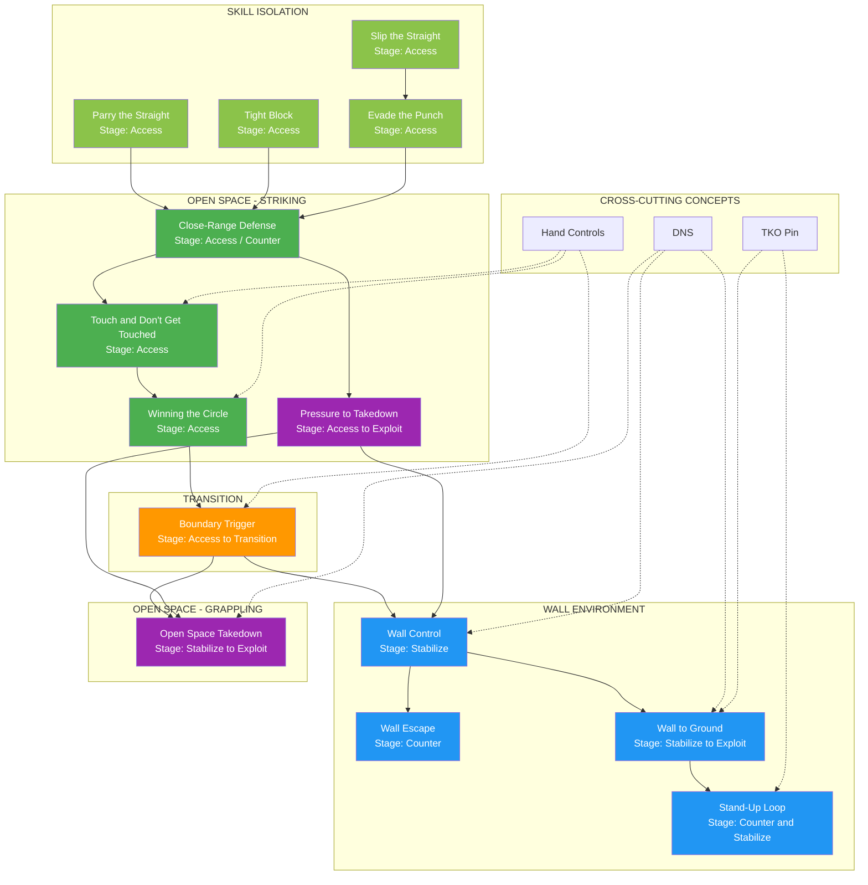
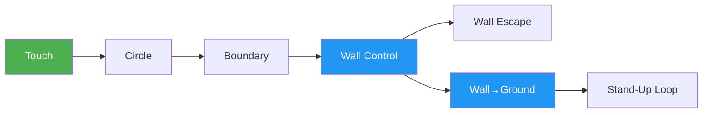

# System Map

This page provides visual navigation of the entire game system.

---

## Complete Flowchart

---

## Progression Pathways

### Wall Pathway (Primary)

### Open Space Pathway

---

## Game Inventory

| # | Game | Environment | Stage |
|---|------|-------------|-------|
| 1 | [Parry the Straight](../games/parry-the-straight.md) | Open Space | Access (Skill Isolation) |
| 2 | [Tight Block](../games/tight-block.md) | Open Space | Access (Skill Isolation) |
| 3 | [Slip the Straight](../games/slip-the-straight.md) | Open Space | Access (Skill Isolation) |
| 4 | [Evade the Punch](../games/evade-the-punch.md) | Open Space | Access (Skill Integration) |
| 5 | [Close-Range Defense](../games/close-range-defense.md) | Open Space | Access / Counter |
| 6 | [Touch and Don't Get Touched](../games/touch-game.md) | Open Space | Access |
| 7 | [Winning the Circle](../games/winning-circle.md) | Open Space | Access |
| 8 | [Pressure to Takedown](../games/pressure-to-takedown.md) | Open Space | Access → Stabilize → Exploit |
| 9 | [Boundary Trigger](../games/boundary-trigger.md) | Transition | Access → Transition |
| 10 | [Wall Control](../games/wall-control.md) | Wall | Stabilize |
| 11 | [Wall Escape](../games/wall-escape.md) | Wall | Counter |
| 12 | [Wall → Ground](../games/wall-to-ground.md) | Wall → Ground | Stabilize → Exploit |
| 13 | [Stand-Up Loop](../games/standup-loop.md) | Wall / Ground | Counter ↔ Stabilize |
| 14 | [Open Space Takedown](../games/open-space-takedown.md) | Open Space | Stabilize → Exploit |

---

## Decision State Coverage

=== "Access"
    Games that teach engagement and connection:

    - Parry the Straight (Skill Isolation)
    - Tight Block (Skill Isolation)
    - Slip the Straight (Skill Isolation)
    - Evade the Punch (Skill Integration)
    - Close-Range Defense
    - Touch and Don't Get Touched
    - Winning the Circle
    - Pressure to Takedown
    - Boundary Trigger

=== "Stabilize"
    Games that teach control establishment:

    - Wall Control — Establish Pin
    - Wall Pin → Ground Control
    - Open Space Takedown

=== "Exploit"
    Games where TKO Pin or damage becomes available:

    - Wall → Ground (Level 3)
    - Stand-Up Loop (TKO access)
    - Open Space Takedown (Level 3)

=== "Counter"
    Games that teach defensive response:

    - Close-Range Defense (Level 4-5)
    - Wall Escape — Anti-Pin
    - Stand-Up & Re-Pin Loop

---

## Concept Integration

| Concept | Where It Appears | Function |
|---------|------------------|----------|
| [Hand Controls](../concepts/hand-controls.md) | Touch, Circle, Boundary | Bridges striking and clinch |
| [DNS](../concepts/tko-pin.md) | Wall Control, Wall→Ground, Open Takedown | Punishes poor posture |
| [TKO Pin](../concepts/tko-pin.md) | Wall→Ground, Stand-Up Loop | Exploitation endpoint |

---

## Gaps (Future Development)

!!! warning "Missing Components"

    | Gap | Priority |
    |-----|----------|
    | Ground-only games (start on ground) | High |
    | Ground Escape game | High |
    | TKO Pin dedicated game | Medium |
    | Submission games | Medium |
    | Shot entry game (takedown from distance) | Lower |
