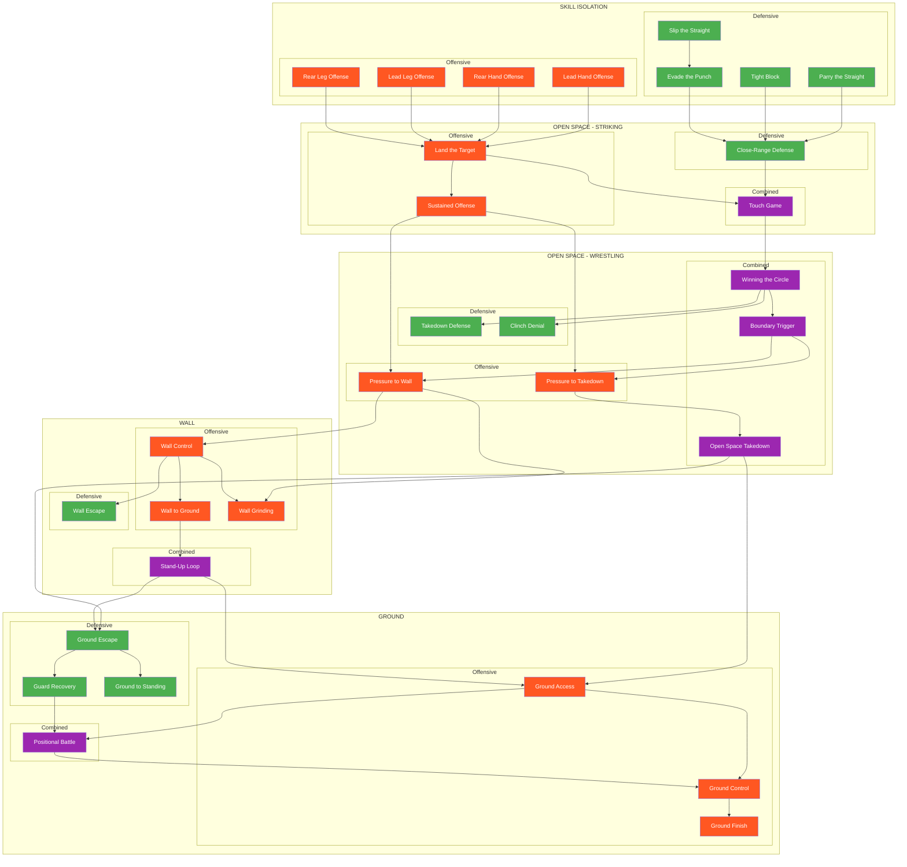
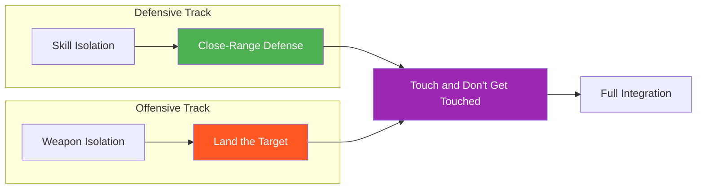
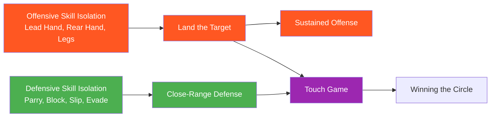
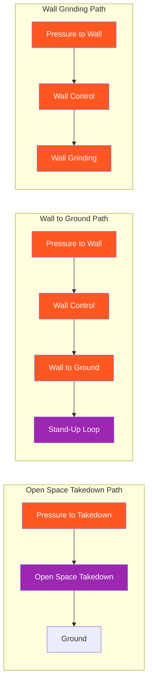
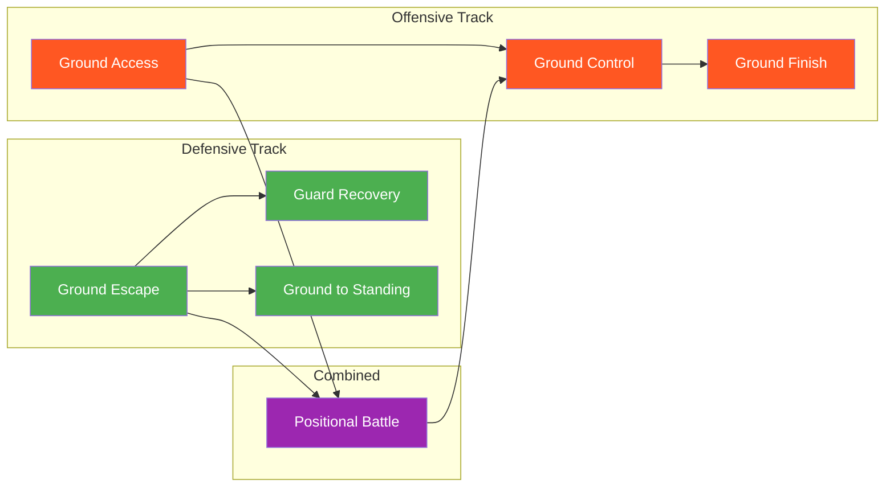

# System Map

This page provides visual navigation of the entire game system, organized by Environment → Domain → Focus.

---

## Master Flowchart

**Legend:**
- Green = Defensive Focus
- Orange = Offensive Focus
- Purple = Combined Focus

---

## Offensive/Defensive Convergence

The system is built around the principle that offensive and defensive skills converge in combined games:

---

## Environment Pathways

### Striking Pathway

### Wall Pathways

Three distinct pathways to/through the wall:

### Ground Pathway

---

## Game Inventory

### By Environment and Focus

| # | Game | Environment | Domain | Focus | Difficulty |
|---|------|-------------|--------|-------|------------|
| 1 | [Parry the Straight](../games/parry-the-straight.md) | Skill Isolation | Striking | Defensive | Beginner |
| 2 | [Tight Block](../games/tight-block.md) | Skill Isolation | Striking | Defensive | Beginner |
| 3 | [Slip the Straight](../games/slip-the-straight.md) | Skill Isolation | Striking | Defensive | Beginner |
| 4 | [Evade the Punch](../games/evade-the-punch.md) | Skill Isolation | Striking | Defensive | Intermediate |
| 5 | [Lead Hand Offense](../games/lead-hand-offense.md) | Skill Isolation | Striking | Offensive | Beginner |
| 6 | [Rear Hand Offense](../games/rear-hand-offense.md) | Skill Isolation | Striking | Offensive | Beginner |
| 7 | [Lead Leg Offense](../games/lead-leg-offense.md) | Skill Isolation | Striking | Offensive | Intermediate |
| 8 | [Rear Leg Offense](../games/rear-leg-offense.md) | Skill Isolation | Striking | Offensive | Intermediate |
| 9 | [Close-Range Defense](../games/close-range-defense.md) | Open Space | Striking | Defensive | Intermediate |
| 10 | [Land the Target](../games/land-the-target.md) | Open Space | Striking | Offensive | Intermediate |
| 11 | [Sustained Offense](../games/sustained-offense.md) | Open Space | Striking | Offensive | Intermediate |
| 12 | [Touch and Don't Get Touched](../games/touch-game.md) | Open Space | Striking | Combined | Beginner |
| 13 | [Winning the Circle](../games/winning-circle.md) | Open Space | Wrestling | Combined | Beginner |
| 14 | [Boundary Trigger](../games/boundary-trigger.md) | Open Space | Wrestling | Combined | Intermediate |
| 15 | [Pressure to Takedown](../games/pressure-to-takedown.md) | Open Space | Wrestling | Offensive | Advanced |
| 16 | [Pressure to Wall](../games/pressure-to-wall.md) | Open Space | Wrestling | Offensive | Advanced |
| 17 | [Takedown Defense](../games/takedown-defense.md) | Open Space | Wrestling | Defensive | Intermediate |
| 18 | [Clinch Denial](../games/clinch-denial.md) | Open Space | Wrestling | Defensive | Intermediate |
| 19 | [Open Space Takedown](../games/open-space-takedown.md) | Open Space | Wrestling | Combined | Intermediate |
| 20 | [Wall Control](../games/wall-control.md) | Wall | Wrestling | Offensive | Intermediate |
| 21 | [Wall Escape](../games/wall-escape.md) | Wall | Wrestling | Defensive | Intermediate |
| 22 | [Wall Pin to Ground](../games/wall-to-ground.md) | Wall | Wrestling | Offensive | Intermediate |
| 23 | [Wall Grinding](../games/wall-grinding.md) | Wall | Wrestling | Offensive | Intermediate |
| 24 | [Stand-Up Loop](../games/standup-loop.md) | Wall | Wrestling | Combined | Advanced |
| 25 | [Ground Access](../games/ground-access.md) | Ground | Grappling | Offensive | Intermediate |
| 26 | [Ground Control](../games/ground-control.md) | Ground | Grappling | Offensive | Intermediate |
| 27 | [Ground Finish](../games/ground-finish.md) | Ground | Grappling | Offensive | Advanced |
| 28 | [Ground Escape](../games/ground-escape.md) | Ground | Grappling | Defensive | Intermediate |
| 29 | [Guard Recovery](../games/guard-recovery.md) | Ground | Grappling | Defensive | Intermediate |
| 30 | [Ground to Standing](../games/ground-to-standing.md) | Ground | Grappling | Defensive | Intermediate |
| 31 | [Positional Battle](../games/positional-battle.md) | Ground | Grappling | Combined | Intermediate |

---

## Focus Distribution

=== "Defensive"
    Games where the defender is the primary learner:

    **Skill Isolation:**
    - Parry the Straight
    - Tight Block
    - Slip the Straight
    - Evade the Punch

    **Open Space:**
    - Close-Range Defense
    - Takedown Defense
    - Clinch Denial

    **Wall:**
    - Wall Escape

    **Ground:**
    - Ground Escape
    - Guard Recovery
    - Ground to Standing

=== "Offensive"
    Games where the attacker is the primary learner:

    **Skill Isolation:**
    - Lead Hand Offense
    - Rear Hand Offense
    - Lead Leg Offense
    - Rear Leg Offense

    **Open Space:**
    - Land the Target
    - Sustained Offense
    - Pressure to Takedown
    - Pressure to Wall

    **Wall:**
    - Wall Control
    - Wall Pin to Ground
    - Wall Grinding

    **Ground:**
    - Ground Access
    - Ground Control
    - Ground Finish

=== "Combined"
    Games where both sides have active learning objectives:

    **Open Space:**
    - Touch and Don't Get Touched
    - Winning the Circle
    - Boundary Trigger
    - Open Space Takedown

    **Wall:**
    - Stand-Up Loop

    **Ground:**
    - Positional Battle

---

## Concept Integration

| Concept | Where It Appears | Function |
|---------|------------------|----------|
| [Three Zones](../concepts/three-zones.md) | Land the Target, Sustained Offense | Offensive target selection |
| [Confidence Rating](../concepts/confidence-rating.md) | Land the Target, Skill Isolation | Commitment timing |
| [Defensive Solutions](../concepts/defensive-solutions.md) | All skill isolation, Close-Range Defense | Defense selection |
| [Hand Controls](../concepts/hand-controls.md) | Touch, Circle, Boundary, Pressure | Bridges striking and clinch |
| [TKO Pin](../concepts/tko-pin.md) | Wall→Ground, Stand-Up Loop, Ground Finish | Exploitation endpoint |
| [Decision States](../concepts/decision-states.md) | All games | Access → Stabilize → Exploit → Counter |
| [Full MMA Expression](../concepts/full-mma-expression.md) | Level 4 of all games | Cross-domain threat integration |

---

## System Statistics

| Category | Count |
|----------|-------|
| **Total Games** | 31 |
| **Defensive Focus** | 11 |
| **Offensive Focus** | 14 |
| **Combined Focus** | 6 |
| **Skill Isolation** | 8 |
| **Open Space** | 11 |
| **Wall** | 5 |
| **Ground** | 7 |

---

!!! abstract "System Evolution Notice"
    This map will be updated as new games are added and existing games are refined.
