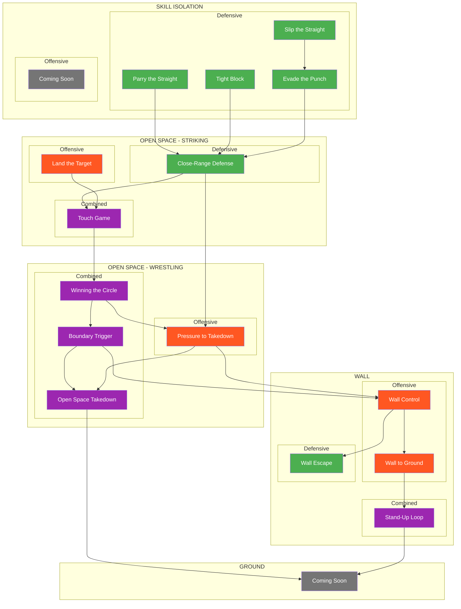
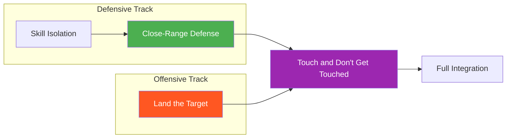
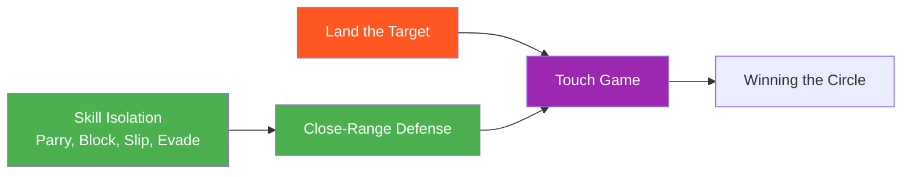
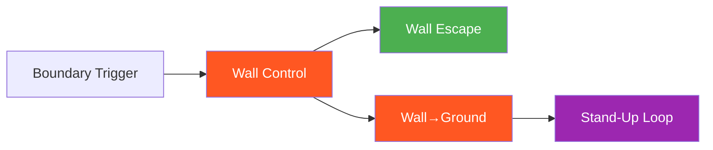

# System Map

This page provides visual navigation of the entire game system, organized by Environment → Domain → Focus.

---

## Master Flowchart

**Legend:**
- Green = Defensive Focus
- Orange = Offensive Focus
- Purple = Combined Focus
- Gray = Coming Soon

---

## Offensive/Defensive Convergence

The system is built around the principle that offensive and defensive skills converge in combined games:

---

## Environment Pathways

### Striking Pathway

### Wall Pathway

### Open Space Wrestling Pathway

---

## Game Inventory

### By Environment and Focus

| # | Game | Environment | Domain | Focus | Difficulty |
|---|------|-------------|--------|-------|------------|
| 1 | [Parry the Straight](../games/parry-the-straight.md) | Skill Isolation | Striking | Defensive | Beginner |
| 2 | [Tight Block](../games/tight-block.md) | Skill Isolation | Striking | Defensive | Beginner |
| 3 | [Slip the Straight](../games/slip-the-straight.md) | Skill Isolation | Striking | Defensive | Beginner |
| 4 | [Evade the Punch](../games/evade-the-punch.md) | Skill Isolation | Striking | Defensive | Intermediate |
| 5 | [Close-Range Defense](../games/close-range-defense.md) | Open Space | Striking | Defensive | Intermediate |
| 6 | [Land the Target](../games/land-the-target.md) | Open Space | Striking | Offensive | Intermediate |
| 7 | [Touch and Don't Get Touched](../games/touch-game.md) | Open Space | Striking | Combined | Beginner |
| 8 | [Winning the Circle](../games/winning-circle.md) | Open Space | Wrestling | Combined | Beginner |
| 9 | [Boundary Trigger](../games/boundary-trigger.md) | Open Space | Wrestling | Combined | Intermediate |
| 10 | [Pressure to Takedown](../games/pressure-to-takedown.md) | Open Space | Wrestling | Offensive | Advanced |
| 11 | [Open Space Takedown](../games/open-space-takedown.md) | Open Space | Wrestling | Combined | Intermediate |
| 12 | [Wall Control](../games/wall-control.md) | Wall | Wrestling | Offensive | Intermediate |
| 13 | [Wall Escape](../games/wall-escape.md) | Wall | Wrestling | Defensive | Intermediate |
| 14 | [Wall Pin to Ground](../games/wall-to-ground.md) | Wall | Wrestling | Offensive | Intermediate |
| 15 | [Stand-Up Loop](../games/standup-loop.md) | Wall | Wrestling | Combined | Advanced |

---

## Focus Distribution

=== "Defensive"
    Games where the defender is the primary learner:

    - Parry the Straight
    - Tight Block
    - Slip the Straight
    - Evade the Punch
    - Close-Range Defense
    - Wall Escape

=== "Offensive"
    Games where the attacker is the primary learner:

    - Land the Target
    - Pressure to Takedown
    - Wall Control
    - Wall Pin to Ground

=== "Combined"
    Games where both sides have active learning objectives:

    - Touch and Don't Get Touched
    - Winning the Circle
    - Boundary Trigger
    - Open Space Takedown
    - Stand-Up Loop

---

## Concept Integration

| Concept | Where It Appears | Function |
|---------|------------------|----------|
| [Three Zones](../concepts/three-zones.md) | Land the Target | Offensive target selection |
| [Confidence Rating](../concepts/confidence-rating.md) | Land the Target, Skill Isolation | Commitment timing |
| [Defensive Solutions](../concepts/defensive-solutions.md) | All skill isolation, Close-Range Defense | Defense selection |
| [Hand Controls](../concepts/hand-controls.md) | Touch, Circle, Boundary, Pressure | Bridges striking and clinch |
| [TKO Pin](../concepts/tko-pin.md) | Wall→Ground, Stand-Up Loop, Ground games | Exploitation endpoint |

---

## Development Roadmap

| Area | Status | Priority |
|------|--------|----------|
| Offensive Skill Isolation | Planned | Medium |
| Defensive Wrestling (Open Space) | Planned | Medium |
| Ground - Offensive | Planned | High |
| Ground - Defensive | Planned | High |
| Ground - Combined | Planned | High |
| Transitions | Planned | Medium |

See placeholder pages for conceptual frameworks.

---

!!! abstract "System Evolution Notice"
    This map will be updated as new games are added to the system.
