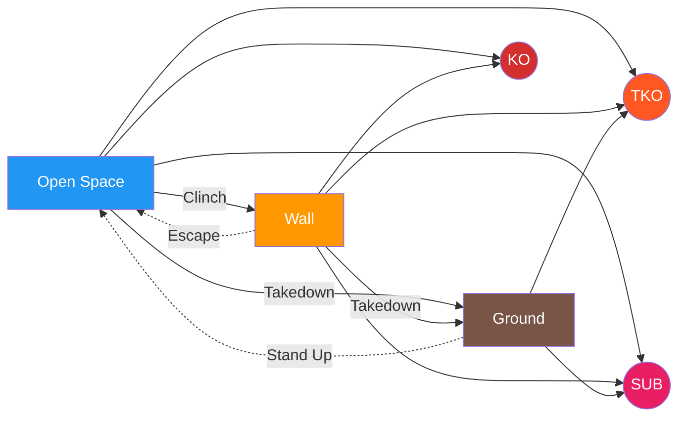

# System Map

Visual NavigationAll 34 GamesEnvironment → Finish

<b>The fight is cyclical.</b> You move between environments until someone finishes, and every path has a reverse. This map routes you from foundation skills through every game to a finish.

Fight States &amp; Transitions

```mermaid
flowchart LR
    OS[Open Space] -->|Clinch| W[Wall]
    OS -->|Takedown| G[Ground]
    W -->|Takedown| G
    W -.->|Escape| OS
    G -.->|Stand Up| OS

    OS --> KO((KO))
    OS --> TKO((TKO))
    OS --> SUB((SUB))
    W --> KO
    W --> TKO
    W --> SUB
    G --> TKO
    G --> SUB

    style OS fill:#2196F3, color:#fff
    style W fill:#FF9800, color:#fff
    style G fill:#795548, color:#fff
    style KO fill:#D32F2F, color:#fff
    style TKO fill:#FF5722, color:#fff
    style SUB fill:#E91E63, color:#fff
```

How to Read the Map

  
Foundation→Open Space

  
Open Space→Transitions (to Wall / Ground)

  
Transitions→Positions (Wall / Ground)

  
Positions→Finish (KO · TKO · SUB)

  🟢 DefensiveSurvive, escape, prevent transitions. The B Side is developing skills.
  🟠 OffensiveAttack, control, initiate transitions. The A Side is developing skills.
  🟣 CombinedBoth roles active, scrambles and mixed situations where both sides have live objectives.

The Cycle in Four Beats

  

1️⃣

Start standing

Every fight starts in <b>Open Space</b>, standing at distance.

  

2️⃣

Transition

From Open Space, move to <b>Wall</b> (clinch) or <b>Ground</b> (grappling).

  

3️⃣

Escape back

From Wall or Ground, you can <b>escape</b> to Open Space.

  

4️⃣

Finish

Any position can lead to a <b>finish</b>, KO, TKO, or Submission.

The Three End States

  

💥

Knockout (KO)

A single strike ends the fight.Primary path: a clean strike landed with power and precision.

  

🥊

TKO

Accumulated damage overwhelms the defense.Primary paths: sustained offense, wall grinding, ground control.

  

🔒

Submission

A choke or joint lock forces the tap.Primary paths: ground control, defensive submissions.

---

🏗️ Foundation: Skill Isolation

Skills developed in isolation before integration into live fighting.

Defensive 🟢

  <a class="emma-card" href="../../games/parry-the-straight/">
🤚

Parry the Straight

Hand deflection timing.
</a>
  <a class="emma-card" href="../../games/tight-block/">
🛡️

Tight Block

Guard absorption.
</a>
  <a class="emma-card" href="../../games/slip-the-straight/">
↪️

Slip the Straight

Head movement.
</a>
  <a class="emma-card" href="../../games/evade-the-punch/">
💨

Evade the Punch

Full evasion vocabulary.
</a>

Offensive 🟠

  <a class="emma-card" href="../../games/lead-hand-offense/">
👊

Lead Hand Offense

Jab mechanics and setups.
</a>
  <a class="emma-card" href="../../games/rear-hand-offense/">
🥊

Rear Hand Offense

Cross / power hand timing.
</a>
  <a class="emma-card" href="../../games/lead-leg-offense/">
🦵

Lead Leg Offense

Lead kick variety.
</a>
  <a class="emma-card" href="../../games/rear-leg-offense/">
🦿

Rear Leg Offense

Power kick delivery.
</a>

---

🥊 Open Space

Standing at distance. This is where every fight starts.

Striking Defense 🟢

  <a class="emma-card" href="../../games/close-range-defense/">
🛡️

Close-Range Defense

Layered defensive response.
</a>
  <a class="emma-card" href="../../games/evasive-movement/">
💨

Evasive Movement

Creating distance under fire.
</a>
  <a class="emma-card" href="../../games/counter-striking/">
⚡

Counter-Striking

Punishing initiation.
</a>

Striking Offense 🟠

  <a class="emma-card" href="../../games/land-the-target/">
🎯

Land the Target

Reading defense, landing clean.
</a>
  <a class="emma-card" href="../../games/sustained-offense/">
🔥

Sustained Offense

Maintaining pressure to finish.
</a>

Control 🟣

  <a class="emma-card" href="../../games/touch-game/">
✋

Touch and Don't Get Touched

Range awareness and timing.
</a>

---

🧱 Open Space → Wall

Transitions from standing at distance to the cage / clinch.

Prevent 🟢

  <a class="emma-card" href="../../games/clinch-denial/">
🚫

Clinch Denial

Breaking clinch attempts.
</a>

Initiate 🟠

  <a class="emma-card" href="../../games/pressure-to-clinch/">
➡️

Pressure to Clinch

Space control and clinch entry.
</a>
  <a class="emma-card" href="../../games/pressure-to-wall/">
🧱

Pressure to Wall

Driving opponent to the cage.
</a>

---

🤼 Open Space → Ground

Transitions from standing to the ground (takedowns / knockdowns).

Prevent 🟢

  <a class="emma-card" href="../../games/takedown-defense/">
🛑

Takedown Defense

Sprawl, underhooks, recovery.
</a>
  <a class="emma-card" href="../../games/counter-wrestling/">
⚡

Counter-Wrestling

Punishing shot attempts.
</a>

Initiate 🟠

  <a class="emma-card" href="../../games/pressure-to-takedown/">
⬇️

Pressure to Takedown

Chaining strikes to takedown.
</a>
  <a class="emma-card" href="../../games/open-space-takedown/">
🤸

Open Space Takedown

Takedowns without the wall.
</a>

---

🧱 Wall

Standing against the cage. You arrive via clinch or pressure.

Escape &amp; Defend 🟢

  <a class="emma-card" href="../../games/wall-escape/">
🚪

Wall Escape

Breaking the pin, returning to open space.
</a>
  <a class="emma-card" href="../../games/wall-defensive-submission/">
🔒

Wall Defensive Submission

Submissions to deter / punish control.
</a>

Control &amp; Grind 🟠

  <a class="emma-card" href="../../games/wall-control/">
📌

Wall Control

Maintaining the pin.
</a>
  <a class="emma-card" href="../../games/wall-grinding/">
⚙️

Wall Grinding

Accumulating damage toward TKO.
</a>

Wall → Ground 🟠

  <a class="emma-card" href="../../games/wall-to-ground/">
⬇️

Wall to Ground

Taking the fight to ground from the wall.
</a>

Combined 🟣

  <a class="emma-card" href="../../games/standup-loop/">
🔁

Stand-Up Loop

Managing repeated stand-up / re-pin cycles.
</a>

---

🤼 Ground

Horizontal grappling. You arrive via takedown or knockdown.

Escape &amp; Defend 🟢

  <a class="emma-card" href="../../games/ground-escape/">
🚪

Ground Escape

Basic escapes from bottom.
</a>
  <a class="emma-card" href="../../games/leg-reclaim/">
🦵

Leg Reclaim

Guard recovery.
</a>
  <a class="emma-card" href="../../games/ground-to-standing/">
🧍

Ground to Standing

Technical stand-up.
</a>
  <a class="emma-card" href="../../games/ground-defensive-submission/">
🔒

Ground Defensive Submission

Submissions from bottom.
</a>

Control &amp; Finish 🟠

  <a class="emma-card" href="../../games/ground-access/">
🗝️

Ground Access

Passing guard.
</a>
  <a class="emma-card" href="../../games/ground-control/">
📌

Ground Control

Maintaining dominant position.
</a>

Combined 🟣

  <a class="emma-card" href="../../games/positional-battle/">
⚔️

Positional Battle

Winning scrambles and exchanges.
</a>

---

The Complete Cycle: In &amp; Out

Every position has a way IN and a way OUT.

  
Open Space → Wall⇄In: Pressure to Clinch / Wall · Out: Wall Escape

  
Open Space → Ground⇄In: Pressure to Takedown / Open Space Takedown / Knockdown · Out: Ground to Standing

  
Wall → Ground⇄In: Wall to Ground · Out: Stand-Up Loop (scramble)

  
Ground → Wall←Out: Scramble (Stand-Up Loop)

System Statistics

  
8Foundation

  
6Open Space

  
3Open → Wall

  
4Open → Ground

  
6Wall

  
7Ground

  
34Total Games

Concept Integration

Where the system's core concepts show up across the games.

  <a class="emma-card emma-has-pop" href="../../concepts/three-zones/" tabindex="0">
🎯

Three Zones

Offensive target selection.Appears in: Land the Target, Sustained Offense.
</a>
  <a class="emma-card emma-has-pop" href="../../concepts/confidence-rating/" tabindex="0">
📊

Confidence Rating

Commitment timing.Appears in: Land the Target, Skill Isolation.
</a>
  <a class="emma-card emma-has-pop" href="../../concepts/defensive-solutions/" tabindex="0">
🛡️

Defensive Solutions

Defense selection.Appears in: all skill isolation, Close-Range Defense.
</a>
  <a class="emma-card emma-has-pop" href="../../concepts/hand-controls/" tabindex="0">
🤝

Hand Controls

Bridges striking and clinch.Appears in: Touch, Pressure to Clinch, Pressure games.
</a>
  <a class="emma-card emma-has-pop" href="../../concepts/tko-pin/" tabindex="0">
📌

TKO Pin

Exploitation endpoint.Appears in: Wall Grinding, Ground Control.
</a>
  <a class="emma-card emma-has-pop" href="../../concepts/decision-states/" tabindex="0">
🔄

Decision States

Access → Stabilize → Exploit → Counter.Appears in: all games.
</a>
  <a class="emma-card emma-has-pop" href="../../concepts/full-mma-expression/" tabindex="0">
🌐

Full MMA Expression

Cross-domain threat integration.Appears in: Level 4 of all games.
</a>
  <a class="emma-card emma-has-pop" href="../../concepts/fight-philosophy/" tabindex="0">
⚖️

Fight Philosophy

Finish while taking minimal damage.Appears: system-wide.
</a>

??? abstract "System evolution notice"
    Games can be added infinitely, the fight states and transitions are the structure; games are the teaching tools. See the <a href="../../reference/changelog/">Change Log</a> for version history.
