# System Map

This page provides visual navigation of the entire game system. Click any category in the diagram to jump to its games.

---

## Fight States & Transitions

**The fight is cyclical.** You move between positions until someone finishes. Every path has a reverse.

```mermaid
flowchart LR
    %% === SINGLE-LEVEL SUBGRAPHS ONLY ===

    START((FIGHT<br>START))

    subgraph FOUNDATION["FOUNDATION"]
        SK_D["🟢 Defensive"]
        SK_O["🟠 Offensive"]
    end

    subgraph OPEN["OPEN SPACE"]
        OS_D["🟢 Defense"]
        OS_O["🟠 Offense"]
        OS_C["🟣 Control"]
    end

    subgraph TO_WALL["OPEN → WALL"]
        TW_D["🟢 Prevent"]
        TW_O["🟠 Initiate"]
    end

    subgraph TO_GROUND["OPEN → GROUND"]
        TG_D["🟢 Prevent"]
        TG_O["🟠 Initiate"]
    end

    subgraph WALL["WALL"]
        W_D["🟢 Escape"]
        W_O["🟠 Control"]
        W_C["🟣 Combined"]
    end

    subgraph GROUND["GROUND"]
        G_D["🟢 Escape"]
        G_O["🟠 Control"]
        G_C["🟣 Combined"]
    end

    subgraph FINISH["FINISH"]
        KO((KO))
        TKO((TKO))
        SUB((Sub))
    end

    %% === MAIN FORWARD FLOW ===
    START --> FOUNDATION --> OPEN
    OPEN --> TO_WALL --> WALL
    OPEN --> TO_GROUND --> GROUND
    WALL --> GROUND

    %% === TO FINISH ===
    WALL --> FINISH
    GROUND --> FINISH
    OS_O --> KO
    OS_O --> TKO
    W_O --> TKO
    G_O --> TKO
    G_O --> SUB

    %% === ESCAPE PATHS (back to open) ===
    W_D -.->|"Escape"| OPEN
    G_D -.->|"Stand Up"| OPEN

    %% === DEFENSIVE SUBS ===
    W_D -.-> SUB
    G_D -.-> SUB

    %% === STYLING ===
    style START fill:#2196F3,color:#fff
    style SK_D fill:#4CAF50,color:#fff
    style SK_O fill:#FF5722,color:#fff
    style OS_D fill:#4CAF50,color:#fff
    style OS_O fill:#FF5722,color:#fff
    style OS_C fill:#9C27B0,color:#fff
    style TW_D fill:#4CAF50,color:#fff
    style TW_O fill:#FF5722,color:#fff
    style TG_D fill:#4CAF50,color:#fff
    style TG_O fill:#FF5722,color:#fff
    style W_D fill:#4CAF50,color:#fff
    style W_O fill:#FF5722,color:#fff
    style W_C fill:#9C27B0,color:#fff
    style G_D fill:#4CAF50,color:#fff
    style G_O fill:#FF5722,color:#fff
    style G_C fill:#9C27B0,color:#fff
    style KO fill:#D32F2F,color:#fff
    style TKO fill:#FF9800,color:#fff
    style SUB fill:#7B1FA2,color:#fff

    %% === CLICK TARGETS ===
    click SK_D "#foundation-defensive"
    click SK_O "#foundation-offensive"
    click OS_D "#open-space-striking-defense"
    click OS_O "#open-space-striking-offense"
    click OS_C "#open-space-control"
    click TW_D "#open-wall-prevent"
    click TW_O "#open-wall-initiate"
    click TG_D "#open-ground-prevent"
    click TG_O "#open-ground-initiate"
    click W_D "#wall-escape-defend"
    click W_O "#wall-control-grind"
    click W_C "#wall-combined"
    click G_D "#ground-escape-defend"
    click G_O "#ground-control-finish"
    click G_C "#ground-combined"
```

---

## Reading the Diagram

**Arrow Colors = Where It Goes:**

| Color | Meaning |
|-------|---------|
| **Gray** | Foundation flow |
| **Orange** | Path toward Wall |
| **Brown** | Path toward Ground |
| **Green** | Escape back to Open Space |
| **Red** | Path to KO |
| **Orange-Red** | Path to TKO |
| **Purple** | Path to Submission |

**Line Styles:**

- **Solid** = Primary/common path
- **Dotted** = Secondary/less common path

**Node Colors:**

- **🟢 Green** = Defensive (survive, escape, prevent)
- **🟠 Orange** = Offensive (attack, control, initiate)
- **🟣 Purple** = Combined (both roles active)

---

## The Three End States

| End State | Definition | Primary Paths |
|-----------|------------|---------------|
| **Knockout (KO)** | Single strike ends the fight | Clean strike with power and precision |
| **TKO** | Accumulated damage overwhelms defense | Sustained offense, wall grinding, ground control |
| **Submission** | Choke or joint lock forces tap | Ground control, defensive submissions |

---

## Foundation (Skill Isolation)

Skills developed in isolation before integration into live fighting.

### Foundation — Defensive

| Game | What It Develops |
|------|------------------|
| [Parry the Straight](../games/parry-the-straight.md) | Hand deflection timing |
| [Tight Block](../games/tight-block.md) | Guard absorption |
| [Slip the Straight](../games/slip-the-straight.md) | Head movement |
| [Evade the Punch](../games/evade-the-punch.md) | Full evasion vocabulary |

### Foundation — Offensive

| Game | What It Develops |
|------|------------------|
| [Lead Hand Offense](../games/lead-hand-offense.md) | Jab mechanics and setups |
| [Rear Hand Offense](../games/rear-hand-offense.md) | Cross/power hand timing |
| [Lead Leg Offense](../games/lead-leg-offense.md) | Lead kick variety |
| [Rear Leg Offense](../games/rear-leg-offense.md) | Power kick delivery |

---

## Open Space

Standing at distance. This is where every fight starts.

### Open Space — Striking Defense

| Game | What It Develops |
|------|------------------|
| [Close-Range Defense](../games/close-range-defense.md) | Layered defensive response |
| [Evasive Movement](../games/evasive-movement.md) | Creating distance under fire |
| [Counter-Striking](../games/counter-striking.md) | Punishing initiation |

### Open Space — Striking Offense

| Game | What It Develops |
|------|------------------|
| [Land the Target](../games/land-the-target.md) | Reading defense, landing clean |
| [Sustained Offense](../games/sustained-offense.md) | Maintaining pressure to finish |

### Open Space — Control

| Game | What It Develops |
|------|------------------|
| [Touch and Don't Get Touched](../games/touch-game.md) | Range awareness and timing |

---

## Open Space → Wall

Transitions from standing at distance to the cage/clinch.

### Open → Wall — Prevent

| Game | What It Develops |
|------|------------------|
| [Clinch Denial](../games/clinch-denial.md) | Breaking clinch attempts |

### Open → Wall — Initiate

| Game | What It Develops |
|------|------------------|
| [Pressure to Clinch](../games/pressure-to-clinch.md) | Space control and clinch entry |
| [Pressure to Wall](../games/pressure-to-wall.md) | Driving opponent to cage |

---

## Open Space → Ground

Transitions from standing to the ground (takedowns/knockdowns).

### Open → Ground — Prevent

| Game | What It Develops |
|------|------------------|
| [Takedown Defense](../games/takedown-defense.md) | Sprawl, underhooks, recovery |
| [Counter-Wrestling](../games/counter-wrestling.md) | Punishing shot attempts |

### Open → Ground — Initiate

| Game | What It Develops |
|------|------------------|
| [Pressure to Takedown](../games/pressure-to-takedown.md) | Chaining strikes to takedown |
| [Open Space Takedown](../games/open-space-takedown.md) | Takedowns without wall |

---

## Wall

Standing against the cage. You arrive via clinch or pressure.

### Wall — Escape & Defend

| Game | What It Develops |
|------|------------------|
| [Wall Escape](../games/wall-escape.md) | Breaking the pin, returning to open space |
| [Wall Defensive Submission](../games/wall-defensive-submission.md) | Submissions to deter/punish control |

### Wall — Control & Grind

| Game | What It Develops |
|------|------------------|
| [Wall Control](../games/wall-control.md) | Maintaining the pin |
| [Wall Grinding](../games/wall-grinding.md) | Accumulating damage toward TKO |

### Wall → Ground

| Game | What It Develops |
|------|------------------|
| [Wall to Ground](../games/wall-to-ground.md) | Taking fight to ground from wall |

### Wall — Combined

| Game | What It Develops |
|------|------------------|
| [Stand-Up Loop](../games/standup-loop.md) | Managing repeated stand-up/re-pin cycles |

---

## Ground

Horizontal grappling. You arrive via takedown or knockdown.

### Ground — Escape & Defend

| Game | What It Develops |
|------|------------------|
| [Ground Escape](../games/ground-escape.md) | Basic escapes from bottom |
| [Leg Reclaim](../games/leg-reclaim.md) | Guard recovery |
| [Ground to Standing](../games/ground-to-standing.md) | Technical stand-up |
| [Ground Defensive Submission](../games/ground-defensive-submission.md) | Submissions from bottom |

### Ground — Control & Finish

| Game | What It Develops |
|------|------------------|
| [Ground Access](../games/ground-access.md) | Passing guard |
| [Ground Control](../games/ground-control.md) | Maintaining dominant position |

### Ground — Combined

| Game | What It Develops |
|------|------------------|
| [Positional Battle](../games/positional-battle.md) | Winning scrambles and exchanges |

---

## The Complete Cycle

Every position has a way IN and a way OUT:

| From | To | How (Forward) | How (Reverse) |
|------|-----|---------------|---------------|
| **Open Space** | **Wall** | Pressure to Clinch, Pressure to Wall | Wall Escape |
| **Open Space** | **Ground** | Pressure to Takedown, Open Space Takedown, Knockdown | Ground to Standing |
| **Wall** | **Ground** | Wall to Ground | Stand-Up Loop (scramble) |
| **Wall** | **Open Space** | — | Wall Escape |
| **Ground** | **Open Space** | — | Ground to Standing |
| **Ground** | **Wall** | — | Scramble (Stand-Up Loop) |

---

## System Statistics

| Category | Games |
|----------|-------|
| **Foundation** | 8 |
| **Open Space** | 6 |
| **Open Space → Wall** | 3 |
| **Open Space → Ground** | 4 |
| **Wall** | 6 |
| **Ground** | 7 |
| **Total** | **34** |

---

## Concept Integration

| Concept | Where It Appears | Function |
|---------|------------------|----------|
| [Three Zones](../concepts/three-zones.md) | Land the Target, Sustained Offense | Offensive target selection |
| [Confidence Rating](../concepts/confidence-rating.md) | Land the Target, Skill Isolation | Commitment timing |
| [Defensive Solutions](../concepts/defensive-solutions.md) | All skill isolation, Close-Range Defense | Defense selection |
| [Hand Controls](../concepts/hand-controls.md) | Touch, Pressure to Clinch, Pressure games | Bridges striking and clinch |
| [TKO Pin](../concepts/tko-pin.md) | Wall Grinding, Ground Control | Exploitation endpoint |
| [Decision States](../concepts/decision-states.md) | All games | Access → Stabilize → Exploit → Counter |
| [Full MMA Expression](../concepts/full-mma-expression.md) | Level 4 of all games | Cross-domain threat integration |
| [Fight Philosophy](../concepts/fight-philosophy.md) | System-wide | Finish while taking minimal damage |

---

!!! abstract "System Evolution Notice"
    Games can be added infinitely — the fight states and transitions are the structure, games are the teaching tools. See [Change Log](../reference/changelog.md) for version history.
