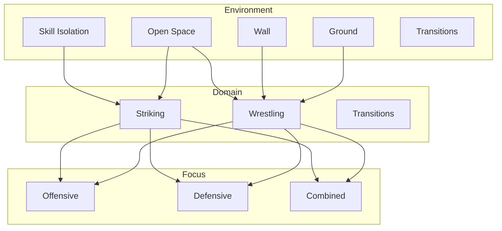

# Tags & Taxonomy

Structured metadata for organizing and filtering games in the Ecological MMA Games System.

---

## Organizational Hierarchy

Games are organized using a three-level hierarchy:

```
Environment → Domain → Focus
```

| Level | Description | Values |
|-------|-------------|--------|
| **Environment** | Physical space/context | Skill Isolation, Open Space, Wall, Ground, Transitions |
| **Domain** | Skill category | Striking, Wrestling, Transitions |
| **Focus** | Tactical objective | Offensive, Defensive, Combined |

---

## Environment Tags

| Tag | Description |
|-----|-------------|
| `skill-isolation` | Constrained drills focusing on single skills |
| `open-space` | Standing position without structural constraints |
| `wall` | Wall/cage as dominant constraint |
| `ground` | Ground as dominant constraint |
| `transitions` | Moving between environments |

---

## Domain Tags

| Tag | Description |
|-----|-------------|
| `striking` | Punches, kicks, and strike defense |
| `wrestling` | Clinch, takedowns, and positional control |
| `transitions` | Movement between environments |

---

## Focus Tags

| Tag | Description |
|-----|-------------|
| `offensive` | A Side is developing skills; primary learning is attack-oriented |
| `defensive` | B Side is developing skills; primary learning is defense-oriented |
| `combined` | Both sides have active learning objectives simultaneously |

---

## Difficulty Tags

| Tag | Description |
|-----|-------------|
| `beginner` | Foundational games, minimal prerequisites |
| `intermediate` | Requires foundational skills, moderate complexity |
| `advanced` | Requires multiple prerequisites, high complexity |

---

## Duration Tags

| Tag | Description |
|-----|-------------|
| `short` | 1-3 minute rounds |
| `medium` | 3-5 minute rounds |
| `long` | 5+ minute rounds |

---

## Stage Tags (Combat Phase)

| Tag | Description |
|-----|-------------|
| `access` | Engagement and connection phase |
| `stabilize` | Control establishment phase |
| `exploit` | Damage or submission phase |
| `counter` | Defensive response phase |

---

## Game Tag Matrix

### Skill Isolation Games

| Game | Domain | Focus | Difficulty |
|------|--------|-------|------------|
| Parry the Straight | Striking | Defensive | Beginner |
| Tight Block | Striking | Defensive | Beginner |
| Slip the Straight | Striking | Defensive | Beginner |
| Evade the Punch | Striking | Defensive | Intermediate |

### Open Space — Striking

| Game | Domain | Focus | Difficulty |
|------|--------|-------|------------|
| Touch and Don't Get Touched | Striking | Combined | Beginner |
| Close-Range Defense | Striking | Defensive | Intermediate |
| Land the Target | Striking | Offensive | Intermediate |

### Open Space — Wrestling

| Game | Domain | Focus | Difficulty |
|------|--------|-------|------------|
| Pressure to Clinch | Wrestling | Combined | Beginner |
| Pressure to Takedown | Wrestling | Offensive | Advanced |
| Open Space Takedown | Wrestling | Combined | Intermediate |

### Wall

| Game | Domain | Focus | Difficulty |
|------|--------|-------|------------|
| Wall Control | Wrestling | Offensive | Intermediate |
| Wall Escape | Wrestling | Defensive | Intermediate |
| Wall Pin to Ground | Wrestling | Offensive | Intermediate |
| Stand-Up & Re-Pin Loop | Wrestling | Combined | Advanced |

---

## Frontmatter Schema

Every game file includes standardized YAML frontmatter:

```yaml
---
title: Game Name
environment: open-space          # skill-isolation, open-space, wall, ground
domain: striking                 # striking, wrestling, transitions
focus: defensive                 # offensive, defensive, combined
difficulty: beginner             # beginner, intermediate, advanced
duration: short                  # short, medium, long
min_players: 2
equipment: gloves                # or list: [gloves, mats, wall]
prerequisites:
  concepts:
    - concept-slug
  games:
    - game-slug
tags:
  - relevant-tag
  - another-tag
---
```

This metadata enables:

- **Filtering** games by any dimension
- **Card deck generation** for physical training tools
- **Session planning** with prerequisite awareness
- **Progress tracking** across the system

---

## Usage

These tags can be used to:

1. **Filter games** by environment, domain, or focus
2. **Plan training sessions** focused on specific skills
3. **Track athlete development** across different domains
4. **Identify gaps** in the curriculum
5. **Generate materials** (cards, checklists, session plans)

---

## Tag Relationships



---

!!! abstract "System Evolution Notice"
    Tags and taxonomy may expand as the game library grows.
