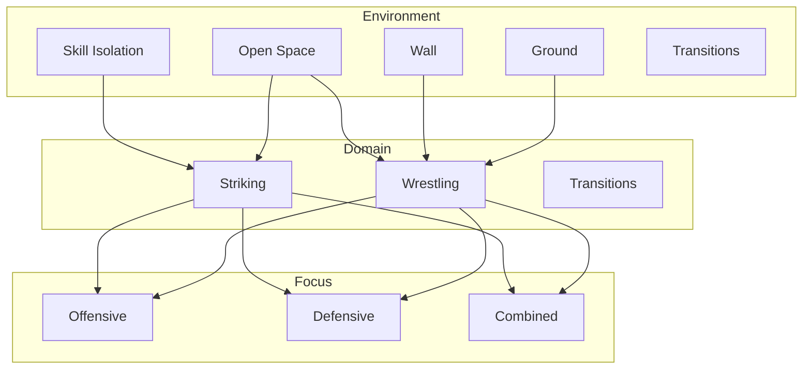

# Tags &amp; Taxonomy

<div class="emma-meta"><span>Metadata</span><span>Filtering &amp; Organizing</span><span>Environment → Domain → Focus</span></div>

<p class="emma-hl"><b>Structured metadata</b> organizes and filters every game in the system. Tags drive session planning, card-deck generation, and gap analysis, and they all hang off one three-level hierarchy.</p>

<p class="emma-glabel">Organizational Hierarchy</p>

<div class="emma-flow">
  <div class="emma-flow__row"><span class="emma-flow__from">Environment</span><span class="emma-flow__arr">→</span><span class="emma-flow__to">Domain</span></div>
  <div class="emma-flow__row"><span class="emma-flow__from">Domain</span><span class="emma-flow__arr">→</span><span class="emma-flow__to">Focus</span></div>
</div>

<div class="emma-cards">
  <div class="emma-card"><div class="emma-card__i">📍</div><div class="emma-card__t">Environment</div><p>Physical space / context.<br><i>Skill Isolation · Open Space · Wall · Ground · Transitions</i></p></div>
  <div class="emma-card"><div class="emma-card__i">🥋</div><div class="emma-card__t">Domain</div><p>Skill category.<br><i>Striking · Wrestling · Transitions</i></p></div>
  <div class="emma-card"><div class="emma-card__i">🎯</div><div class="emma-card__t">Focus</div><p>Tactical objective.<br><i>Offensive · Defensive · Combined</i></p></div>
</div>

<p class="emma-glabel">Environment Tags</p>

<div class="emma-chips">
  <span class="emma-chip emma-chip--info" tabindex="0"><span class="emma-chip__i">🎯</span> <code>skill-isolation</code><span class="emma-chip__detail">Constrained drills focusing on single skills.</span></span>
  <span class="emma-chip emma-chip--info" tabindex="0"><span class="emma-chip__i">🥊</span> <code>open-space</code><span class="emma-chip__detail">Standing position without structural constraints.</span></span>
  <span class="emma-chip emma-chip--info" tabindex="0"><span class="emma-chip__i">🧱</span> <code>wall</code><span class="emma-chip__detail">Wall / cage as the dominant constraint.</span></span>
  <span class="emma-chip emma-chip--info" tabindex="0"><span class="emma-chip__i">🤼</span> <code>ground</code><span class="emma-chip__detail">Ground as the dominant constraint.</span></span>
  <span class="emma-chip emma-chip--info" tabindex="0"><span class="emma-chip__i">🔀</span> <code>transitions</code><span class="emma-chip__detail">Moving between environments.</span></span>
</div>

<p class="emma-glabel">Domain Tags</p>

<div class="emma-chips">
  <span class="emma-chip emma-chip--info" tabindex="0"><span class="emma-chip__i">🥊</span> <code>striking</code><span class="emma-chip__detail">Punches, kicks, and strike defense.</span></span>
  <span class="emma-chip emma-chip--info" tabindex="0"><span class="emma-chip__i">🤼</span> <code>wrestling</code><span class="emma-chip__detail">Clinch, takedowns, and positional control.</span></span>
  <span class="emma-chip emma-chip--info" tabindex="0"><span class="emma-chip__i">🔀</span> <code>transitions</code><span class="emma-chip__detail">Movement between environments.</span></span>
</div>

<p class="emma-glabel">Focus Tags</p>

<div class="emma-chips">
  <span class="emma-chip emma-chip--info" tabindex="0"><span class="emma-chip__i">🟠</span> <code>offensive</code><span class="emma-chip__detail">A Side is developing skills; primary learning is attack-oriented.</span></span>
  <span class="emma-chip emma-chip--info" tabindex="0"><span class="emma-chip__i">🟢</span> <code>defensive</code><span class="emma-chip__detail">B Side is developing skills; primary learning is defense-oriented.</span></span>
  <span class="emma-chip emma-chip--info" tabindex="0"><span class="emma-chip__i">🟣</span> <code>combined</code><span class="emma-chip__detail">Both sides have active learning objectives simultaneously.</span></span>
</div>

<p class="emma-glabel">Difficulty &amp; Duration</p>

<div class="emma-chips">
  <span class="emma-chip emma-chip--info" tabindex="0"><span class="emma-chip__i">🟩</span> <code>beginner</code><span class="emma-chip__detail">Foundational games, minimal prerequisites.</span></span>
  <span class="emma-chip emma-chip--info" tabindex="0"><span class="emma-chip__i">🟨</span> <code>intermediate</code><span class="emma-chip__detail">Requires foundational skills, moderate complexity.</span></span>
  <span class="emma-chip emma-chip--info" tabindex="0"><span class="emma-chip__i">🟥</span> <code>advanced</code><span class="emma-chip__detail">Requires multiple prerequisites, high complexity.</span></span>
  <span class="emma-chip emma-chip--info" tabindex="0"><span class="emma-chip__i">⏱️</span> <code>short</code><span class="emma-chip__detail">1–3 minute rounds.</span></span>
  <span class="emma-chip emma-chip--info" tabindex="0"><span class="emma-chip__i">⏲️</span> <code>medium</code><span class="emma-chip__detail">3–5 minute rounds.</span></span>
  <span class="emma-chip emma-chip--info" tabindex="0"><span class="emma-chip__i">⏳</span> <code>long</code><span class="emma-chip__detail">5+ minute rounds.</span></span>
</div>

<p class="emma-glabel">Stage Tags (Combat Phase)</p>

<div class="emma-cards">
  <div class="emma-card"><div class="emma-card__i">🤝</div><div class="emma-card__t">access</div><p>Engagement and connection phase.</p></div>
  <div class="emma-card"><div class="emma-card__i">🔒</div><div class="emma-card__t">stabilize</div><p>Control establishment phase.</p></div>
  <div class="emma-card"><div class="emma-card__i">💥</div><div class="emma-card__t">exploit</div><p>Damage or submission phase.</p></div>
  <div class="emma-card"><div class="emma-card__i">↩️</div><div class="emma-card__t">counter</div><p>Defensive response phase.</p></div>
</div>

<p class="emma-glabel">Technique Tags</p>

??? note "🥊 Striking: Offense"

    <div class="emma-chips">
      <span class="emma-chip emma-chip--info" tabindex="0"><code>jab</code><span class="emma-chip__detail">Lead hand straight punch.</span></span>
      <span class="emma-chip emma-chip--info" tabindex="0"><code>cross</code><span class="emma-chip__detail">Rear hand straight punch.</span></span>
      <span class="emma-chip emma-chip--info" tabindex="0"><code>hook</code><span class="emma-chip__detail">Curved punch to side of head / body.</span></span>
      <span class="emma-chip emma-chip--info" tabindex="0"><code>uppercut</code><span class="emma-chip__detail">Upward punch to chin / body.</span></span>
      <span class="emma-chip emma-chip--info" tabindex="0"><code>overhand</code><span class="emma-chip__detail">Looping power punch.</span></span>
      <span class="emma-chip emma-chip--info" tabindex="0"><code>teep</code><span class="emma-chip__detail">Push kick / front kick.</span></span>
      <span class="emma-chip emma-chip--info" tabindex="0"><code>round-kick</code><span class="emma-chip__detail">Circular kick to leg / body / head.</span></span>
      <span class="emma-chip emma-chip--info" tabindex="0"><code>low-kick</code><span class="emma-chip__detail">Kick targeting the legs.</span></span>
      <span class="emma-chip emma-chip--info" tabindex="0"><code>body-kick</code><span class="emma-chip__detail">Kick targeting the torso.</span></span>
      <span class="emma-chip emma-chip--info" tabindex="0"><code>head-kick</code><span class="emma-chip__detail">Kick targeting the head.</span></span>
      <span class="emma-chip emma-chip--info" tabindex="0"><code>knee</code><span class="emma-chip__detail">Knee strike.</span></span>
      <span class="emma-chip emma-chip--info" tabindex="0"><code>elbow</code><span class="emma-chip__detail">Elbow strike.</span></span>
    </div>

??? note "🛡️ Striking: Defense"

    <div class="emma-chips">
      <span class="emma-chip emma-chip--info" tabindex="0"><code>parry</code><span class="emma-chip__detail">Deflecting strikes with the hands.</span></span>
      <span class="emma-chip emma-chip--info" tabindex="0"><code>block</code><span class="emma-chip__detail">Absorbing strikes with the guard.</span></span>
      <span class="emma-chip emma-chip--info" tabindex="0"><code>slip</code><span class="emma-chip__detail">Head movement to avoid straight punches.</span></span>
      <span class="emma-chip emma-chip--info" tabindex="0"><code>roll</code><span class="emma-chip__detail">Head movement to avoid hooks.</span></span>
      <span class="emma-chip emma-chip--info" tabindex="0"><code>pull</code><span class="emma-chip__detail">Leaning back to avoid strikes.</span></span>
      <span class="emma-chip emma-chip--info" tabindex="0"><code>check</code><span class="emma-chip__detail">Blocking kicks with the shin.</span></span>
      <span class="emma-chip emma-chip--info" tabindex="0"><code>catch</code><span class="emma-chip__detail">Catching the opponent's kick.</span></span>
    </div>

??? note "🦶 Movement"

    <div class="emma-chips">
      <span class="emma-chip emma-chip--info" tabindex="0"><code>footwork</code><span class="emma-chip__detail">Stance and movement patterns.</span></span>
      <span class="emma-chip emma-chip--info" tabindex="0"><code>angle</code><span class="emma-chip__detail">Creating off-center positioning.</span></span>
      <span class="emma-chip emma-chip--info" tabindex="0"><code>distance</code><span class="emma-chip__detail">Range management.</span></span>
      <span class="emma-chip emma-chip--info" tabindex="0"><code>pressure</code><span class="emma-chip__detail">Forward movement and cage cutting.</span></span>
      <span class="emma-chip emma-chip--info" tabindex="0"><code>retreat</code><span class="emma-chip__detail">Backward movement and escape.</span></span>
      <span class="emma-chip emma-chip--info" tabindex="0"><code>pivot</code><span class="emma-chip__detail">Rotational movement.</span></span>
      <span class="emma-chip emma-chip--info" tabindex="0"><code>level-change</code><span class="emma-chip__detail">Changing height / elevation.</span></span>
    </div>

??? note "🤼 Wrestling"

    <div class="emma-chips">
      <span class="emma-chip emma-chip--info" tabindex="0"><code>underhook</code><span class="emma-chip__detail">Arm under opponent's armpit.</span></span>
      <span class="emma-chip emma-chip--info" tabindex="0"><code>overhook</code><span class="emma-chip__detail">Arm over opponent's arm (whizzer).</span></span>
      <span class="emma-chip emma-chip--info" tabindex="0"><code>collar-tie</code><span class="emma-chip__detail">Hand behind opponent's neck.</span></span>
      <span class="emma-chip emma-chip--info" tabindex="0"><code>wrist-control</code><span class="emma-chip__detail">Controlling opponent's wrists.</span></span>
      <span class="emma-chip emma-chip--info" tabindex="0"><code>pummel</code><span class="emma-chip__detail">Fighting for underhook position.</span></span>
      <span class="emma-chip emma-chip--info" tabindex="0"><code>sprawl</code><span class="emma-chip__detail">Hip defense against takedowns.</span></span>
      <span class="emma-chip emma-chip--info" tabindex="0"><code>single-leg</code><span class="emma-chip__detail">Single leg takedown.</span></span>
      <span class="emma-chip emma-chip--info" tabindex="0"><code>double-leg</code><span class="emma-chip__detail">Double leg takedown.</span></span>
      <span class="emma-chip emma-chip--info" tabindex="0"><code>trip</code><span class="emma-chip__detail">Off-balancing with the leg.</span></span>
      <span class="emma-chip emma-chip--info" tabindex="0"><code>throw</code><span class="emma-chip__detail">Hip or shoulder throw.</span></span>
    </div>

??? note "🧩 Grappling Positions"

    <div class="emma-chips">
      <span class="emma-chip emma-chip--info" tabindex="0"><code>guard</code><span class="emma-chip__detail">Bottom position with legs engaged.</span></span>
      <span class="emma-chip emma-chip--info" tabindex="0"><code>half-guard</code><span class="emma-chip__detail">Bottom with one leg trapped.</span></span>
      <span class="emma-chip emma-chip--info" tabindex="0"><code>mount</code><span class="emma-chip__detail">Top position sitting on torso.</span></span>
      <span class="emma-chip emma-chip--info" tabindex="0"><code>side-control</code><span class="emma-chip__detail">Top position perpendicular to opponent.</span></span>
      <span class="emma-chip emma-chip--info" tabindex="0"><code>back-control</code><span class="emma-chip__detail">Controlling from behind.</span></span>
      <span class="emma-chip emma-chip--info" tabindex="0"><code>turtle</code><span class="emma-chip__detail">Defensive all-fours position.</span></span>
      <span class="emma-chip emma-chip--info" tabindex="0"><code>north-south</code><span class="emma-chip__detail">Top position head-to-head.</span></span>
      <span class="emma-chip emma-chip--info" tabindex="0"><code>crucifix</code><span class="emma-chip__detail">Controlling both arms from the side.</span></span>
    </div>

??? note "🔒 Submissions"

    <div class="emma-chips">
      <span class="emma-chip emma-chip--info" tabindex="0"><code>guillotine</code><span class="emma-chip__detail">Front headlock choke.</span></span>
      <span class="emma-chip emma-chip--info" tabindex="0"><code>rnc</code><span class="emma-chip__detail">Rear naked choke.</span></span>
      <span class="emma-chip emma-chip--info" tabindex="0"><code>arm-triangle</code><span class="emma-chip__detail">Head and arm choke.</span></span>
      <span class="emma-chip emma-chip--info" tabindex="0"><code>darce</code><span class="emma-chip__detail">Arm-in head and arm choke.</span></span>
      <span class="emma-chip emma-chip--info" tabindex="0"><code>armbar</code><span class="emma-chip__detail">Straight arm lock.</span></span>
      <span class="emma-chip emma-chip--info" tabindex="0"><code>kimura</code><span class="emma-chip__detail">Shoulder lock (double wristlock).</span></span>
      <span class="emma-chip emma-chip--info" tabindex="0"><code>americana</code><span class="emma-chip__detail">Reverse shoulder lock.</span></span>
      <span class="emma-chip emma-chip--info" tabindex="0"><code>triangle</code><span class="emma-chip__detail">Leg triangle choke.</span></span>
      <span class="emma-chip emma-chip--info" tabindex="0"><code>heel-hook</code><span class="emma-chip__detail">Rotational knee / ankle attack.</span></span>
      <span class="emma-chip emma-chip--info" tabindex="0"><code>ankle-lock</code><span class="emma-chip__detail">Straight ankle lock.</span></span>
    </div>

<p class="emma-glabel">Situational Tags</p>

<div class="emma-chips">
  <span class="emma-chip emma-chip--info" tabindex="0"><code>beginner-friendly</code><span class="emma-chip__detail">Suitable for new practitioners.</span></span>
  <span class="emma-chip emma-chip--info" tabindex="0"><code>high-intensity</code><span class="emma-chip__detail">Requires significant exertion.</span></span>
  <span class="emma-chip emma-chip--info" tabindex="0"><code>low-intensity</code><span class="emma-chip__detail">Technical focus, lower exertion.</span></span>
  <span class="emma-chip emma-chip--info" tabindex="0"><code>live-sparring</code><span class="emma-chip__detail">Full resistance, competitive.</span></span>
  <span class="emma-chip emma-chip--info" tabindex="0"><code>positional-sparring</code><span class="emma-chip__detail">Specific start position, reset on escape / score.</span></span>
  <span class="emma-chip emma-chip--info" tabindex="0"><code>flow</code><span class="emma-chip__detail">Cooperative, exploratory pace.</span></span>
  <span class="emma-chip emma-chip--info" tabindex="0"><code>timing</code><span class="emma-chip__detail">Emphasis on timing development.</span></span>
  <span class="emma-chip emma-chip--info" tabindex="0"><code>reaction</code><span class="emma-chip__detail">Emphasis on reaction training.</span></span>
</div>

<p class="emma-glabel">Game Tag Matrix</p>

<p class="emma-sub">Skill Isolation Games</p>

<div class="emma-cards">
  <div class="emma-card"><div class="emma-card__i">🛡️</div><div class="emma-card__t">Parry the Straight</div><p>Striking · Defensive · Beginner</p></div>
  <div class="emma-card"><div class="emma-card__i">🛡️</div><div class="emma-card__t">Tight Block</div><p>Striking · Defensive · Beginner</p></div>
  <div class="emma-card"><div class="emma-card__i">↪️</div><div class="emma-card__t">Slip the Straight</div><p>Striking · Defensive · Beginner</p></div>
  <div class="emma-card"><div class="emma-card__i">💨</div><div class="emma-card__t">Evade the Punch</div><p>Striking · Defensive · Intermediate</p></div>
</div>

<p class="emma-sub">Open Space: Striking</p>

<div class="emma-cards">
  <div class="emma-card"><div class="emma-card__i">✋</div><div class="emma-card__t">Touch and Don't Get Touched</div><p>Striking · Combined · Beginner</p></div>
  <div class="emma-card"><div class="emma-card__i">🛡️</div><div class="emma-card__t">Close-Range Defense</div><p>Striking · Defensive · Intermediate</p></div>
  <div class="emma-card"><div class="emma-card__i">🎯</div><div class="emma-card__t">Land the Target</div><p>Striking · Offensive · Intermediate</p></div>
</div>

<p class="emma-sub">Open Space: Wrestling</p>

<div class="emma-cards">
  <div class="emma-card"><div class="emma-card__i">➡️</div><div class="emma-card__t">Pressure to Clinch</div><p>Wrestling · Combined · Beginner</p></div>
  <div class="emma-card"><div class="emma-card__i">⬇️</div><div class="emma-card__t">Pressure to Takedown</div><p>Wrestling · Offensive · Advanced</p></div>
  <div class="emma-card"><div class="emma-card__i">🤸</div><div class="emma-card__t">Open Space Takedown</div><p>Wrestling · Combined · Intermediate</p></div>
</div>

<p class="emma-sub">Wall</p>

<div class="emma-cards">
  <div class="emma-card"><div class="emma-card__i">📌</div><div class="emma-card__t">Wall Control</div><p>Wrestling · Offensive · Intermediate</p></div>
  <div class="emma-card"><div class="emma-card__i">🚪</div><div class="emma-card__t">Wall Escape</div><p>Wrestling · Defensive · Intermediate</p></div>
  <div class="emma-card"><div class="emma-card__i">⬇️</div><div class="emma-card__t">Wall Pin to Ground</div><p>Wrestling · Offensive · Intermediate</p></div>
  <div class="emma-card"><div class="emma-card__i">🔁</div><div class="emma-card__t">Stand-Up &amp; Re-Pin Loop</div><p>Wrestling · Combined · Advanced</p></div>
</div>

<p class="emma-glabel">Frontmatter Schema</p>

Every game file includes standardized YAML frontmatter:

```yaml
---
title: Game Name
environment: open-space          # skill-isolation, open-space, wall, ground
domain: striking                 # striking, wrestling, transitions
focus: defensive                 # offensive, defensive, combined
difficulty: beginner             # beginner, intermediate, advanced
duration: short                  # short, medium, long
min_players: 2
equipment: gloves                # or list: [gloves, mats, wall]
prerequisites:
  concepts:
    - concept-slug
  games:
    - game-slug
tags:
  - relevant-tag
  - another-tag
---
```

<p class="emma-glabel">What This Metadata Enables</p>

<div class="emma-cards">
  <div class="emma-card"><div class="emma-card__i">🔍</div><div class="emma-card__t">Filter games</div><p>By environment, domain, focus, or any dimension.</p></div>
  <div class="emma-card"><div class="emma-card__i">🃏</div><div class="emma-card__t">Generate card decks</div><p>Physical training tools from the tag data.</p></div>
  <div class="emma-card"><div class="emma-card__i">📅</div><div class="emma-card__t">Plan sessions</div><p>With prerequisite awareness built in.</p></div>
  <div class="emma-card"><div class="emma-card__i">📈</div><div class="emma-card__t">Track development</div><p>Progress across domains, and identify curriculum gaps.</p></div>
</div>

<p class="emma-glabel">Tag Relationships</p>


```mermaid
flowchart TD
    subgraph Environment
        SI[Skill Isolation]
        OS[Open Space]
        W[Wall]
        G[Ground]
        T[Transitions]
    end

    subgraph Domain
        ST[Striking]
        WR[Wrestling]
        TR[Transitions]
    end

    subgraph Focus
        OFF[Offensive]
        DEF[Defensive]
        COM[Combined]
    end

    SI --> ST
    OS --> ST
    OS --> WR
    W --> WR
    G --> WR

    ST --> OFF
    ST --> DEF
    ST --> COM
    WR --> OFF
    WR --> DEF
    WR --> COM
```

??? abstract "System evolution notice"
    Tags and taxonomy may expand as the game library grows.
